# Plan: Closed Learning Loop + Unified `.harness/` Storage

> **Source:** docs/spec/learning-loop/design.md · docs/spec/learning-loop/spec.md
> **Created:** 2026-06-04
> **Status:** planning

## Goal

Unify all harness artifacts under `.harness/` (knowledge / features / runtime zones) and close the learning loop: lessons are mechanically captured from pipeline signals, curated once per run, and deterministically routed back into every sub-agent's context.

## Acceptance Criteria

- [ ] All 37 spec REQs pass their acceptance criteria (REQ-001–037); phase-level mapping below
- [ ] `node --test skills/_shared/knowledge.test.mjs hooks/*.test.mjs` green
- [ ] Old-root grep over `skills/` returns zero matches (REQ-011, runs as a test)
- [ ] This repo itself migrated to the new layout (dogfooded in phase 0)
- [ ] 4 PRs, one per phase, each leaving the plugin fully working; minor version bump per PR

## Codebase Context

### Context Map (Step 2.0)
- **Context map:** none (`docs/context/` does not exist in this repo)

### Existing Patterns to Follow
- **Shared contract location**: `skills/_shared/fallow.md` — `knowledge.mjs` + its contract doc live beside it; consuming skills reference `../_shared/` relative to their own dir
- **Script envelope + exit codes**: `skills/_shared/fallow.md` (0 = clean, 1 = findings/actions, 2 = real error; JSON on stdout, noise to stderr) — `knowledge.mjs` mirrors this
- **Hook output contract**: `hooks/session-start-context.mjs:93-97` — `{hookSpecificOutput: {hookEventName, additionalContext}}`, content packed to a char cap via `_lib/context-map.mjs packSections()`
- **Reusable helpers**: `hooks/_lib/git.mjs` (`repoRoot`, `gitAvailable`), `hooks/_lib/io.mjs` (`writeJsonAtomic`, `fileExists`), `hooks/_lib/paths.mjs` (`harnessDir()` — must be repointed)
- **Path source for dashboard**: `skills/orchestrate/dashboard/dag-update.mjs:64` — `join(cwd, ".harness", specName)` → becomes `join(cwd, ".harness", "runtime", specName)`
- **Prompt-pointer convention**: orchestrate SKILL.md:449-493 — sub-agent prompts pass paths as `Key: <path>` lines after `[PREAMBLE]`; new lesson-path lines match this
- **Evals format**: `skills/<name>/evals/evals.json` — `{skill_name, evals: [{id, name, prompt, expected_output, files, expectations, anti_expectations}]}`

### Test Infrastructure
- Node built-in `node:test`, no package.json — run `node --test <files>`
- Convention (from `hooks/coder-e2e-gate.test.mjs`): `mkdtempSync` sandbox → `git init` + initial commit → spawn script as child process → assert exit code + output tokens → `rmSync` cleanup
- SKILL.md (prompt) behavior is covered by evals, not unit tests — per spec verification matrix

### Decisions Resolved at Planning
- **Zero duplication rule (owner directive)**: no duplicated logic, paths, or contract text anywhere in the implementation — `knowledge.mjs` reuses `hooks/_lib/{git,io}.mjs` (never reimplements); path mappings live in ONE place (`knowledge.mjs` constants) and skills cite the contract doc rather than restating it (the `_shared/fallow.md` consumption pattern); envelope/exit-code rules are written once in `skills/_shared/knowledge.md` and referenced everywhere else; eviction/ranking rules appear only in the script + its tests, never re-explained per skill
- Delivery: ~~PR per phase (4 PRs)~~ **superseded by owner directive during implementation — all 4 phases in one PR, single bump to v1.10.0**
- Phase 0 **self-migrates this repo** (docs/spec/learning-loop, fallow-integration → `.harness/features/`)
- `knowledge.mjs` imports `hooks/_lib/{git,io}.mjs` rather than duplicating helpers
- Repo-local `.claude/hooks/check-proof-report.mjs` is included in the phase-0 path sweep (it reads `docs/spec/` + `.harness/<name>/`)
- `hooks/_lib/context-map.mjs findContextRoot()` repoints `docs/context/` → `.harness/knowledge/context/` in phase 0 (with old-path fallback until migration runs)

## Phase Graph

```dot
digraph phases {
  rankdir=LR
  node [shape=box]

  phase_0 [label="Phase 0: Unified storage + knowledge.mjs\n(verify/migrate/reindex, path sweep, self-migrate)\nREQ-001..011, 013-015"]
  phase_1 [label="Phase 1: Deterministic retrieval\n(route, prompt injection, SessionStart INDEX)\nREQ-012, 016-022, 036-037"]
  phase_2 [label="Phase 2: Capture + curator\n(signals, consolidate mode)\nREQ-023..031"]
  phase_3 [label="Phase 3: Human feedback + metrics\n(review-fixer, evidence, summary)\nREQ-032..035"]

  phase_0 -> phase_1 -> phase_2 -> phase_3
}
```

Strictly sequential: each phase consumes the previous phase's mechanics.

## Phase Summaries

| Phase | Delivers | PR / version |
|---|---|---|
| 0 | `.harness/` three zones exist and are enforced; `knowledge.mjs verify/migrate/reindex` with tests; dashboard + breadcrumb + all 18 skills + repo-local hooks repointed; this repo migrated; gitignore narrowed | v1.10.0 |
| 1 | `knowledge.mjs route`; lesson routing frontmatter in learn; relevant-lessons.md injected into 4 stage prompts; reviewer `matched_lesson` reporting; SessionStart hook injects INDEX for ad-hoc sessions | v1.11.0 |
| 2 | Nomination signals append candidates JSONL from stage prompts; learn `--consolidate` curator (4 tests, dedupe, patch-don't-rewrite, source provenance, reindex) | v1.12.0 |
| 3 | review-fixer distills human comments to candidates; evidence_count from reviewer matches; `lessons: retrieved/matched/captured` in orchestrate summary | v1.13.0 |

Detailed steps: `.harness/learning-loop/phase-0.md` … `phase-3.md` (gitignored working files).
