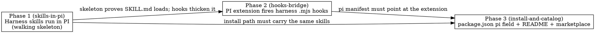

# Plan: PI coding agent plugin support

Make the `harness` plugin installable and fully functional in the **PI coding agent**
(`@earendil-works/pi-coding-agent`), as a third target alongside Claude Code and Codex. Full
parity: skills run, hooks fire, orchestrate works, and install is documented + catalogued.

## Acceptance Criteria

- A PI user can install harness (via `npx skills add vertexcover-io/harness-engineering --agent pi`
  and/or a `settings.json` `packages` entry) and every harness skill is discoverable and invocable
  in PI via `/skill:<name>` and implicit description-based activation.
- The harness JSON hooks (`hooks/hooks.json`: PreToolUse/PostToolUse/SubagentStop/Stop on
  AskUserQuestion/orchestrate gates) fire their existing `.mjs` scripts inside a PI session via a PI
  TypeScript extension, so `orchestrate` and its dashboard/gates behave in PI as they do in Claude
  Code / Codex.
- A root `package.json` declares a `"pi"` field pointing at `skills`, the extension, and prompts;
  the repo is registered in the cross-agent skills catalog; the README has a PI install section
  mirroring the Codex one.
- Claude Code and Codex installs are unchanged (existing manifests, hooks, and agents untouched).

## Codebase Context

**Existing dual-target structure (the abstraction PI extends):**
- Claude Code: `.claude-plugin/plugin.json`, `.claude-plugin/marketplace.json`, `settings.json`, `hooks/hooks.json`.
- Codex: `.codex-plugin/plugin.json`, `.codex/agents/*.toml`, `references/codex-config.toml`, `references/codex-tools.md`, `.agents/plugins/marketplace.json`.
- Shared: `skills/` (23 skills with `SKILL.md` + `references/` + `evals/`; plus helper dirs `_shared/`, `orchestrate-workspace/` without a `SKILL.md`), `hooks/*.mjs`, `AGENTS.md`/`CLAUDE.md`.

**PI format (verified via earendil-works/pi docs, 2026-07-21):**
- **Skills — drop-in.** PI's `SKILL.md` frontmatter (`name`, `description`, optional `allowed-tools`, `compatibility`, `metadata`) is the same Agent-Skills open standard harness already uses. PI discovers skills from `pi.skills` in `package.json`, `.pi/skills/`, `.agents/skills/`, or a `--skill <path>` flag. Invoked via `/skill:<name>` or implicit description activation. **No per-skill change needed.**
- **Manifest — new, thin.** PI has no `.pi-plugin/plugin.json`. A package is a `package.json` with a `"pi"` field: `{ "extensions": [...], "skills": ["./skills"], "prompts": [...] }`. Verified precondition: **no root `package.json` exists** — it is created net-new, no conflict.
- **Hooks — divergent.** PI has no JSON command-hook file. Hooks are TypeScript extensions: `export default function (pi: ExtensionAPI) { pi.on(event, handler) }`, discovered from `~/.pi/agent/extensions/*.ts`, `.pi/extensions/*.ts`, or the `pi.extensions` manifest field. Event names differ from Claude Code: `session_start`, `tool_call` (pre, can block), `tool_result` (post, can modify), `session_shutdown` (≈ Stop/SessionEnd), plus `agent_end`/`agent_settled`. Handlers get `ctx` (ui, cwd, sessionManager). **Strategy: refactor the 3 hook scripts to export `run(argv) → {exitCode, stdout}` (keeping a thin `isMain` CLI wrapper so Claude Code / Codex JSON hooks are unchanged), and a PI bridge extension imports those modules and calls `run()` in-process on the mapped events — no `node` child spawned per event. In-process is required because the scripts signal "block" via `process.exit(2)`, which would kill the PI host if shelled/imported naively; `run()` returns the code instead, and the extension maps exit 2 → PI block.**
- **Harness hook events to map:** `PreToolUse`→`tool_call`, `PostToolUse`→`tool_result`, `Stop`→`session_shutdown`, `SubagentStop`→`agent_end`/`agent_settled`. `SessionEnd`→`session_shutdown` as well.
- **Install/distribution.** Two path *types*, both offered:
  (a) the Agent-Skills open-standard CLI `npx skills add <owner>/<repo> --agent <agent>` (from
  vercel-labs `skills`), which auto-discovers `SKILL.md`, needs **no manifest**, and — verified —
  supports `claude-code`, `codex`, and `pi` (30+ agents total), installing to `.claude/skills` /
  `~/.codex/skills` (project `.agents/skills`) / `~/.pi/agent/skills` respectively. **Carries skills
  only** for every agent.
  (b) each agent's **native plugin install** — Claude Code `/plugin install harness`, Codex
  `codex plugin add harness`, PI `settings.json` `packages: ["git:github.com/vertexcover-io/harness-engineering@main"]` (reads the `pi` manifest field) — **carries skills *and* hooks/orchestrate**.
  The README documents path (a) uniformly across all three agents (correcting today's README, which
  omits `npx skills` for Codex/Claude Code) with the single shared caveat that it is skills-only, and
  path (b) per agent for full parity.

**Verified execution preconditions:**
- No root `package.json` (checked) — Phase 3 creates it; no merge risk.
- Hook scripts are top-level `.mjs` (no exports) that use `process.argv` and `process.exit(0|2)` (checked: `coder-e2e-gate.mjs`, `ask-user-hook.mjs`, `dag-update.mjs`; `_lib/*.mjs` are already proper modules, unchanged). Phase 2 refactors the 3 to export `run(argv)` so PI can call them in-process without spawning `node` or letting `process.exit` reach the host.
- `ask-user-hook.mjs` internally `spawnSync`s `dag-update.mjs` — after the refactor this becomes a direct in-process `dagUpdate.run(...)` call.
- Because PI **imports** the modules, sibling-path resolution via `import.meta.url` stays correct with no external root arg — the `${CLAUDE_PLUGIN_ROOT}` shim the shell-out approach needed is **eliminated**, so there is no unverified root-resolution precondition.

## System E2E Tests

<!-- Cross-slice journeys only. Each phase below is itself an end-to-end capability with its own E2E;
     the only genuinely cross-slice flow is install-then-orchestrate, which chains all three slices. -->

**S9 — Install in PI then run orchestrate end to end (cross-slice: Phase 3 install → Phase 1 skills → Phase 2 hooks).**
Steps: from a clean PI environment, install harness via the documented `packages` entry (Phase 3); start a PI session in a scratch git repo; invoke `/skill:orchestrate` (Phase 1 skill discovery) on a trivial spec; confirm the orchestrate dashboard/gate hooks fire (Phase 2 extension bridging `tool_call`/`session_shutdown`).
Expected: skill loads, the pipeline advances through at least the plan gate, and the hook-driven dashboard state updates — proving skills + hooks + install compose in a real PI session.

## Phase Graph

Phase 1 is the walking skeleton (thinnest path: a real harness `SKILL.md` loads and runs in PI).
Phases 2 and 3 both build on it and are largely independent of each other; the `pi` manifest field
in Phase 3 references the extension file that Phase 2 creates, so Phase 3 lands after Phase 2.
