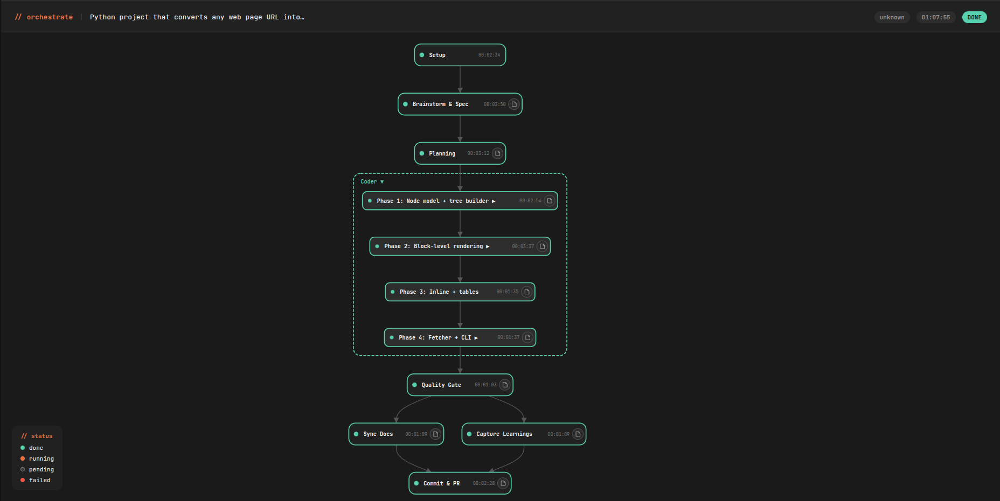
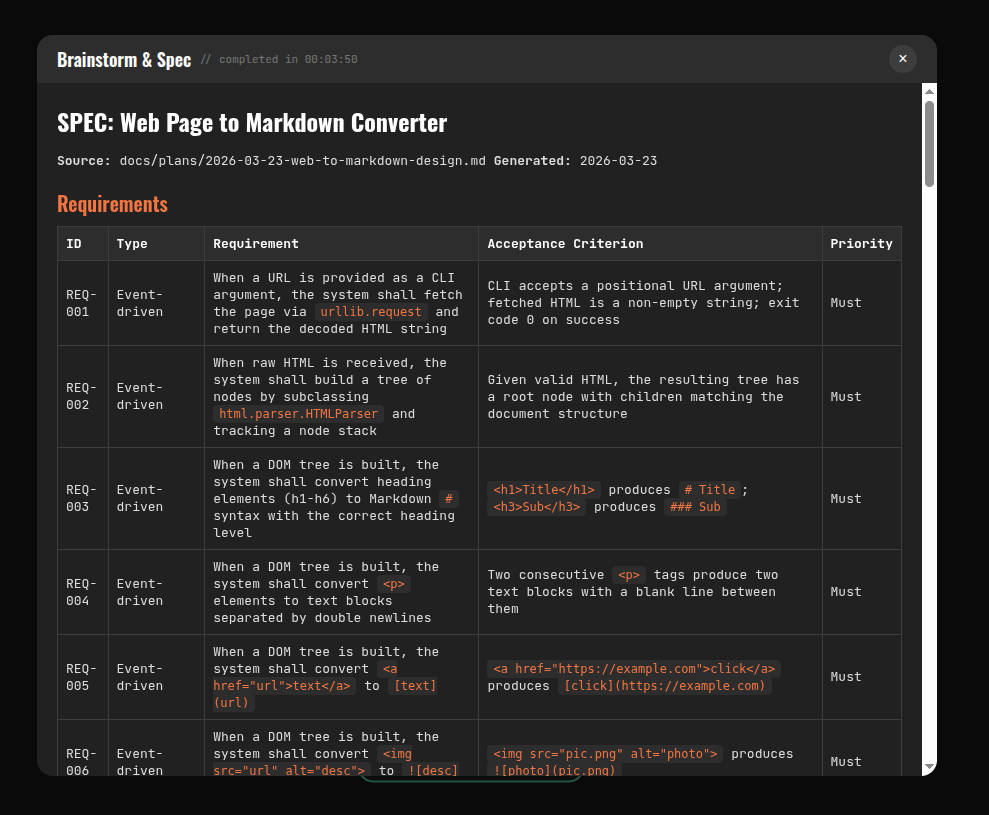
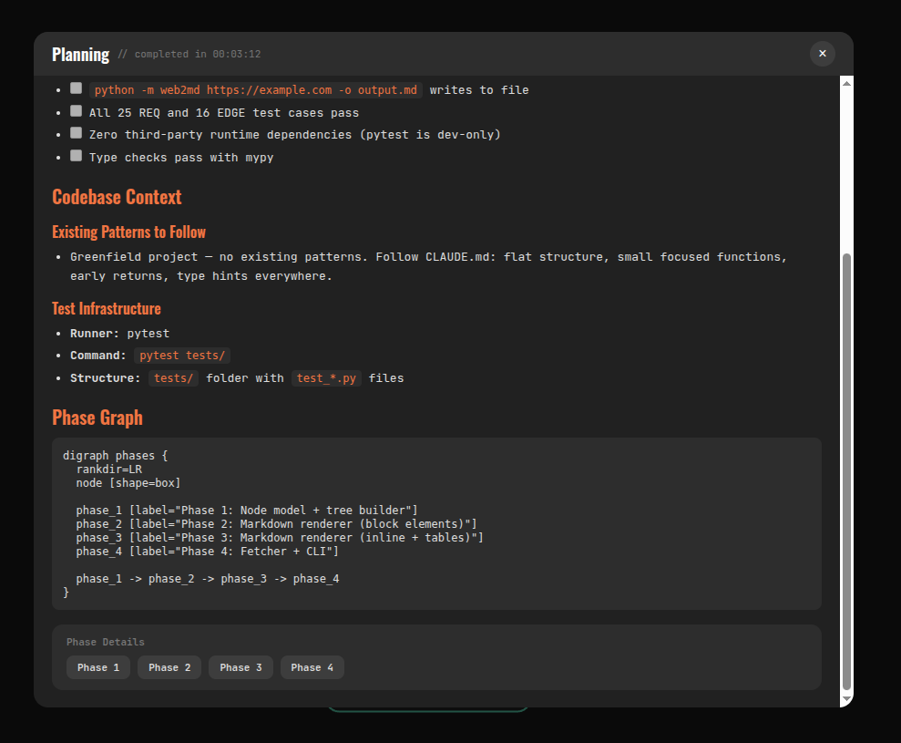

<h1 align="center">Harness</h1>

<p align="center">
  <strong>Engineering discipline for AI-assisted development</strong><br>
  A Claude Code plugin that adds the engineering your AI skips — design docs before code, tests before implementation, quality gates before merging
</p>

<p align="center">
  <a href="https://opensource.org/licenses/MIT"></a>
  <a href="https://github.com/vertexcover-io/harness-engineering/stargazers"></a>
  <a href="https://docs.anthropic.com/en/docs/claude-code"></a>
</p>

<p align="center">
  <a href="#installation"><b>Installation</b></a> &nbsp;·&nbsp;
  <a href="#the-pipeline">The Pipeline</a> &nbsp;·&nbsp;
  <a href="#recipes">Recipes</a> &nbsp;·&nbsp;
  <a href="#skill-reference">Skill Reference</a>
</p>

AI coding tools are fast. They're also reckless — no tests, no design, no verification. Code appears in seconds and breaks in production minutes later. Harness fixes this with a full pipeline where every stage has clear inputs, outputs, and pass/fail criteria:

```
Brainstorm → Plan → TDD → Quality Gate → Docs → PR
```

Run the full pipeline end-to-end, or pick individual skills for smaller tasks.

## Installation

### Option 1: Plugin marketplace (recommended)

```bash
# Clone the repo
git clone https://github.com/vertexcover-io/harness-engineering.git

# Add as a local marketplace
/plugin marketplace add ./

# Install the plugin
/plugin install harness
```

This persists across sessions — the plugin loads automatically on startup.

### Option 2: Load with `--plugin-dir`

For quick one-off usage without installing:

```bash
claude --plugin-dir <path-to-harness>
```

## Quick Start

Tell Claude what you want to build. For the full pipeline:

```
/orchestrate "Add rate limiting to the API"
```

This handles everything — design, planning, coding with tests, quality checks, docs, and a PR.

For smaller tasks, use individual skills like `/tdd`, `/code-review`, or `/git-commit`.

## The Pipeline

The orchestrate skill runs a full development pipeline end-to-end. Give it a prompt or a spec file and it handles the rest.

**Pipeline stages:**

```
Setup → Brainstorm → Planner → Coder → Quality Gate → Sync Docs → Learnings → Commit & PR
```

| Stage | What happens |
|-------|-------------|
| **Setup** | Creates an isolated git worktree, runs baseline metrics |
| **Brainstorm** | Interactive design session — you approve the architecture before any code |
| **Planner** | Generates phased implementation plan with dependency graph |
| **Coder** | Dispatches parallel sub-agents running TDD (RED-GREEN-REFACTOR) per phase |
| **Quality Gate** | Hard pass/fail verification — typecheck, lint, tests, coverage |
| **Sync Docs** | Updates documentation to match the new code |
| **Learnings** | Captures gotchas and patterns for future sessions |
| **Commit & PR** | Creates conventional commits and opens a pull request |

Stages 0–2 (Setup, Brainstorm, Planner) run interactively so you stay in control of design decisions. Stages 3–7 run as autonomous sub-agents.

All artifacts land in `docs/spec/<name>/` — spec, plan, phase files, and quality reports.

**Live DAG Dashboard**

The pipeline launches a live dashboard that visualizes progress as a directed acyclic graph. Each node represents a stage or phase, color-coded by status (pending, running, done, failed). Click any node to see its report.

<p align="center">
  
</p>

Click any completed node to inspect its report:

<p align="center">
  
  
</p>

After the pipeline completes, the dashboard is finalized into a self-contained HTML file you can share or archive.

You can also run stages individually if you prefer more control:
`/brainstorm` → `/planning` → `/tdd` → `/quality-gate` → `/git-commit`

## Recipes

### I want to build a feature

Run `/orchestrate` with a prompt or spec file. It runs the full pipeline:

1. **Brainstorms** the problem with you and produces a design doc
2. **Plans** the implementation — breaks work into phases (you approve before coding starts)
3. **Codes** each phase using TDD with parallel sub-agents
4. **Runs quality checks** — typecheck, lint, tests, coverage
5. **Updates docs** to match the new code
6. **Captures learnings** from the run
7. **Commits and creates a PR**

All artifacts are saved to `docs/spec/<name>/` for traceability.

---

### I want to fix a bug

Run `/orchestrate` with a description of the bug. It writes a failing test to reproduce the issue, fixes it, verifies everything passes, and commits the result.

---

### I want to review a PR

Run `/code-review`. It reads the diff, checks against a plan or design doc if provided, and produces a `REVIEW.md` with a verdict: APPROVE, APPROVE WITH SUGGESTIONS, or REQUEST CHANGES.

---

### I want to auto-fix PR review comments

The `review-fixer` skill runs in GitHub Actions. When a human leaves review comments on a PR, it classifies each comment, applies fixes, runs the quality gate, commits, and replies inline on the PR.

---

### I want to audit code quality

Three standalone tools — run any of them independently:

**Tech Debt Finder** — scans your codebase for technical debt and creates GitHub issues:

```
/tech-debt-finder src/
/tech-debt-finder full    # scan entire repo
```

Three parallel agents scan simultaneously:

| Scanner | Looks for |
|---------|-----------|
| **Dependency & Environment** | Known CVEs, outdated packages, unused dependencies, circular imports, pinning gaps |
| **Structural & Complexity** | God modules, high cyclomatic complexity, deep nesting, layer violations, code duplication |
| **Code Patterns** | Bare except, swallowed exceptions, `Any` overuse, blocking calls in async, mutable defaults, magic numbers, dead code |

Output: terminal report by severity + GitHub issues with code snippets and permalinks.

Suppress known findings in `.claude/harness/tech-debt-ignore.md`:

```
providers/fal.py:god-module       # suppress specific rule for a file
utils.py:*                        # suppress all rules for a file
*:magic-number                    # suppress a rule everywhere
```

**Coverage Guard** — enforces minimum test coverage (default 90%). Auto-generates missing tests via `/orchestrate` if below threshold.

```
/coverage-guard
```

**Doc Quality Guard** — checks docs for accuracy against the actual code and flags AI-generated tone:

```
/doc-quality-guard docs/
/doc-quality-guard          # scan all READMEs and docs
```

| Category | Examples |
|----------|----------|
| **Accuracy** | Wrong API signatures, removed features still documented, stale code examples, dead internal links, outdated install instructions |
| **AI slop** | "Additionally", "leverage", "seamlessly", promotional language, filler phrases, em dash overuse, chatbot tone |

Findings are classified by severity, then a fix spec is generated and handed off to `/orchestrate` for automated remediation.

---

### I want to commit my changes

Run `/git-commit`. It does more than `git commit`:

- Analyzes your dirty working tree
- Groups related changes into logical commits (using hunk-level staging)
- Writes conventional commit messages with proper prefixes (`feat`, `fix`, `refactor`, etc.)

---

### I want to refactor code

Use `/refactor`. It assesses your code for improvement opportunities:

1. Identifies extraction, simplification, and naming improvements
2. Applies refactoring patterns (extract method, inline temp, replace conditional with polymorphism, etc.)
3. Verifies tests still pass after each change

---

### I want to test a skill

Two tools work together: `/skill-eval-generator` creates the test suite, and `skill-creator eval` (from the [skill-creator](https://www.npmjs.com/package/skill-creator) plugin) runs it.

**Generate evals:**

```
/skill-eval-generator skills/tdd/SKILL.md
```

This reads the SKILL.md, extracts behavioral rules (MUST, NEVER, ALWAYS clauses), and produces `evals/evals.json` with realistic prompts, verifiable expectations, and anti-expectations. Fixture files are generated when the skill operates on input files (e.g., code-review needs source code with planted bugs).

**Run evals:**

```
/skill-creator eval skills/tdd/SKILL.md
```

This executes each eval case against the skill, checks expectations and anti-expectations, and reports pass/fail per case.

**Typical workflow:** generate evals → run them → iterate on the SKILL.md until evals pass → ship the skill.

## Always-On Skills

Some skills run automatically when you're writing code — through `/tdd`, `/orchestrate`, or directly. You never invoke them:

- **code-quality** — Enforces strict types (no `any`), immutability (`readonly`), pure functions, Result types for errors, early returns over nested conditionals
- **testing** — Enforces behavior-driven test patterns, proper factories, minimal mocking — tests verify *what* not *how*
- **refactor** — Kicks in after tests pass (GREEN phase) to assess code for extraction, simplification, and naming improvements

## Skill Reference

**Slash commands you invoke:**

| Command | What it does |
|---------|-------------|
| `/orchestrate` | Full pipeline: design → plan → code → PR |
| `/brainstorm` | Deep problem exploration, produces design doc |
| `/planning` | Breaks work into phases with dependency graph |
| `/tdd` | RED-GREEN-REFACTOR development cycle |
| `/code-review` | Reviews a PR, produces verdict in REVIEW.md |
| `/git-commit` | Groups changes into logical conventional commits |
| `/tech-debt-finder` | Finds code smells, creates GitHub issues |
| `/coverage-guard` | Enforces minimum test coverage |
| `/doc-quality-guard` | Audits docs for accuracy and staleness |
| `/skill-eval-generator` | Generates eval test suites for skills (pairs with `skill-creator eval`) |

**Run automatically (no command needed):**
`code-quality` · `testing` · `refactor` · `quality-gate` · `pipeline-setup` · `spec-generation` · `sync-docs` · `learn` · `review-fixer` · `using-git-worktrees`

## Structure

```
harness/
├── CLAUDE.md        # Global instructions for Claude Code
├── settings.json    # Permissions, hooks, and environment config
├── hooks/
│   └── hooks.json   # Session hooks for dashboard management (ask-user, DAG updates)
└── skills/          # Reusable skills that extend Claude's capabilities
    ├── brainstorm/
    ├── code-quality/
    ├── code-review/
    ├── coverage-guard/
    ├── doc-quality-guard/
    ├── git-commit/
    ├── learn/
    ├── orchestrate/
    ├── pipeline-setup/
    ├── planning/
    ├── quality-gate/
    ├── refactor/
    ├── review-fixer/
    ├── skill-eval-generator/
    ├── spec-generation/
    ├── sync-docs/
    ├── tdd/
    ├── tech-debt-finder/
    ├── testing/
    └── using-git-worktrees/
```

## Configuration

**CLAUDE.md** — Global instructions Claude Code follows across every project:
- TDD-first approach, strict TypeScript, Python type hints, functional style
- Explore before implementing, plan before coding, re-plan when stuck
- Small focused functions, early returns over nested conditionals

**settings.json** — Runtime behavior:
- Pre-approved read-only tools (git, grep, find, jq) and denied dangerous commands
- Deny rules for dotfiles, `~/Library`, `/etc`, and other sensitive paths
- Session lifecycle hooks for the orchestrate dashboard
- [ccstatusline](https://www.npmjs.com/package/ccstatusline) integration

## Inspiration

The skills and CLAUDE.md in this repo were heavily inspired by these projects:

- [obra/superpowers](https://github.com/obra/superpowers) — The primary reference for many of the skills here (TDD, code quality, planning, brainstorm, refactor, testing, and more). A comprehensive and well-thought-out skill collection that informed the structure and content of most skills in this repo.
- [coelhoxyz/claude-code-global-config](https://github.com/coelhoxyz/claude-code-global-config) — Inspired the global CLAUDE.md structure and approach to shaping Claude Code's behavior across projects.
- [abhishekray07/claude-md-templates](https://github.com/abhishekray07/claude-md-templates/blob/main/global/CLAUDE.md) — Another reference for CLAUDE.md patterns, particularly around workflow preferences and coding style directives.
- [citypaul/.dotfiles/claude](https://github.com/citypaul/.dotfiles/tree/main/claude/.claude) — A well-organized Claude Code configuration that served as a reference for the overall repo layout and settings.
