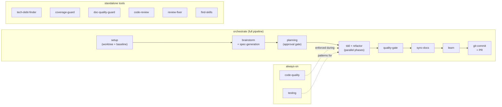
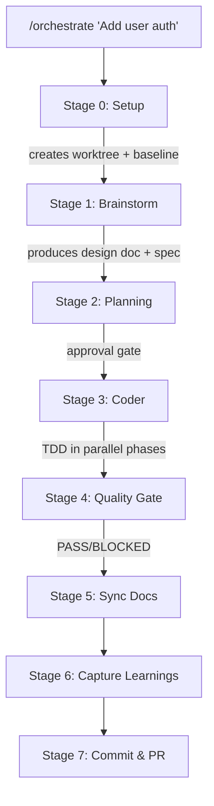
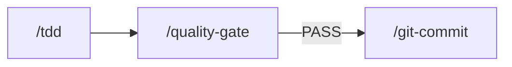
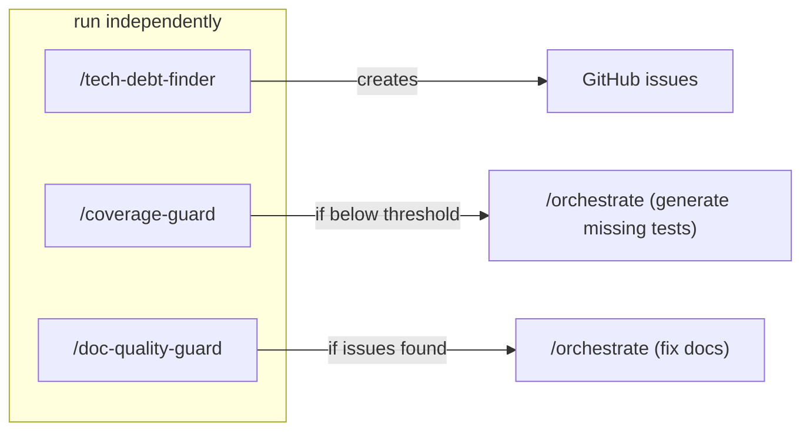

# Skills Guide

This document explains how the 21 skills in the harness plugin work together. For installation and setup, see [README.md](README.md).

## The Big Picture

The plugin's skills form a development pipeline orchestrated by a single entry point. Most skills run as stages in this pipeline. A few are standalone utilities.



## Workflows

### Building a Feature

Run `/orchestrate <prompt>` or `/orchestrate <spec-file>`. This triggers the full 8-stage pipeline:



**What happens at each stage:**

| Stage | Skill(s) | What it does |
|-------|----------|-------------|
| 0. Setup | `pipeline-setup` + `using-git-worktrees` | Creates an isolated git worktree, installs dependencies, runs baseline metrics (typecheck, lint, test, coverage) |
| 1. Brainstorm | `brainstorm` → `spec-generation` | Explores the problem space interactively, produces a design doc, then converts it to a testable spec with EARS acceptance criteria |
| 2. Planning | `planning` | Reads the spec, explores the codebase, breaks work into phases and steps with a dependency graph. **Only approval gate in the pipeline** — you review the plan before coding starts |
| 3. Coder | `tdd` + `refactor` | Implements each phase using RED-GREEN-REFACTOR. Independent phases run in parallel as sub-agents. `code-quality` and `testing` patterns are enforced automatically |
| 4. Quality Gate | `quality-gate` | Runs typecheck, lint, tests, coverage. Compares against baseline. Verdict is PASS (continue), BLOCKED (stop), or STAGNATION (stop, don't retry) |
| 5. Sync Docs | `sync-docs` | Scans for stale or missing docs, updates them to match the new code |
| 6. Learnings | `learn` | Captures gotchas, patterns, and friction points from the run into `docs/solutions/` |
| 7. Commit & PR | `git-commit` | Groups changes into logical commits with conventional messages, pushes, creates a PR |

All artifacts are saved to `docs/spec/<name>/` for traceability.

### Quick Bug Fix

For small fixes, you don't need the full pipeline. Use individual skills:



1. **`/tdd`** — Write a failing test that reproduces the bug, then fix it. The RED-GREEN-REFACTOR cycle ensures the fix is verified.
2. Run typecheck/lint/tests yourself, or invoke the quality gate.
3. **`/git-commit`** — Stage and commit with a conventional message.

You can also run `/orchestrate` for bug fixes — it will scale down. Pass a spec file or prompt describing the bug, and stages like brainstorm and planning can be skipped if the fix is straightforward.

### Code Quality Audit

Three standalone guard skills scan your codebase for different problems:



| Skill | What it finds | What it produces |
|-------|--------------|-----------------|
| `tech-debt-finder` | Code smells, dependency issues, structural problems | Terminal report + GitHub parent issue with category sub-issues |
| `coverage-guard` | Test coverage gaps below threshold (default 90%) | If below threshold: generates a spec and invokes `/orchestrate` to write missing tests |
| `doc-quality-guard` | Stale docs, wrong API signatures, AI slop in writing | Fix spec → approval gate → invokes `/orchestrate` to fix docs |

### Reviewing a PR

Two skills handle code review from different angles:

| Skill | When to use | How it works |
|-------|------------|-------------|
| `/code-review` | Manual review of a PR or working tree | Reads the diff, checks against a plan/design doc if provided. Produces `REVIEW.md` with verdicts: APPROVE, APPROVE WITH SUGGESTIONS, or REQUEST CHANGES |
| `review-fixer` | Automated — runs in GitHub Actions | Triggered when a human leaves review comments on a PR. Classifies each comment as a direct fix or orchestration task, applies fixes, runs quality gate, commits, and comments back |

## Always-On Skills

These skills activate automatically during implementation. You don't invoke them directly — they enforce patterns whenever code is being written.

| Skill | What it enforces |
|-------|-----------------|
| `code-quality` | Strict types (no `any`/`Any`), immutability (`readonly`), pure functions, Result types for errors, early returns over nested conditionals |
| `testing` | Behavior-driven test patterns, proper factories, minimal mocking, tests verify *what* not *how* |
| `refactor` | Runs automatically after tests pass (GREEN phase) in TDD. Assesses code for extraction, simplification, and naming improvements |

## Discovering New Skills

The `find-skills` skill searches the open skills ecosystem:

```
/find-skills "how do I do X"
```

Uses `npx skills find <query>` to search, and `npx skills add <owner/repo@skill>` to install.

## Quick Reference

| Skill | Invoke with | What it does | Auto/Manual |
|-------|------------|-------------|-------------|
| [brainstorm](skills/brainstorm/SKILL.md) | `/brainstorm` | Deep problem exploration, produces design doc | Manual |
| [code-quality](skills/code-quality/SKILL.md) | — | Strict types, functional patterns, immutability | Auto |
| [code-review](skills/code-review/SKILL.md) | `/code-review` | Deep code review against plan/design | Manual |
| [coverage-guard](skills/coverage-guard/SKILL.md) | `/coverage-guard` | Enforces minimum test coverage threshold | Manual |
| [doc-quality-guard](skills/doc-quality-guard/SKILL.md) | `/doc-quality-guard` | Audits docs for accuracy and AI slop | Manual |
| [find-skills](skills/find-skills/SKILL.md) | `/find-skills` | Discovers skills from the ecosystem | Manual |
| [git-commit](skills/git-commit/SKILL.md) | `/git-commit` | Logical commits with conventional messages | Manual |
| [learn](skills/learn/SKILL.md) | `/learn` | Captures gotchas and patterns to docs | Manual |
| [orchestrate](skills/orchestrate/SKILL.md) | `/orchestrate` | Full pipeline: brainstorm → plan → code → PR | Manual |
| [pipeline-setup](skills/pipeline-setup/SKILL.md) | — | Worktree + baseline (orchestrate Stage 0) | Auto |
| [planning](skills/planning/SKILL.md) | `/planning` | Breaks work into phases with dependency graph | Manual |
| [quality-gate](skills/quality-gate/SKILL.md) | — | Hard pass/fail verification gate | Auto |
| [refactor](skills/refactor/SKILL.md) | `/refactor` | Post-GREEN refactoring assessment | Auto |
| [review-fixer](skills/review-fixer/SKILL.md) | — | Fixes PR review comments via GitHub Actions | Auto |
| [skill-eval-generator](skills/skill-eval-generator/SKILL.md) | `/skill-eval-generator` | Generates test suites for skills | Manual |
| [spec-generation](skills/spec-generation/SKILL.md) | — | Design doc → testable SPEC with EARS criteria | Auto |
| [sync-docs](skills/sync-docs/SKILL.md) | — | Updates docs to match code changes | Auto |
| [tdd](skills/tdd/SKILL.md) | `/tdd` | RED-GREEN-REFACTOR development cycle | Manual |
| [tech-debt-finder](skills/tech-debt-finder/SKILL.md) | `/tech-debt-finder` | Finds code smells, creates GitHub issues | Manual |
| [testing](skills/testing/SKILL.md) | — | Behavior-driven testing patterns | Auto |
| [using-git-worktrees](skills/using-git-worktrees/SKILL.md) | `/using-git-worktrees` | Creates isolated worktrees for feature work | Manual |
