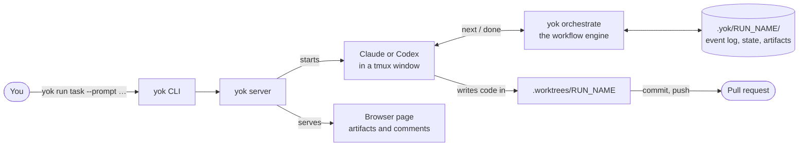

# What Yok is, in 60 seconds

Yok takes a task and a coding agent, and walks the agent through a workflow of stages until a pull request is open. It checks each stage's result with code, records everything that happens, and keeps the agent moving when nobody is watching.

It is a harness builder more than a harness. The engine knows nothing about software. It knows nodes, dependencies, inputs, outputs, and events. The shipped `task` workflow and its skills are one harness built on it. You can build another.

## The one picture

## The five things to know

**You type one command.** `yok run task --prompt "…"` in your repo. Everything else is automatic until a stage needs your answer or your approval.

**A workflow is a YAML file of nodes.** The shipped one, `task`, has twelve: fetch the ticket, make a worktree, record a baseline, design, plan, implement, review, QA in a loop, commit, open the PR, run a retro. You can write your own.

**Most nodes are stages, and a stage is a skill with a contract.** A skill is a folder with a `SKILL.md` the agent reads. The contract, in its frontmatter, says what the stage takes, what it must return, which files it must produce, and which checks must pass before it counts as done.

**The agent asks for one step at a time.** It runs `yok orchestrate next`, gets one card back, does the work, and reports with `yok orchestrate done`. The engine decides what the next card is. The agent never sees the whole plan.

**Everything is written down as events.** Every start, finish, rejection, hook call, and comment is a line in `event.jsonl`. The run's current state is computed from that log, never edited by hand. Delete the state file and it comes back.

## What you get at the end

- A branch in a worktree under `.worktrees/`, with tidy conventional commits.
- An open pull request with a visual change outline and a proof report.
- A folder `.yok/RUN_NAME/` holding the design, the plan, the baseline, the QA proof, and the full event log.
- A retro report that says what the harness itself should do better next time.

## What you need on your laptop

Bun, tmux, git, and the agent CLI you use. The release build is one binary with no other runtime. The setup page has the exact steps: [Setup and first run](07-setup-and-first-run.md).

## Where to go next

- Want the reasons behind the design: [Core principles](03-core-principles.md).
- Want to see the pieces and which folder holds each: [Architecture](04-architecture.md).
- Want to watch one run go through, hop by hop: [One task, end to end](05-one-task-end-to-end.md).
