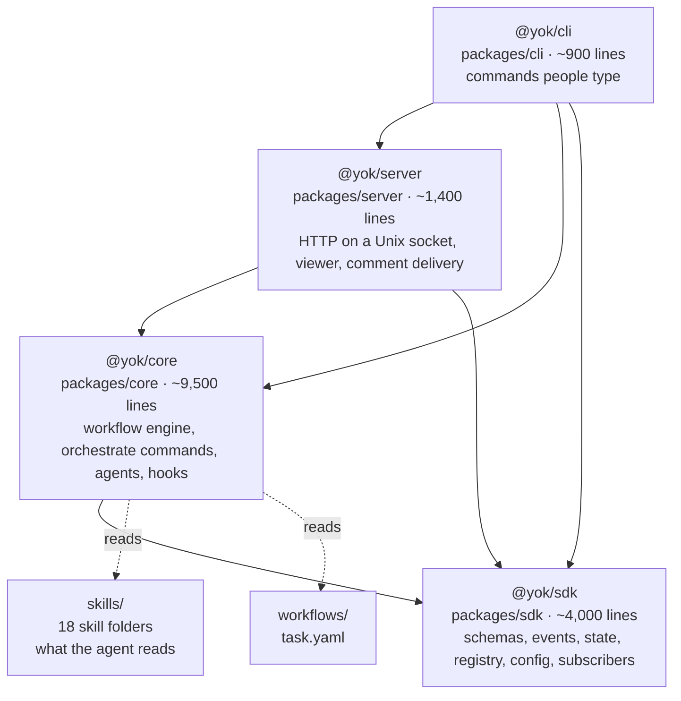
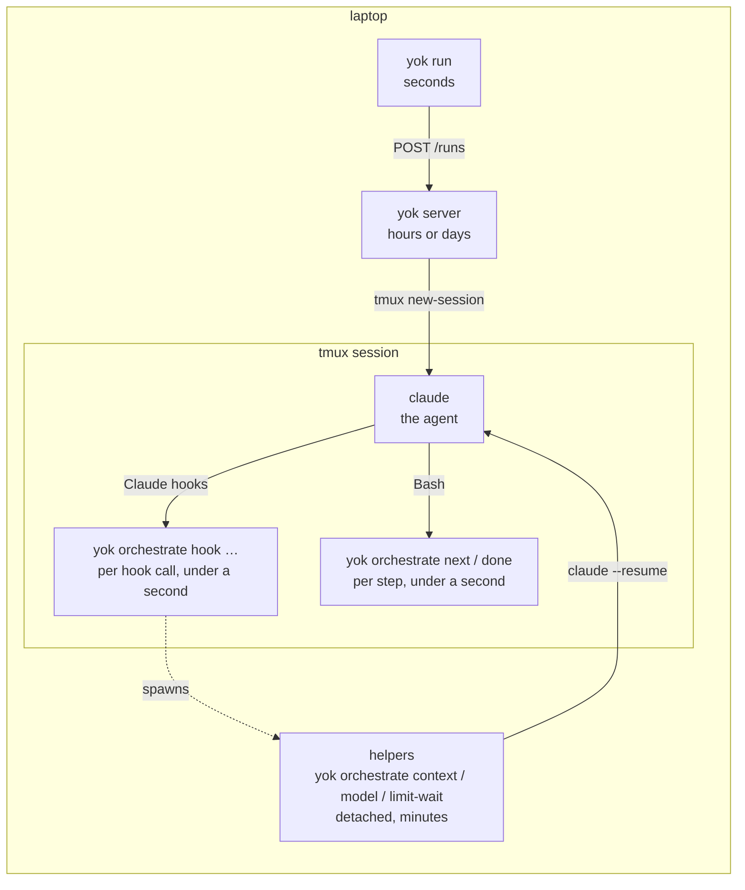

# Architecture

Yok is one program, four packages, a folder of skills, and a few files on disk. This page names each piece, says what it owns, and shows the lines between them. Read it with the repo open.

## The packages

Arrows point from the package that imports to the package it imports. The direction never reverses: `sdk` imports nothing of ours, `core` never imports `server`, and `server` never imports `cli`.

### `@yok/sdk`: the vocabulary

Everything two other parts must agree on lives here. The Zod schemas for config, workflow runs, events, state, and stage outputs. The event store that appends to `event.jsonl` and folds into `state.json`. The registry of runs. The subscriber runner. Small helpers for git, processes, files, env, and logging. It depends only on `zod` and `yaml`.

It has two entry points, by design. `@yok/sdk` is a short curated list for people writing verifiers, subscribers, and schema files in their own projects. `@yok/sdk/internal` is everything the engine needs and extension authors should not touch. A test, `boundaries.test.ts`, keeps the public list honest. The reasoning is in [ADR 0003](../adr/0003-sdk-public-entry-is-curated-engine-behind-internal.md).

| Where | What |
|---|---|
| `contracts.ts` | the State, NodeRun, Event, and Stage port schemas |
| `events.ts` | every event type, and the built-in handler that folds each one into state |
| `state.ts` | `appendRunEvent`, `readState`, the fold, the atomic write |
| `registry.ts` | `registry.json`, `yokHome`, the run record |
| `config.ts` | `orchestrate.config.yaml`, tiers, extensions, subscribers |
| `subscribers.ts` | calls a subscriber, blocking or detached, and records the call |
| `verifier.ts` | what a verifier receives and must return |

### `@yok/core`: the engine

The biggest package, and the one you will edit most.

| Where | What |
|---|---|
| `workflow/compile.ts` | YAML to plan: resolves stages, checks ids and dependencies, loads output schemas |
| `workflow/next.ts` | `decideNext`: walks the plan against state and picks the next leaf, writing start and skip events |
| `workflow/done.ts` | the gates a `done` must pass: output schema, artifacts, consumed artifacts |
| `workflow/verifiers.ts` | runs a stage's verifiers, as a function or a script |
| `workflow/evaluate.ts` | the `{{ … }}` expression language |
| `workflow/exec.ts` | runs an exec node's script or function |
| `runs.ts` | init, next, exec, done as operations on a run folder; the StepReply the agent sees |
| `orchestrate.ts` | the `yok orchestrate …` command tree: every action a skill may take |
| `stage.ts` | finds skills, parses `SKILL.md` frontmatter, applies a project's extensions |
| `agents/` | Claude and Codex providers, the tmux host, and the hook settings each agent needs |
| `hooks/` | the handlers behind each agent hook: link-session, continue-workflow, record-guard, and friends |
| `context-step.ts` | new-session and compact steps, and the model switch |
| `limit-wait.ts` | pausing a run until a usage limit resets |
| `comments.ts` | `comments.json` and replies |
| `doctor.ts` | the machine, repo, and config checks |
| `notifier.ts` | the built-in Slack subscriber |

### `@yok/server`: the one long-lived process

A Hono app on a Unix socket in the yok home. Two routes matter: `GET /health` and `POST /runs`. It also serves the viewer page for each run, streams the run's files to it, stores comments, and types them into the run's tmux session when the agent's input box is free. It is the only process that launches agent sessions. It is started on demand by the CLI and stays up until stopped.

### `@yok/cli`: commands for people

`run`, `doctor`, `attach`, `view`, `verify`, `types`, `plugin install`, `update`, `server start|stop|status`, `claude`, `codex`. Each one parses flags, maybe calls `ensureServer()`, calls one route or one core function, and prints. The `orchestrate` subtree is mounted here too, but it is core's code. The whole binary is built from `packages/cli/src/index.ts`.

### `skills/`: what the agent reads

Eighteen folders. Each has a `SKILL.md`. The ones with a stage contract in their frontmatter can run as workflow nodes: ticket-fetcher, create-workspace, baseline, design, planning, implement, code-review, qa, git-commit, visual-pr, retro. The rest are helpers the stages load or people call directly: code-quality, tdd, refactor, writing-style, adr, resolve-merge-conflict, and orchestrate itself.

A skill's scripts live beside it, declared as references, and run through `yok orchestrate skill run STAGE.REF`. That indirection is what lets a project replace a script without touching the skill.

### `workflows/`: the shipped graphs

One today: `task.yaml`. `demo-workflows/` holds smaller ones used by tests and for trying things: `step-demo` runs only exec nodes, `kitchen-sink` uses every node type, `context-demo` exercises session resets.

## The processes at run time

Every box is the same binary. Only the CLI and the hooks are short-lived. The server is one per yok home. The agent is one per run, in its own tmux session, and it outlives the server if the server is stopped.

## The files on disk

| Path | Owner | What |
|---|---|---|
| `~/.yok/` or `~/.yok-dev/` | server, CLI | the yok home: `registry.json`, `yok.sock`, `server.pid`, `server.log`, `shims/` |
| `REPO/.yok/RUN_NAME/` | orchestrate | `workflow.yaml`, `event.jsonl`, `state.json`, `comments.json`, `artifacts/` |
| `REPO/.worktrees/RUN_NAME/` | create-workspace stage | the git worktree the code is written in |
| `REPO/orchestrate.config.yaml` | you | packages, commands, tiers, extensions, subscribers, workspace, notifier |
| `REPO/.env` | you | secrets a run's env starts with |
| `REPO/.yok/types/` | `yok types` | SDK type files for your editor |

The release binary and the dev build never share a home, so they never share a server or a registry. `YOK_HOME` overrides either.

## Where to look when you want to change something

| You want to | Go to |
|---|---|
| change what a stage does | `skills/STAGE/SKILL.md` and its `references/` |
| change what a stage must return or produce | that `SKILL.md`'s frontmatter, and its `scripts/*.ts` schemas export |
| change the order of stages | `workflows/task.yaml` |
| add an action a skill can take on a run | a subcommand in `packages/core/src/orchestrate.ts`, logic in `runs.ts` |
| add a command a person types | `packages/cli/src/NAME.ts`, registered in `index.ts` |
| change how the next node is chosen | `packages/core/src/workflow/next.ts` |
| change what `done` accepts | `packages/core/src/workflow/done.ts`, `verifiers.ts` |
| add a fact to the record | an event type and its handler in `packages/sdk/src/events.ts`, maybe a field in `contracts.ts` |
| change how the agent is launched or hooked | `packages/core/src/agents/claude.ts`, `claude-hooks.ts` |
| change what a hook decides | `packages/core/src/hooks/*.ts` |
| change what the doctor checks | `packages/core/src/doctor.ts` |
| change the browser page | `packages/server/src/viewer.ts`, `viewer.html` |

Next: [One task, end to end](05-one-task-end-to-end.md).
