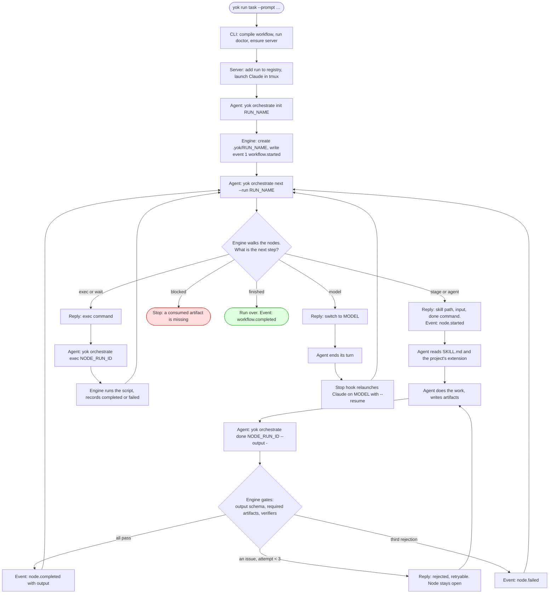

# One task, end to end

This page follows one real run from the moment you type `yok run` to the moment a pull request opens. Every hop names the code that does it, so you can open the file and see for yourself.

The example throughout:

```bash
cd ~/code/my-app
yok run task --prompt "Add a --json flag to the doctor command"
```

`task` is the workflow Yok ships at [workflows/task.yaml](../../workflows/task.yaml). It has twelve nodes. The run takes about an hour. We will not read every stage's instructions. We will watch how the pieces hand work to each other, because that is the same for every stage.

## The five players

| Player | What it is | Where it lives |
|---|---|---|
| **The `yok` CLI** | The command you type. Checks your machine, then asks the server for a run. | `packages/cli` |
| **The yok server** | One small HTTP server per machine, on a Unix socket. Starts agent sessions, keeps the list of runs, serves the viewer page. | `packages/server` |
| **The agent session** | A Claude Code (or Codex) conversation running inside a tmux window. It does the actual work. | started by `packages/core/src/agents` |
| **The orchestrate commands** | `yok orchestrate init`, `next`, `done`. The agent calls these to ask "what now?" and to report "finished". They are the workflow engine. | `packages/core/src/orchestrate.ts`, `runs.ts`, `workflow/` |
| **The run folder** | `.yok/RUN_NAME/` inside your repo. The event log, the current state, and every file a stage produced. | written by `packages/sdk` |

One point to hold on to: the CLI, the server, and the orchestrate commands are the **same binary**. `yok run` is a person calling it. `yok orchestrate next` is the agent calling it. The server is it running in the background. There is no second program to install.

```mermaid
sequenceDiagram
    participant You
    participant CLI as yok run
    participant Server as yok server
    participant Agent as Claude in tmux
    participant Orch as yok orchestrate
    participant Disk as .yok/RUN_NAME/

    You->>CLI: yok run task --prompt "…"
    CLI->>CLI: compile workflow, run doctor
    CLI->>Server: POST /runs
    Server->>Disk: registry.json gets run r-1a2b3c4d
    Server->>Agent: tmux new-session claude "/yok:orchestrate --workflow … --inputs …"
    Server-->>CLI: run id, attach command, view URL
    CLI-->>You: prints them, opens the browser

    Agent->>Orch: init add-json-flag-to-doctor
    Orch->>Disk: create folder, state.json, event #1 workflow.started
    loop until finished
        Agent->>Orch: next --run add-json-flag-to-doctor
        Orch->>Disk: read state + events, decide, write node.started
        Orch-->>Agent: {kind: stage, skill: …/SKILL.md, input, done: "yok orchestrate done nr-… --run …"}
        Agent->>Agent: read the skill, do the work
        Agent->>Orch: done nr-… --output - <<'OUT' … OUT
        Orch->>Disk: check output, artifacts, verifiers; write node.completed
        Orch-->>Agent: {status: completed}
    end
    Orch-->>Agent: {kind: finished, status: completed}
```

## The loop, step by step

The sequence above is the whole run. This is the loop inside it, the part that repeats for every node. Read it once now and come back to it after hops 4 and 5.



Two things the picture makes plain. First, every arrow back to `next` goes through a recorded event, so the engine always knows where the run stands. Second, the agent box never holds the workflow. It holds one card at a time.

## Hop 1. The CLI gets ready

[packages/cli/src/run.ts:53](../../packages/cli/src/run.ts#L53) is where `yok run` starts work. Before it talks to anyone, it does four things in your terminal.

**It finds the workflow file.** A bare name like `task` means one of Yok's own workflows. A name with a slash or a `.yaml` ending means a file in your project. The rule is six lines at [packages/core/src/stage.ts:164](../../packages/core/src/stage.ts#L164).

**It compiles the workflow.** [compileWorkflow](../../packages/core/src/workflow/compile.ts#L531) reads the YAML and turns it into a plan. It checks that every `stage:` names a skill that exists and that every `dependsOn` points at a real node. A typo in the YAML fails here, in a second, not forty minutes in.

**It runs the doctor.** [runDoctor](../../packages/cli/src/run.ts#L62) checks tmux, the agent binary, the Yok plugin, and whatever the workflow asked for in its `doctor:` block. For `task` that is `LINEAR_API_KEY`, `bun`, and `gh`. One failing check prints `BLOCKED` with the fix and stops.

**It makes sure the server is up.** [ensureServer](../../packages/cli/src/client.ts#L101) calls `GET /health` on the socket at `~/.yok-dev/yok.sock` (or `~/.yok/yok.sock` for the release binary). No answer means no server, so it spawns `yok server start` detached and waits up to five seconds for health. A file lock stops two CLIs from starting two servers.

Then it sends one request: `POST /runs` with the workflow name and path, the inputs, your repo root, the agent to use, the environment, and the model tiers.

## Hop 2. The server starts the run

[startRun](../../packages/server/src/run.ts#L35) handles that request. It is the only route a run needs.

1. It mints a run id, `r-` plus eight hex characters, for example `r-1a2b3c4d`.
2. It writes the run into `registry.json` at [run.ts:71](../../packages/server/src/run.ts#L71). The name is still `null`. The agent will pick one.
3. It builds the session's environment at [run.ts:79](../../packages/server/src/run.ts#L79): `YOK_RUN_ID=r-1a2b3c4d`, `YOK_HOME`, and a `PATH` whose first entry is a shim folder, so that plain `yok` inside the session means the same program that launched it. That is [ADR 0012](../adr/0012-skills-call-plain-yok-a-per-program-path-shim-picks-the-program.md).
4. It launches Claude in a new tmux session. The launch args, built by [claudeArgs](../../packages/core/src/agents/claude.ts#L122), carry a `--settings` JSON that registers Yok's hooks: SessionStart, Stop, StopFailure, PreToolUse, PostToolUse, and the status line. Every hook is just `yok orchestrate hook …` run as a subprocess.
5. The first message to Claude is the orchestrate skill with its arguments, from [run.ts:78](../../packages/server/src/run.ts#L78):

```
/yok:orchestrate --workflow /…/workflows/task.yaml --inputs {"prompt":"Add a --json flag to the doctor command","environment":"default"}
```

The server replies with the run, an attach command, and a view URL. The CLI prints them and opens the viewer in your browser:

```
r-1a2b3c4d
yok-dev attach --run-id r-1a2b3c4d
view: http://127.0.0.1:PORT/runs/r-1a2b3c4d
```

If Claude fails to launch, the server deletes the registry entry again. A run that never started leaves nothing behind.

## Hop 3. The session wakes up and names the run

Two things happen before the agent does any work.

**The SessionStart hook fires.** [linkSession](../../packages/core/src/hooks/session-start.ts#L7) reads `YOK_RUN_ID` from the environment and writes Claude's session id into the registry. From now on the Stop hook can find this run from this session.

**The agent reads the orchestrate skill.** [skills/orchestrate/SKILL.md](../../skills/orchestrate/SKILL.md) is the whole protocol the agent follows. Its Step 1 says: pick a short kebab-case name from the prompt and run `init`.

```bash
yok orchestrate init add-json-flag-to-doctor
```

[initializeRun](../../packages/core/src/runs.ts#L305) and [fillRunDir](../../packages/core/src/runs.ts#L190) do the setup:

- Create `.yok/add-json-flag-to-doctor/` in your repo.
- Copy `task.yaml` in as `workflow.yaml`. The run keeps its own copy, so editing the shipped file later cannot change a run in flight.
- Write the first `state.json`, with the tiers the server resolved and the config file it was started with.
- Append event number one, `workflow.started`, to `event.jsonl`.
- Record the name in `registry.json` and rename the tmux window to `claude-add-json-flag-to-doctor-3c4d`.

It prints `{"runId":"r-1a2b3c4d","dir":"/…/.yok/add-json-flag-to-doctor"}`. The agent tells you the folder and moves to Step 2.

## Hop 4. `next`: asking what to do

Step 2 is a loop. It begins with:

```bash
yok orchestrate next --run add-json-flag-to-doctor
```

This is the heart of the engine, so slow down here.

[walkToNextStep](../../packages/core/src/runs.ts#L520) reads `state.json` and `event.jsonl`, recompiles `workflow.yaml`, and hands all of it to [decideNext](../../packages/core/src/workflow/next.ts#L554). `decideNext` walks the nodes top to bottom. For each one, [decideStart](../../packages/core/src/workflow/next.ts#L227) asks three questions:

1. Are all its `dependsOn` nodes completed?
2. Is its `when:` expression true, or absent?
3. If it is a stage, does every artifact it `consumes` exist from an earlier node?

The first node that passes and has not run yet is the answer. Its `input:` block is filled in by [resolveValue](../../packages/core/src/workflow/evaluate.ts#L277), which replaces every `{{ … }}` with a value from the inputs or from an earlier node's output. Then [recordStart](../../packages/core/src/workflow/next.ts#L293) appends a `workflow.node.started` event, and `next` prints the step.

For our run the first node is `ticket-fetcher`. It has no dependencies and its input is `request: "{{ inputs.prompt }}"`. The reply:

```json
{
  "kind": "stage",
  "nodeRunId": "nr-5e6f7a8b9c0d1e2f",
  "nodeId": "ticket-fetcher",
  "stage": "ticket-fetcher",
  "skill": "/…/skills/ticket-fetcher/SKILL.md",
  "extension": null,
  "input": { "request": "Add a --json flag to the doctor command" },
  "variables": { "provider": "auto" },
  "done": "yok orchestrate done nr-5e6f7a8b9c0d1e2f --run add-json-flag-to-doctor"
}
```

The shape is [StepReply](../../packages/core/src/runs.ts#L337), built by [buildLeafReply](../../packages/core/src/runs.ts#L482). Notice what is in it: the exact file to read, the exact data to work on, and the exact command to run when finished. The agent does not have to know the workflow, only this one card.

Notice also what is *not* anywhere: a process holding the run in memory. `next` rebuilt everything from files and exited. If the session crashes, gets compacted, or is replaced, the next `next` gives the same answer. That is the decision in [ADR 0002](../adr/0002-session-drives-workflow-step-by-step-through-stateless-orchestrate-commands.md), and it is why a run can survive a laptop reboot.

## Hop 5. The agent does the stage, then `done`

The agent reads the file at `skill`. A stage's `SKILL.md` has two parts. The frontmatter is its **contract**, parsed by [StageSchema](../../packages/core/src/stage.ts#L75): its tier, the tools it may use, the artifacts it produces and consumes, the schema its output must match, and its verifiers. The body is the instructions.

If your project has an **extension** for this stage in `orchestrate.config.yaml`, `next` would have set `extension` to that file's path, and the agent reads it second. Where the two disagree, the extension wins. That is how a project changes a shipped skill without forking it.

For `ticket-fetcher` with a plain prompt, the work is small: the prompt is the task. The skill says to report it as JSON, so the agent runs the `done` command from the card, with the output on stdin in a quoted heredoc:

```bash
yok orchestrate done nr-5e6f7a8b9c0d1e2f --run add-json-flag-to-doctor --output - <<'OUT'
{ "task": "Add a --json flag to the doctor command" }
OUT
```

[finishStep](../../packages/core/src/runs.ts#L869) and [recordStepEnd](../../packages/core/src/runs.ts#L658) take it from there. Before anything is accepted, [checkCompletion](../../packages/core/src/runs.ts#L774) runs three gates:

| Gate | What it checks | Code |
|---|---|---|
| Output schema | The JSON matches the stage's declared `outputs.schema`. For this stage that is `ticket-fetcher.output.v1`, defined by the skill's own script. | [findDefaultIssues](../../packages/core/src/workflow/done.ts#L138) |
| Artifacts | Every artifact the stage `produces` and did not mark optional was passed with `--artifact NAME=artifacts/FILE`, and each file really exists inside `.yok/RUN_NAME/artifacts/`. | same |
| Verifiers | Each verifier the stage declares runs and reports no findings. | [verifiers.ts](../../packages/core/src/workflow/verifiers.ts) |

Any gate failing means [rejectDone](../../packages/core/src/runs.ts#L840): the node stays open, `done` exits non-zero, and its JSON names each issue with `retryable: true`. The agent fixes the work and calls `done` again with the same node run id. The third rejection fails the node for good.

When all gates pass, `done` appends `workflow.node.completed` with the output and artifacts, and prints:

```json
{ "nodeRunId": "nr-5e6f7a8b9c0d1e2f", "nodeId": "ticket-fetcher", "status": "completed", "attempts": 1 }
```

The agent logs `✓ ticket-fetcher completed` and goes back to `next`.

## Hop 6. How data moves between stages

There is no message bus. Nodes talk through two things, both on disk.

**Outputs.** The second node's input is `request: "{{ nodes.ticket-fetcher.output.task }}"`. When `next` reaches `create-workspace`, it reads the ticket-fetcher node run from `state.json`, takes `.output.task`, and puts the string into the new card. Later nodes do the same with `{{ nodes.create-workspace.output }}`, which is the whole workspace object: layout, branch, folder, and repos.

**Artifacts.** Larger things go in files. The `design` stage writes `artifacts/design.md` and passes `--artifact design=artifacts/design.md` to `done`. The `planning` stage declares `consumes: [design]`. Before `planning` can start, `decideStart` checks that some completed node listed an artifact named `design`. [findConsumedArtifacts](../../packages/core/src/workflow/done.ts#L169) picks the newest one when several did. If none did, `next` replies `{"kind": "blocked", "stage": "planning", "missing": ["design"]}` and the agent stops and tells you.

This is why artifacts are declared in the contract and not just written to disk. The engine can refuse to start a stage whose inputs do not exist yet.

## Hop 7. The twelve nodes, in order

Every node in `task.yaml` goes through hops 4 and 5 the same way. Here is what each one hands the next.

| Node | Stage | Tier | Takes | Gives |
|---|---|---|---|---|
| `ticket-fetcher` | ticket-fetcher | fast | your prompt | `task` text, maybe a `ticket` artifact |
| `create-workspace` | create-workspace | fast | the task | branch, worktree folder, repos |
| `baseline` | baseline | fast | nothing | `baseline` artifact: test and lint numbers before any change |
| `design` | design | deep | the task | `design` artifact |
| `planning` | planning | deep | task, workspace, consumes `design` | `plan` artifact |
| `implement` | implement | deep | workspace, consumes `plan` | `implementation` artifact, commits in the worktree |
| `code-review` | code-review | deep | workspace | review findings, fixes applied |
| `qa-loop` | loop of `fix` + `qa` | deep | workspace, task | `status` of PASS, FAIL or BLOCKED, `bugs` |
| `commit` | git-commit | deep | workspace | tidy commits, only if qa was not BLOCKED |
| `pr` | visual-pr | deep | workspace, task, consumes `plan` and `proof-report` | the open pull request |
| `retro` | retro | deep | nothing | a report of what the harness itself got wrong |

Three nodes do something the others do not.

**`qa-loop` is a loop node.** Its children are `fix` and `qa`. `fix` has `when: "{{ iteration.index > 1 }}"`, so on the first pass `next` records it as skipped and hands out `qa` straight away. If `qa` reports `FAIL`, the loop's `until` is false, so the next pass runs `fix` with `feedback: "{{ iteration.previous.bugs }}"`, then `qa` again. It stops after a pass that is not `FAIL`, or after four passes.

**`commit` has a `when`.** `"{{ nodes.qa-loop.output.status != 'BLOCKED' }}"`. BLOCKED means qa could not verify at all, so nothing is published. The node is skipped, and because `pr` depends on `commit`, `pr` is skipped too.

**`retro` has `always: true` and `allowFailure: true`.** It runs even when an earlier node failed, so a broken run still gets audited. If retro itself fails, the run's status does not change. That is [ADR 0008](../adr/0008-a-node-marked-always-still-starts-after-an-earlier-failure.md).

## Hop 8. Changing the model between stages

`ticket-fetcher` is tagged `tier: fast`. `design` is tagged `tier: deep`. Built in, `fast` is Sonnet and `deep` is Opus at high effort, from [config.ts:69](../../packages/sdk/src/config.ts#L69). Your `orchestrate.config.yaml` can override either.

The session is running on one model. So when `next` is about to hand out `design` and the session is on the fast model, it does not hand out the stage. It replies:

```json
{ "kind": "model", "nodeId": "design", "model": "claude-opus-5-5", "effort": "high" }
```

The skill tells the agent to log `⇄ design: claude-opus-5-5` and end its turn with no other command. Ending the turn fires the Stop hook. The hook sees a pending switch and starts a helper that restarts Claude on the new model with `claude --resume`, keeping the whole conversation. The resumed session receives `/yok:orchestrate --resume add-json-flag-to-doctor` and goes back to `next`, which now hands out `design`. The full design is [ADR 0009](../adr/0009-a-stage-tier-switches-the-live-claude-session-model-between-stages.md).

Codex does not switch. It runs the whole workflow on its launch model.

## Hop 9. The safety net: the Stop hook

Agents drift. They finish a step and forget to report it, or they answer you and wait, or they declare victory early. The Stop hook is what keeps a run moving without a person watching.

Every time Claude tries to end its turn, [runStopHook](../../packages/core/src/hooks/stop.ts#L229) runs. [decideStop](../../packages/core/src/hooks/stop.ts#L137) reads the run's state and answers one question: is the agent allowed to stop?

| State of the run | Decision |
|---|---|
| Status is not `running` | Allow. The run is over. |
| A context or model node is waiting for the turn to end | Allow, and start that switch. |
| A stage or exec node is still open | Send the agent back with the exact `done` or `exec` command it owes. |
| Between nodes, and the agent ran no orchestrate command since your last message | Allow. You were chatting with it. |
| Between nodes, and it did run orchestrate commands | Send it back: "run `yok orchestrate next --run …`". |

It sends the agent back at most once in a row by default. If the agent stops again at the same spot with no progress, the hook records `agent.stuck` and lets the turn end, so a confused agent cannot loop forever. Every hook call is itself an event, `hooks.stop.called`, so you can read later why a turn was or was not allowed to end.

A second hook guards the records. [recordGuard](../../packages/core/src/hooks/pre-tool-use.ts#L61) is a PreToolUse hook that refuses any tool call writing to `state.json`, `event.jsonl`, or `registry.json`. The agent may read them. Only `next`, `exec`, and `done` may write them.

## Hop 10. The end

After `retro` reports, the agent runs `next` once more. `decideNext` walks all twelve nodes and finds every one completed or skipped. It appends `workflow.completed` and replies:

```json
{ "kind": "finished", "status": "completed" }
```

The agent tells you the run finished and stops. The Stop hook sees status `completed` and allows it. The tmux session stays open, so you can attach and read the conversation. The viewer still serves the run's artifacts, and a comment you leave there is typed into that tmux session by the server, which is how you talk to a finished or paused run.

## What is on disk afterwards

```
~/code/my-app/
  .yok/
    add-json-flag-to-doctor/
      workflow.yaml        the run's own copy of task.yaml
      event.jsonl          every event, one JSON line each, in order
      state.json           the current picture, rebuilt from the events
      comments.json        comments left in the viewer
      artifacts/
        baseline.json
        design.md
        plan.md
        phases/phase-1.md
        implementation.md
        verification/proof-report.html
        retro.md
  .worktrees/
    add-json-flag-to-doctor/   the git worktree the code was written in

~/.yok-dev/                    or ~/.yok for the release binary
  registry.json                every run on this machine, with its sessions and tmux name
  yok.sock                     the server's socket
  server.log
  shims/HASH/yok               the PATH shim from hop 2
```

## Events are the truth, state is a summary

Everything above wrote events: `workflow.started`, `workflow.node.started`, `orchestrate.next`, `workflow.node.completed`, `hooks.stop.called`, and so on. The full list is in [events.ts](../../packages/sdk/src/events.ts#L463). Each event has a sequence number, a timestamp, a type, a source, and a payload.

`state.json` is never written by hand. [appendRunEvent](../../packages/sdk/src/state.ts#L297) takes a file lock, appends the event, then folds it into the state with [applyEvent](../../packages/sdk/src/state.ts#L33) and writes `state.json` atomically. Delete `state.json` and the engine can rebuild it from `event.jsonl`. The reverse is not true.

Right after an event is stored, its **subscribers** run. A subscriber is a function or shell command your config or workflow attaches to an event type. The built-in Slack notifier is one. Subscribers only observe. None of them can stop or change the run. That is [ADR 0005](../adr/0005-a-subscriber-is-a-module-export-or-shell-command-from-config-and-workflow.md) and [ADR 0006](../adr/0006-the-sdk-calls-an-events-subscribers-right-after-storing-it.md).

The first eight events of our run, trimmed:

```
1  workflow.started          orchestrate   inputs, workflow name
2  orchestrate.next          orchestrate   the reply it printed
3  workflow.node.started     workflow      ticket-fetcher, nr-5e6f…, input
4  hooks.pre-tool-use.called hooks         a hook checked one of the agent's tool calls
5  orchestrate.done          orchestrate   nodeRunId, output, artifacts
6  workflow.node.completed   workflow      ticket-fetcher, output
7  orchestrate.next          orchestrate
8  workflow.node.started     workflow      create-workspace, input resolved from event 6
```

## The one rule to remember

**The engine decides and records. The agent only performs.**

`next` evaluates `when`, `dependsOn`, loops, switches, and templates, and writes the start event. `done` validates and writes the end event. The agent never sees the workflow as a whole. It reads one card, does one piece of work, reports it, and asks for the next card. Every piece of state lives in files, so any process can pick up where another left off.

When you add a stage, a node type, or a hook, ask where it falls on that line. Deciding goes in `packages/core/src/workflow`. Performing goes in a skill. Recording goes through `appendRunEvent` and nowhere else.
