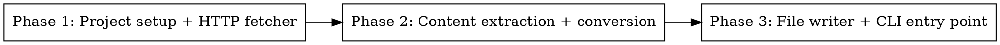

# Plan: Web Page to Markdown Converter

> **Source:** docs/spec/web-page-to-markdown/spec.md
> **Created:** 2026-03-23
> **Status:** planning

## Goal

Deliver a Python CLI tool (`url2md`) that converts any web page URL into a clean markdown file.

## Acceptance Criteria

- [ ] `url2md https://example.com` fetches, extracts main content, converts to markdown, saves to file
- [ ] All 11 REQ requirements pass their acceptance criteria
- [ ] All 11 EDGE cases handled correctly
- [ ] Type-checked with mypy (strict), linted with ruff
- [ ] Tests pass with pytest

## Codebase Context

### Existing Patterns to Follow
- **Greenfield** — no existing patterns. Follow CLAUDE.md preferences: small focused functions, early returns, strict type hints, functional style.

### Project Structure
- `url2md.py` — single module with all logic
- `test_url2md.py` — all tests
- `pyproject.toml` — project config, dependencies, entry point

### Test Infrastructure
- **Framework:** pytest
- **Mocking:** `unittest.mock` / `responses` library for HTTP mocking
- **Run:** `pytest test_url2md.py -v`

## Phase Graph

