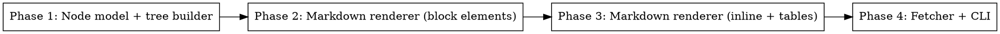

# Plan: Web Page to Markdown Converter

> **Source:** docs/spec/web-to-markdown-converter/spec.md
> **Created:** 2026-03-23
> **Status:** planning

## Goal

Build a Python CLI tool that fetches a web page and converts it to clean Markdown using only stdlib, with a custom tree-based HTML parser.

## Acceptance Criteria

- [ ] `python -m web2md https://example.com` outputs valid Markdown to stdout
- [ ] `python -m web2md https://example.com -o output.md` writes to file
- [ ] All 25 REQ and 16 EDGE test cases pass
- [ ] Zero third-party runtime dependencies (pytest is dev-only)
- [ ] Type checks pass with mypy

## Codebase Context

### Existing Patterns to Follow
- Greenfield project — no existing patterns. Follow CLAUDE.md: flat structure, small focused functions, early returns, type hints everywhere.

### Test Infrastructure
- **Runner:** pytest
- **Command:** `pytest tests/`
- **Structure:** `tests/` folder with `test_*.py` files

## Phase Graph

