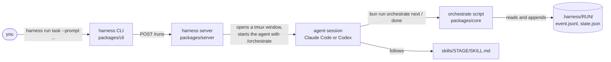
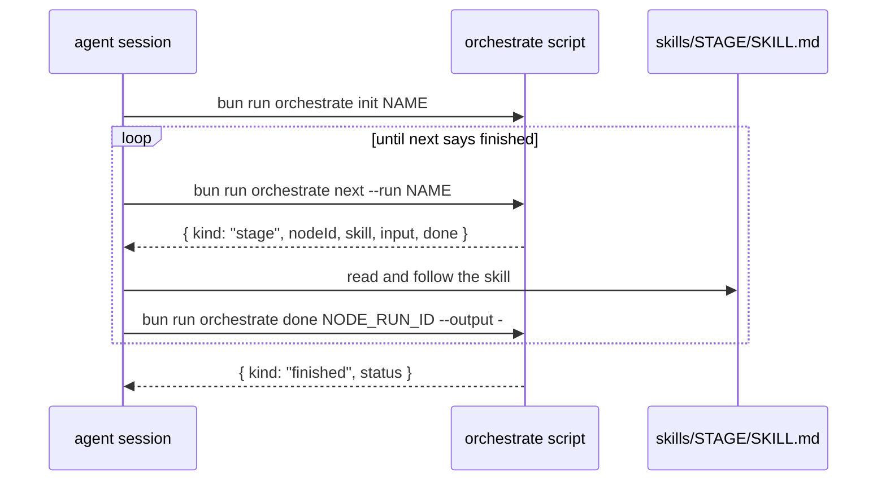

# 1. The 30-second model

[Index](README.md) · Next: [Repo map](02-repo-map.md)

Here is the whole thing in one breath.

You type `harness run task --prompt "add rate limiting"`. The harness opens a Claude Code (or
Codex) session in a tmux window. That session reads a list of stages from a YAML file and does
them one at a time: fetch the ticket, make a branch, design, plan, write the code, review it, test
it, commit, open a PR. The harness itself writes no code. Its job is to keep the session on the
list and to remember where it got to.

Four parts do this.

**The CLI** is the thing you type. `harness run` reads the workflow file, runs a few health
checks, starts the server if it is not running, and asks the server to start a run. Then it
prints the run id and quits. Pass `--attach` and it drops you into the session instead.

**The server** keeps the sessions alive. The CLI exits right away, so someone has to own the tmux
windows. The server opens one and starts Claude Code or Codex in it with `HARNESS_RUN_ID` set.
The first prompt, `/orchestrate --workflow ...`, goes in as a command-line argument, so the session
starts on it. The server also serves the run's web page and types
review comments from that page into the session.

**The orchestrate script** decides what happens next. The session never guesses. It runs
`bun run orchestrate next`, and the script reads the run's state from disk, picks the next node
that can start, writes down that it started, and prints one JSON reply. The session does what the
reply says, then runs `done` with the result. Nothing is kept in memory between calls. If the
session crashes, you resume it and it just asks `next` again.

**The skills** are the stages. Every folder under `skills/` is one stage. Inside is a `SKILL.md`
the session reads and follows, plus any scripts it calls. The YAML says which stage each node
uses. The script does not know what `planning` does. It only knows what goes in, what should come
out, and whether `done` was called.

## It is one loop

Strip everything else away and a run is this:

`next` does not always say `stage`. It can say `exec` (run this shell command), `model` (switch
to a different Claude model first), `blocked` (a file this stage needs is missing), or `waiting`
(something is still running). Section 5 goes through each one.

## Why three programs and not one

This split is the main thing to keep in your head when you add code. It tells you where the
code goes.

- The CLI is for people. A command reads its flags, calls one server route, prints the answer. That is all a command does.
- The orchestrate script is for skills. Anything a skill needs to do to a run is a subcommand here. It talks to core directly and never to the server.
- The server is there because sessions live longer than the CLI call that started them.

So: a skill needs something new, add it to the orchestrate script. A person needs something new,
add it to the CLI. Add a server route only when something outside the session has to reach in.

## Files to open first

| What | Where |
|---|---|
| The command you type | `packages/cli/src/run.ts` |
| Where the server starts the session | `packages/server/src/run.ts` |
| `init`, `next`, `done`, `exec` | `packages/core/src/orchestrate.ts` |
| How `next` picks the node | `packages/core/src/workflow/next.ts` |
| What the session is told to do | `skills/orchestrate/SKILL.md` |
| The default workflow | `workflows/task.yaml` |
| A run's folder on disk | `.harness/RUN_NAME/` |

[Index](README.md) · Next: [Repo map](02-repo-map.md)
