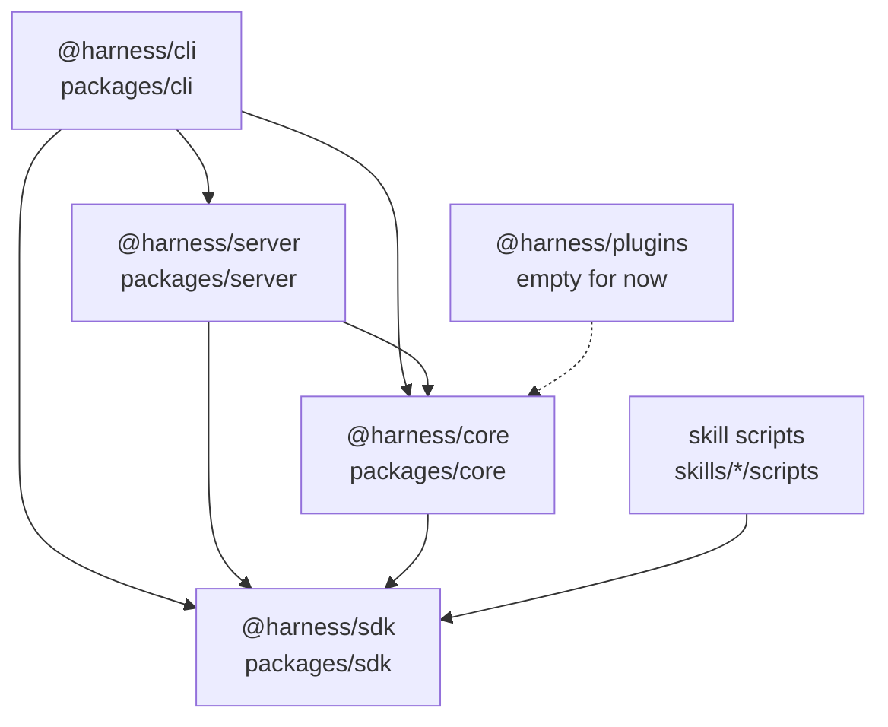

# 2. Repo map

[Index](README.md) · Previous: [The 30-second model](01-thirty-second-model.md) · Next: [Running it locally](03-running-locally.md)

The repo is two things at once. It is a Bun workspace of five TypeScript packages that make up
the harness program, and it is a Claude Code and Codex plugin whose skills live in `skills/`.
Most changes touch one package and maybe one skill.

## Top level

| Path | What it is |
|---|---|
| `packages/` | The five workspace packages: `sdk`, `core`, `server`, `cli`, `plugins`. The root `package.json` lists `packages/*` as its workspaces. |
| `skills/` | One folder per skill. Each holds a `SKILL.md`, and some hold `scripts/`, `references/` and `evals/`. |
| `workflows/` | The workflows the harness ships. Today that is just [task.yaml](../../workflows/task.yaml), the ticket-to-PR pipeline. |
| `demo-workflows/` | Small workflows for trying the engine and for tests, with their own demo stages in `demo-workflows/stages/`. |
| `docs/adr/` | Architecture decision records. Read [INDEX.md](../adr/INDEX.md) first. |
| `docs/walkthrough/` | This walkthrough. Start at [README.md](README.md). |
| `docs/learnings/` | Short code-style lessons from past reviews, such as [naming.md](../learnings/naming.md). |
| `docs/plans/`, `docs/research/` | Design notes and research from earlier work. Both are gitignored (`docs/*` in `.gitignore`), so a fresh clone does not have them. |
| `hooks/` | One Node test, `proof-report-template.test.mjs`, that checks the qa skill's HTML report template. Run it with `bun run test:hooks`. |
| `scripts/` | Repo scripts: `check.ts` (`bun run check`), `version.ts` (`bun run release:version`), `check-release-tag.sh` for the release workflow. |
| `references/` | Codex notes: `codex-tools.md` maps Claude tool names to Codex ones, `codex-config.toml` is the snippet for `~/.codex/config.toml`. |
| `orchestrate.config.yaml` | This repo's own harness config, so the harness can run on itself. See below. |
| `.harness/` | Run folders, one per run, created in whatever repo a run happens in. Gitignored. |
| `.claude-plugin/` | Claude Code plugin manifest (`plugin.json`) and the two marketplaces: `marketplace.json` (stable) and `pre-release/marketplace.json`. |
| `.codex-plugin/` | Codex plugin manifest. Its `"skills": "./skills/"` points Codex at the same skill folder. |
| `.agents/`, `.codex/` | Codex marketplace catalog (`.agents/plugins/marketplace.json`) and Codex subagent roles (`.codex/agents/*.toml`). |
| `.claude/skills/orchestrate` | A symlink to `skills/orchestrate`. It is why `/orchestrate` resolves in a session started in this checkout. `.agents/skills/orchestrate` is the same link for Codex. |
| `.github/workflows/release.yml` | The release workflow. Section 11 covers it. |
| `GLOSSARY.md` | The project's words: workflow, run, node, stage. Use these names in code and docs. |
| `CLAUDE.md`, `AGENTS.md` | Instructions for agents working in this repo. The architecture rules in `CLAUDE.md` apply to you too. |

A few root files are personal tooling rather than harness code: `settings.json` (Claude Code
permissions and status line), `permission-reviewer.sh` (a borrowed permission hook) and
`todo.md` (open ideas).

## How the packages depend on each other

Arrows point from the importer to what it imports. This is the `dependencies` block of each
`packages/*/package.json`, and the imports in `src/` match it.

The sdk sits at the bottom and imports no other package. A test in
[boundaries.test.ts](../../packages/sdk/src/boundaries.test.ts) fails if anything under
`packages/sdk` imports `@harness/core`, so the sdk can install as a library on its own.

`@harness/plugins` declares a dependency on core, but its whole `src/index.ts` is `export {};`.
It was scaffolded with the workspace and nothing imports it yet.

Skill scripts are not workspace packages. They reach `@harness/sdk` through the
`node_modules/@harness/*` symlinks that `bun install` creates at the repo root. They may not
import `@harness/core`: test EH12 in `boundaries.test.ts` checks that. A skill acts on a run
through the orchestrate script or the sdk, nothing else.

## The sdk's two entries (ADR 0003)

`@harness/sdk` has two entry points, set in its `package.json` `exports`:

- `@harness/sdk` is [src/index.ts](../../packages/sdk/src/index.ts). It is the short list for people who write stage scripts, verifiers, event handlers and doctor checks: schemas, `emitRunEvent`, `readState`, `withLock`, `createGit`, the logger, the process helpers.
- `@harness/sdk/internal` is [src/internal.ts](../../packages/sdk/src/internal.ts). It holds the engine's pieces: `createRegistry`, `createState`, `appendRunEvent`, `syncState`, `jsonlEventStore`, `builtInHandlers`, `resolveTiers`. Core, server and cli import from it.

[ADR 0003](../adr/0003-sdk-public-entry-is-curated-engine-behind-internal.md) explains the
split. The code that writes `state.json` stays in the sdk, next to the code that appends to the
event log, so storing an event and updating `state.json` is one call and the two never disagree.
Hiding those writers behind `internal` keeps the public list short.

Tests hold the line. In `boundaries.test.ts`, SC5 compares the public entry's runtime exports
with a fixed list, `PUBLIC_RUNTIME_NAMES`. SC7 fails if a skill script imports
`@harness/sdk/internal` (skill tests may). So when you add an sdk export, you either add its
name to `PUBLIC_RUNTIME_NAMES` or export it from `internal.ts`. Nothing stops core from using
`internal`; that is by design.

## What is in each package

### packages/sdk

Shared types and the run's on-disk records.

- Contracts: `contracts.ts` (Zod schemas shared by everything: `State`, `NodeRun`, `Ticket`, tiers), `events.ts` (every event type and how each one changes state), `config.ts` (the `orchestrate.config.yaml` schema and loaders), `verifier.ts`, `hooks.ts` (agent hook handler types), `agent.ts` (the `IAgentProvider` and `ITerminal` interfaces).
- Run records: `event-store.ts` (the `event.jsonl` store), `state.ts` (append an event and fold it into `state.json` under a lock), `registry.ts` (`~/.harness/registry.json` and `harnessHome()`), `runs.ts` (find a run by name or id, find the config root), `run-hooks.ts` (call the hooks a config or workflow attaches to an event).
- Plumbing: `files.ts` (locks, YAML, frontmatter), `git.ts` (the only file allowed to run `git`, by test SC33), `process.ts` (spawn helpers), `logger.ts`, `env.ts` (builds a run's environment from `.env`, config and workflow), `check.ts` (the doctor's `Check` type and `checkBinary`).

### packages/core

The engine. It reads workflows, runs the orchestrate script, and drives agents.

- The script: [orchestrate.ts](../../packages/core/src/orchestrate.ts) parses the subcommands (`init`, `link-session`, `emit`, `next`, `exec`, `done`, `node show`, `skill ref`, `hook …`, `statusline`, `context`, `model`, `limit-wait`, `comments list`/`reply`). The work behind each one is in [runs.ts](../../packages/core/src/runs.ts): `initializeRun`, `nextStep`, `execStep`, `finishStep`.
- The workflow engine, in `workflow/`: `types.ts` (node schemas), `compile.ts` (YAML to a plan), `next.ts` (pick the next node), `evaluate.ts` (the `{{ }}` expressions), `done.ts` (accept or reject a `done`), `exec.ts` and `executors.ts` (run exec nodes), `verifiers.ts`. Section 5 goes through these.
- Stages: `stage.ts` loads a skill's `SKILL.md` frontmatter and finds skill and workflow folders. `harnessSkillsDir()` and `harnessWorkflowsDir()` point at this checkout's `skills/` and `workflows/`.
- Agents, in `agents/`: `claude.ts` and `codex.ts` launch and prompt each agent in a pane, `claude-hooks.ts` and `codex-hooks.ts` wire that agent's hooks to `orchestrate hook`, `tmux.ts` (plus `tmux.conf`) is the terminal, `claude-limit.ts` reads the usage-limit screen.
- Agent hook handlers, in `hooks/`: `session-start`, `pre-tool-use` (refuses writes to `state.json`, `event.jsonl` and the registry), `post-tool-use`, `stop` (keeps the session on the loop), `stop-failure`. Section 7 covers them.
- Run helpers: `context-step.ts` (`context` nodes: new session or compact), `limit-wait.ts`, `statusline.ts`, `comments.ts`, `notifier.ts` (Slack), `doctor.ts`, `logging.ts` (pino).

### packages/server

A Hono app on a Unix socket, plus a second HTTP server for the run page.

- `server.ts` starts both, writes the pid file, and handles shutdown. `app.ts` holds `/health` and mounts `run.ts`.
- `run.ts` is `POST /runs`: it records the run in the registry, opens the tmux session, starts the agent with `HARNESS_RUN_ID` set, and types `/orchestrate --workflow … --inputs …` as the first message.
- `viewer.ts` and `viewer.html` serve the run page on `127.0.0.1`: files, a live stream, review comments. `delivery.ts` types review comments into the session ([ADR 0004](../adr/0004-harness-server-types-review-comments-into-the-run-tmux-session.md)).
- `client.ts` is the typed client the CLI uses, exported as `@harness/server/client`. `protocol.ts` holds the request schemas and the paths under `HARNESS_HOME`.

### packages/cli

One file per command: `run.ts`, `doctor.ts`, `verify.ts`, `view.ts`, `attach.ts`, `server.ts`
(`server start`, `stop`, `status`). `index.ts` wires them into commander. `client.ts` holds the
shared parts: the logger, `ensureServer()` (start the server if `/health` does not answer), and
opening the browser.

## Skills with their own TypeScript

Most skills are only Markdown. Five also ship scripts with tests, and the root `typecheck`,
`test` and Biome config name each one explicitly:

| Skill | Script | Run it with |
|---|---|---|
| `create-workspace` | `scripts/workspace.ts` makes the run's git worktree | `bun run workspace` |
| `ticket-fetcher` | `scripts/ticket.ts`, `linear.ts`, `asana.ts` fetch the ticket | `bun run ticket`, `bun run linear`, `bun run asana` |
| `baseline` | `scripts/baseline.ts` runs the project's baseline command | `bun run baseline` |
| `qa` | `scripts/qa.ts` is the stage's output schema, `report-media.ts` handles report media | named in the skill's `SKILL.md` |
| `harness-retro` | `scripts/retro.ts` and `transcript.ts` pull the run's transcripts | `bun run retro` |

If you add TypeScript to another skill, add it to the `typecheck` and `test` scripts in the root
`package.json` and to `files.includes` in `biome.json`, or none of the three will see it.

## orchestrate.config.yaml

The harness reads a `version: 2` config from the root of the repo a run happens in. The doctor
fails without one. This repo's [orchestrate.config.yaml](../../orchestrate.config.yaml) is the
config for running the harness on its own code: `baseline: bun run check`, worktrees under
`.worktrees/{{ branch }}` set up with `bun install`, a Slack notifier, and per-package
`typecheck`, `lint` and `test` commands that stages such as `baseline` read.

## .harness/ run folders

Every run gets a folder at `.harness/RUN_NAME/` in the repo it runs in. `runDirOf` in
[events.ts](../../packages/sdk/src/events.ts) builds the path.

| File | What it holds |
|---|---|
| `workflow.yaml` | The copy of the workflow that `init` took. The run follows this copy. |
| `event.jsonl` | The append-only event log, one JSON event per line. |
| `state.json` | The current state, folded from the events. Only `packages/sdk/src/state.ts` may build this path (test EH11). |
| `artifacts/` | Files stages write and hand on, such as `design.md`. |
| `locks/` | Lock folders, so two processes never write at once. |
| `comments.json` | Review comments from the run page. |
| `context.log`, `model.log`, `limit-wait.log` | Logs of the detached helpers, written when they run. |

The `.harness/README.md` in this repo describes an older layout (`knowledge/`, `features/`,
`runtime/`). Trust the code over it.

## Files to open

| What | Where |
|---|---|
| Package dependencies | `packages/*/package.json` |
| What the sdk exports publicly | [packages/sdk/src/index.ts](../../packages/sdk/src/index.ts) |
| The engine's sdk imports | [packages/sdk/src/internal.ts](../../packages/sdk/src/internal.ts) |
| The import rules, as tests | [packages/sdk/src/boundaries.test.ts](../../packages/sdk/src/boundaries.test.ts) |
| The orchestrate subcommands | [packages/core/src/orchestrate.ts](../../packages/core/src/orchestrate.ts) |
| The server's run route | [packages/server/src/run.ts](../../packages/server/src/run.ts) |
| The CLI commands | [packages/cli/src/index.ts](../../packages/cli/src/index.ts) |
| The repo's own harness config | [orchestrate.config.yaml](../../orchestrate.config.yaml) |

[Index](README.md) · Previous: [The 30-second model](01-thirty-second-model.md) · Next: [Running it locally](03-running-locally.md)
