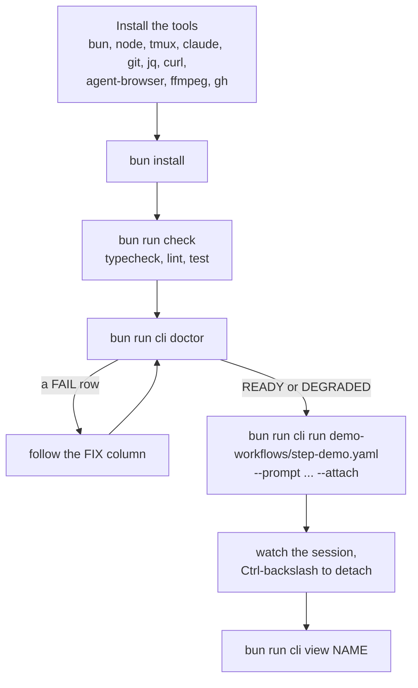

# 3. Running it locally

[Index](README.md) · Previous: [Repo map](02-repo-map.md) · Next: [Who calls what](04-who-calls-what.md)

You can run everything from a clone. There is no build step: Bun runs the TypeScript directly,
the CLI included. This section gets you from a fresh clone to a run you can watch.



## What you need installed

The root `package.json` sets `engines` to Bun 1.3.3 or later and Node 22.12 or later. Bun runs
the code and the tests. Node runs `bun run test:scripts` and `bun run test:hooks`, and the
release workflow uses it.

The rest comes from the doctor. `harness doctor` runs the checks in `CHECKS` in
[packages/core/src/doctor.ts](../../packages/core/src/doctor.ts), plus the checks of the
terminal and the agent from `packages/core/src/agents/`. A required check that fails blocks
`harness run`. An optional one only warns.

| Check | Required | What it wants |
|---|---|---|
| `git`, `git-repo` | yes | git on PATH, and the current folder inside a repo |
| `jq`, `curl` | yes | both on PATH |
| `harness-gitignored` | yes | `.harness/` ignored by git (already true here) |
| `orchestrate-config` | yes | one `orchestrate.config.yaml` with `version: 2` at the repo root (already here) |
| `agent-browser`, `ffmpeg` | yes | both on PATH. The `qa` stage uses them, but the doctor asks for them on every run |
| `tmux` | yes | tmux 3.3 or later |
| `claude` | yes | the Claude Code CLI on PATH. A run also needs it logged in, which the doctor does not check. `harness run` with an `agent: codex` workflow checks `codex` instead |
| `notifier` | yes | Slack keys in the run's env when the config turns the notifier on. See below |
| `gh` | no | GitHub CLI, logged in with `gh auth login` |
| `tmux-terminfo`, `samskara` | no | nice to have |

A workflow can add its own checks in a `doctor:` block. [task.yaml](../../workflows/task.yaml)
adds `LINEAR_API_KEY`, `bun` and `gh`. `harness doctor --workflow task` runs those too.

**The notifier row.** This repo's `orchestrate.config.yaml` has `notifier: { type: slack }`, and
`enabled` defaults to true. So the doctor fails the `notifier` row unless the run's env has
`SLACK_BOT_TOKEN` and `SLACK_CHANNEL_ID`. Put them in a `.env` at the repo root, or, to try
things out, add `enabled: false` under `notifier:` in `orchestrate.config.yaml` and leave that
edit out of your commits.

## Install and check

```bash
bun install
bun run check
```

`bun run check` runs [scripts/check.ts](../../scripts/check.ts). It runs `typecheck`, `lint` and
`test` in turn, runs all three even when one fails, and prints one JSON object with each one's
exit code and counts (type errors, lint errors and warnings, tests passed and failed). It exits
1 if any of the three failed. It drops `FORCE_COLOR` and sets `CI=1`, so the result is the same
in every shell. This JSON is also the baseline the harness records when it runs on this repo:
`orchestrate.config.yaml` says `baseline: bun run check`.

On a clean `main`-based checkout it took about six minutes on a MacBook and printed this:

```json
{
  "typecheck": { "exitCode": 0, "errors": 0 },
  "lint": { "exitCode": 0, "errors": 0, "warnings": 3 },
  "test": { "exitCode": 0, "passed": 1532, "failed": 0 }
}
```

The counts will drift as tests are added. The shape will not.

You can run the three on their own:

| Command | What it runs |
|---|---|
| `bun run typecheck` | `tsc --noEmit` in each `@harness/*` package, then `tsc -p` for the five skills that have TypeScript |
| `bun run test` | `bun test` over `./packages` and those five skills |
| `bun run lint` | `biome check`. `bun run lint:fix` applies the fixes |
| `bun test FILE` | one test file |

The test suite starts real tmux servers on throwaway sockets and drives a fake agent
(`packages/core/src/agents/fixtures/fake-agent.ts`) instead of Claude. So the tests need tmux,
but no Claude login and no API keys. Each test points `HARNESS_HOME` at a temp folder, so tests
never touch your real runs.

## Running the CLI from the checkout

```bash
bun run cli --help
```

`bun run cli` is `bun --no-env-file packages/cli/src/index.ts`. The `--no-env-file` flag stops
Bun from loading the repo's `.env` into the CLI process. The harness reads `.env` itself, in
`packages/sdk/src/env.ts`, and builds the session's environment from it, the config and the
workflow.

`bun run` always starts the script in the repo root, whatever folder you are in. Relative paths
you pass are read from there. Run it from `demo-workflows/` and
`bun run cli verify step-demo.yaml` fails with `missing-workflow: cannot read workflow
…/harness-engineering/step-demo.yaml`. To run the checkout's CLI from another folder, call it
by path:

```bash
alias harness="bun --no-env-file /path/to/harness-engineering/packages/cli/src/index.ts"
```

The rest of this section writes `harness` for that.

A workflow argument is either a bare name or a file. A bare name like `task` means
`workflows/task.yaml` in the checkout. Anything with a `/`, or ending in `.yaml` or `.yml`, is a
file relative to the current folder. That logic is `findWorkflowPath` in
[stage.ts](../../packages/core/src/stage.ts). Check that a workflow compiles before you run it:

```
$ harness verify demo-workflows/step-demo.yaml
ok: workflow step-demo compiles (6 nodes)
```

## The doctor

```bash
harness doctor
harness doctor --workflow task
harness doctor --json
```

It prints one row per check with a FIX column, then a verdict. `READY` means every check passed.
`DEGRADED samskara` means an optional check warned. `BLOCKED NAME …` lists the required checks
that failed, and the command exits 1. `harness run` runs the same checks first and refuses to
start on `BLOCKED`.

## Your first run

[step-demo.yaml](../../demo-workflows/step-demo.yaml) is the one to start with. All its nodes are
`exec` nodes (run a shell command) and one `wait` node, so it calls no ticket tracker and needs
no API keys. You still need Claude Code logged in, because a Claude session walks the
workflow.

```bash
harness run demo-workflows/step-demo.yaml --prompt "try the engine" --attach
```

`harness run` checks the doctor, starts the server if none answers, and asks it to start the
run. It prints the run id, an attach command and the run page's URL, and opens the page in your
browser (`--no-open` skips that). With `--attach` you land in the session's tmux pane. You see
the session run `bun run orchestrate init`, then `next` and `exec` in turn. The `wait` node comes
back from `next` as an `exec` too, and an exec records its own result, so this run never needs
`done`. `hello` prints some JSON, `slow-build` sleeps 20 seconds in the background, `full-lint` is
skipped because `mode` is `quick`, and `summary` collects the outputs.

The harness tmux config turns off the prefix key, so every key goes to the agent. Press
`Ctrl-\` to detach. The session keeps running.

| Command | What it does |
|---|---|
| `harness attach NAME` | attach to a run's pane again. `--run-id ID` instead of a name, `--print` to print the tmux command |
| `harness view NAME` | open the run's page. `--print` prints the URL only |
| `harness server status` | print the server's pid and version, or `not running` |
| `harness server stop` | stop the server. tmux sessions keep running |
| `tmux -L harness ls` | list the harness tmux sessions. They live on their own tmux server named `harness` |

The run's files are in `.harness/RUN_NAME/` in the repo root. `RUN_NAME` comes from your
`--prompt` unless you pass `--name`. The other demos show more of the engine:
[kitchen-sink.yaml](../../demo-workflows/kitchen-sink.yaml) uses every node type with small demo
stages, and [context-demo.yaml](../../demo-workflows/context-demo.yaml) tests `context` nodes
(fresh session, compact). Both call Claude for real work, so they cost tokens.

## Where the harness keeps its own files

`HARNESS_HOME` is the harness's home folder. It defaults to `~/.harness` (`harnessHome()` in
[registry.ts](../../packages/sdk/src/registry.ts)).

| File | What it is |
|---|---|
| `registry.json` | every run: id, name, workflow, folder, tmux session |
| `harness.sock` | the server's Unix socket. The CLI talks to the server only through it |
| `server.pid` | the running server's pid |
| `server.log` | the server's log, when the CLI started the server |
| `viewer.port` | the port of the run page server, reused on the next start |
| `tmux.conf` | the harness tmux config, copied from `packages/core/src/agents/tmux.conf` |

`ensureServer()` in [packages/cli/src/client.ts](../../packages/cli/src/client.ts) starts the
server as a detached `harness server start` and sends its output to `server.log`. The lines are
pino JSON. To read them:

```bash
tail -f ~/.harness/server.log | bunx pino-pretty
```

The server logs at `debug` unless `LOG_LEVEL` says otherwise. The CLI logs to stderr at `warn`;
run it with `LOG_LEVEL=debug` to see each step and the full stack of an error.

Two things catch people out:

- **A running server keeps the code it started with.** After you change anything in `packages/server` or in what it calls, run `harness server stop`. The next command starts a fresh one. To watch the server, run `harness server start` in its own terminal: it stays in the foreground and pretty-prints its log there.
- **One `HARNESS_HOME`, one server.** The server re-runs the CLI that started it, so whichever copy started it first, your checkout or an installed one, serves every run. Set `HARNESS_HOME=/tmp/harness-dev` to give your checkout its own server and registry. The tmux server is still shared unless you also set `HARNESS_TMUX_SOCKET`.

## Loading the skills into your own Claude session

A `harness run` session needs nothing extra. `/orchestrate` resolves through the
`.claude/skills/orchestrate` symlink, and each `next` reply gives the stage skill's path inside
this checkout's `skills/` folder, so the session reads your edited copy.

To try a skill by hand in an ordinary Claude Code session, load the plugin from your checkout:

```bash
claude --plugin-dir /path/to/harness-engineering
```

The skills then show up under the plugin's name, such as `/harness:code-review`. If you also
installed harness from the marketplace, both copies may load. Turn the installed one off from
`/plugin` while you test, so you know which one answered.

## Working in a nested worktree

This repo puts its worktrees under `.worktrees/`, inside the main checkout. Its own config
does the same for runs: `workspace.path: .worktrees/{{ branch }}`. Two things follow.

**Install first.** A worktree starts with no `node_modules`. Bun looks for `@harness/sdk` by
walking up the folders, finds the main checkout's `node_modules/@harness/*`, and those links
point at the main checkout's `packages/`. Your tests then run the main checkout's code, not
yours. Run this in the worktree before anything else:

```bash
bun install --frozen-lockfile
```

`--frozen-lockfile` installs exactly what `bun.lock` says and fails instead of rewriting it.

**Lint.** `biome.json` lists `"!!.worktrees"` in `files.includes`, so `bun run lint` in the main
checkout skips every worktree. Inside a worktree, that pattern names the worktree's own
`.worktrees` folder, which does not exist, so lint there checks the worktree's files. Run it
from inside the worktree. `CLAUDE.md` still says lint in a worktree processes no files; that was
true while the pattern was `!!**/.worktrees`, before commit `37010d1`. If lint in a worktree
checks nothing, that branch's `biome.json` is older than that commit.

## Files to open

| What | Where |
|---|---|
| The scripts you run | [package.json](../../package.json) |
| What `bun run check` does | [scripts/check.ts](../../scripts/check.ts) |
| The doctor's checks | [packages/core/src/doctor.ts](../../packages/core/src/doctor.ts) |
| tmux and its version check | [packages/core/src/agents/tmux.ts](../../packages/core/src/agents/tmux.ts) |
| Starting the server, `server.log` | [packages/cli/src/client.ts](../../packages/cli/src/client.ts) |
| The paths under `HARNESS_HOME` | [packages/server/src/protocol.ts](../../packages/server/src/protocol.ts) |
| The demo workflows | [demo-workflows/](../../demo-workflows/) |

[Index](README.md) · Previous: [Repo map](02-repo-map.md) · Next: [Who calls what](04-who-calls-what.md)
