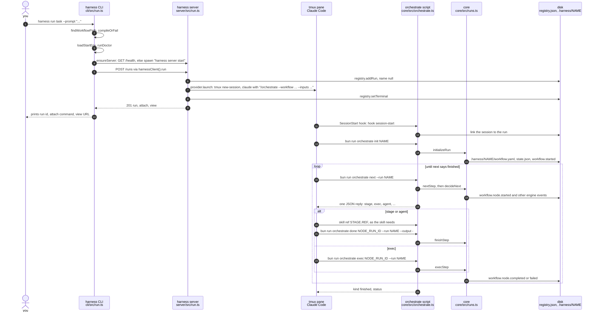
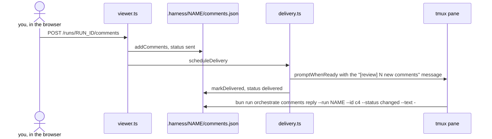

# 4. Who calls what

[Index](README.md) · Previous: [Running it locally](03-running-locally.md) · Next: [The workflow engine](05-workflow-engine.md)

This section follows one run from the moment you press enter to the last `done`. Every box in the
diagrams is a real file and every arrow is a real call. Open the files beside it as you read.

The example is `harness run task --prompt "add rate limiting"`, run from the root of a git repo.

## The whole trip



## Step 1: the CLI

[`runCommand`](../../packages/cli/src/run.ts) is the `harness run` command. It does five things,
in order, and stops at the first one that fails.

1. **Find and compile the workflow.** `findWorkflowPath` turns a bare name like `task` into the
   shipped `workflows/task.yaml`. A path, or anything ending in `.yaml`, is used as given.
   `compileOrFail` (in [client.ts](../../packages/cli/src/client.ts)) calls `compileWorkflow` and
   prints `CODE: message` if the YAML is wrong. [Section 5](05-workflow-engine.md) covers compile.
2. **Build the env and run the doctor.** `loadStartEnv` merges the project `.env`, the config and
   the workflow's own `env`. `runDoctor` runs the standard checks plus three extra sets: tmux and
   the agent binary (`runtimeChecks`), the workflow's `doctor:` list (`workflowChecks`), and the
   notifier. A `BLOCKED` verdict prints each failing check and exits 1.
3. **Check for git.** The run's folder lives in the repo root, so a run outside git is refused.
4. **Make sure the server is up.** `ensureServer` calls `GET /health` on the server's Unix socket
   (`~/.harness/harness.sock`). If nothing answers, it takes a file lock, spawns
   `harness server start` detached, and polls `/health` for up to five seconds.
5. **Ask the server to start the run.** `harnessClient().run(...)` uses a Hono client typed from
   the server's own `AppType` ([server/src/client.ts](../../packages/server/src/client.ts)). It
   sends `POST /runs` over the socket.

Then it prints the run id, `harness attach --run-id RUN_ID`, and the view URL, opens the view in
your browser, and exits. With `--attach` it attaches you to the tmux session after printing.

## Step 2: the server

[app.ts](../../packages/server/src/app.ts) builds the Hono app: a request logger, `/health`, and
the `/runs` routes from [server/src/run.ts](../../packages/server/src/run.ts).
[api.ts](../../packages/server/src/api.ts) has the shared helpers: `jsonBody` validates a body
against a Zod schema and turns a failure into a 400 in the API's error shape. The body schema is
`StartRunBodySchema` in [protocol.ts](../../packages/server/src/protocol.ts).

`startRun` is where the session is born:

- It resolves the run's tiers (the named model levels a stage can ask for, see [section 7](07-agents-and-hooks.md)).
- It makes a run id, `r-` plus 8 hex characters, and saves the run to the registry with `name: null`. It has to be saved first, because the session's first act is `init`, and `init` looks the run up.
- It calls `provider.launch`. For Claude that is `claudeProvider` in [agents/claude.ts](../../packages/core/src/agents/claude.ts), which runs `tmux new-session -d` with `claude --settings JSON PROMPT`, plus `--model` and `--effort` for the run's default tier. The settings carry the hooks. The env carries `HARNESS_RUN_ID` and `HARNESS_HOME` (`sessionEnv`).
- If the launch fails, it removes the run from the registry and replies 502 `agent-failed`.

The prompt is the session's first message, passed on the `claude` command line:

```
/orchestrate --workflow /abs/path/workflows/task.yaml --inputs {"prompt":"add rate limiting"} --name NAME
```

`--name` is there only when you passed `--name` to `harness run`. Codex gets the same line with
`$` in front instead of `/` (each provider's `skillPrefix`).

## Step 3: the orchestrate skill

[skills/orchestrate/SKILL.md](../../skills/orchestrate/SKILL.md) is all the session knows about
running a workflow. It says: pick a run name, run `init`, then loop on `next` and do what each
reply says. It never decides the order of stages. It only acts on the reply in front of it.

Before the skill even starts, Claude's `SessionStart` hook runs the orchestrate script's
`hook session-start` subcommand. The `link-session` handler in
[hooks/session-start.ts](../../packages/core/src/hooks/session-start.ts) finds the run by
`HARNESS_RUN_ID` and records the session id on it. That is how the server later knows which
agent to type comments into.

## Step 4: init, next, exec, done

`bun run orchestrate` is a script in the root `package.json` that runs
[orchestrate.ts](../../packages/core/src/orchestrate.ts). Each subcommand parses its flags and
calls one function in [runs.ts](../../packages/core/src/runs.ts). It prints JSON on stdout and
logs on stderr, so the session can parse the output.

| Command | Function | What it does |
|---|---|---|
| `init NAME` | `initializeRun` | Checks the name is a free slug, makes `.harness/NAME/`, copies the workflow there as `workflow.yaml`, writes `state.json`, appends `workflow.started`, sets the name in the registry, renames the tmux session to `claude-NAME-XXXX` |
| `next` | `nextStep` | Compiles `.harness/NAME/workflow.yaml`, reads `state.json`, calls `decideNext`, turns the decision into a reply |
| `exec NODE_RUN_ID` | `execStep` | Runs an exec or wait node that `next` already started, appends `workflow.node.completed` or `failed` |
| `done NODE_RUN_ID` | `finishStep` | Checks an agent or stage node's output, artifacts and verifiers, then appends its end event, or rejects the call |
| `skill ref STAGE.REF` | `resolveReference` in [stage.ts](../../packages/core/src/stage.ts) | Prints one of a skill's reference files with the project's extensions applied |

Every `next`, `exec` and `done` call is itself logged as an `orchestrate.next`, `orchestrate.exec`
or `orchestrate.done` event with its input and reply (`logCall` in runs.ts). The event log is
[section 6](06-events-and-state.md).

`init` freezes the workflow by copying it. Every later command compiles that copy, not the file
in `workflows/`. Editing `workflows/task.yaml` mid-run changes nothing for runs already going.

## Two entry points, on purpose

[CLAUDE.md](../../CLAUDE.md) splits the command line by who calls it:

- `harness` ([packages/cli](../../packages/cli/src/index.ts)) is for people. A command parses flags, calls `ensureServer()`, calls one server route, prints the reply.
- `bun run orchestrate` is for skills. Every action a skill takes on a run is a subcommand there. It calls core directly and never goes through the server.

So a new thing a skill needs goes in `orchestrate.ts`, never as a server route and never in
`harness`. The server and the orchestrate script both write `registry.json`, and they share it
through a file lock (`registry.json.lock`).

[ADR 0002](../adr/0002-session-drives-workflow-step-by-step-through-stateless-orchestrate-commands.md)
is the reason the orchestrate commands keep no state. Each call reads `workflow.yaml` and
`state.json`, decides, writes its events, and exits. No process holds the run in memory. A crashed
or compacted session loses nothing: its next `next` sees the same state on disk. The engine, not
the skill, evaluates `when`, loops, switches and includes, and records every node event. The
skill only runs the leaf node it is handed.

## How a command finds its run

A run has two handles. The **run id** (`r-1a2b3c4d`) is made by the server. The **run name** (the
slug passed to `init`, like `add-rate-limiting`) names its folder, `.harness/NAME/`. Both live in
`registry.json` under `HARNESS_HOME`, which defaults to `~/.harness`.

`init` takes the id from `--run-id`, else from `$HARNESS_RUN_ID`. Every later command goes
through `pickRun` in [sdk/src/runs.ts](../../packages/sdk/src/runs.ts):

- `--run-id ID` wins. The run must already be initialized.
- `--run NAME` looks the name up in the registry, among runs whose folder belongs to the same repo root as the current directory. The newest match wins.
- With neither flag, `$HARNESS_RUN_ID` is used as the id.
- `--run` and `--run-id` that point at different runs is an error.

With nothing to go on, the command fails with
`no run: pass --run or --run-id, or run inside a harness session`. The skill passes `--run NAME`
everywhere, so a command copied out of a session into your own shell still finds the run.

## How review comments reach the session

The server also serves a web page per run ([viewer.ts](../../packages/server/src/viewer.ts)). You
can comment on any artifact there. [ADR 0004](../adr/0004-harness-server-types-review-comments-into-the-run-tmux-session.md)
says the server types those comments into the session. The agent sets up no watcher.



`deliverComments` in [delivery.ts](../../packages/server/src/delivery.ts) waits, and retries
every 2 seconds, while the run has no name yet, while a context step is replacing the session, or
while Claude has a menu open or text in its input box. A dead pane is a failure, not a wait.
[comments.ts](../../packages/core/src/comments.ts) owns the file. The server and the orchestrate
script both write it, so every change re-reads it inside a lock. `deliveryMessage` builds the text
the agent sees, ending with the exact `comments reply` command to answer with. When the server
starts it calls `resumeDeliveries`, so comments sent while it was down still go out.

## Resume

There is no `harness resume` command. A session picks a run back up by receiving
`/orchestrate --resume NAME`. The skill then skips `init` and goes straight to the `next` loop,
which works because `next` needs nothing but the state on disk.

The harness sends that line itself when it swaps the session out: after a `context` node starts
a fresh session or compacts it, and after a `model` reply restarts Claude on another model
(`resumePrompt` in [context-step.ts](../../packages/core/src/context-step.ts), covered in
[section 7](07-agents-and-hooks.md)). If a session stops mid-run for any other reason, attach to
it with `harness attach --run-id RUN_ID` and type the same line.

Nothing is lost between turns either way. The Stop hook checks the run each time Claude ends a
turn. A turn that ends with a node still open, or before `next` was called, is sent back to the
agent with the command it still owes.

## Files to open

| What | Where |
|---|---|
| `harness run` | [packages/cli/src/run.ts](../../packages/cli/src/run.ts) |
| `ensureServer`, `compileOrFail` | [packages/cli/src/client.ts](../../packages/cli/src/client.ts) |
| `POST /runs`, `startRun` | [packages/server/src/run.ts](../../packages/server/src/run.ts) |
| Request body schema | [packages/server/src/protocol.ts](../../packages/server/src/protocol.ts) |
| What the session is told | [skills/orchestrate/SKILL.md](../../skills/orchestrate/SKILL.md) |
| Every orchestrate subcommand | [packages/core/src/orchestrate.ts](../../packages/core/src/orchestrate.ts) |
| `initializeRun`, `nextStep`, `execStep`, `finishStep` | [packages/core/src/runs.ts](../../packages/core/src/runs.ts) |
| `pickRun`, `requireRun` | [packages/sdk/src/runs.ts](../../packages/sdk/src/runs.ts) |
| Comment delivery | [packages/server/src/delivery.ts](../../packages/server/src/delivery.ts), [packages/core/src/comments.ts](../../packages/core/src/comments.ts) |

[Index](README.md) · Previous: [Running it locally](03-running-locally.md) · Next: [The workflow engine](05-workflow-engine.md)
