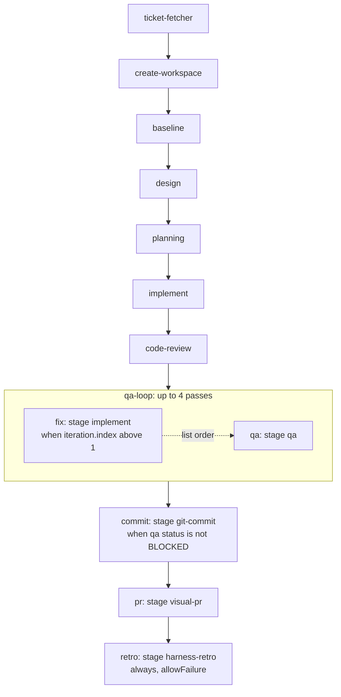
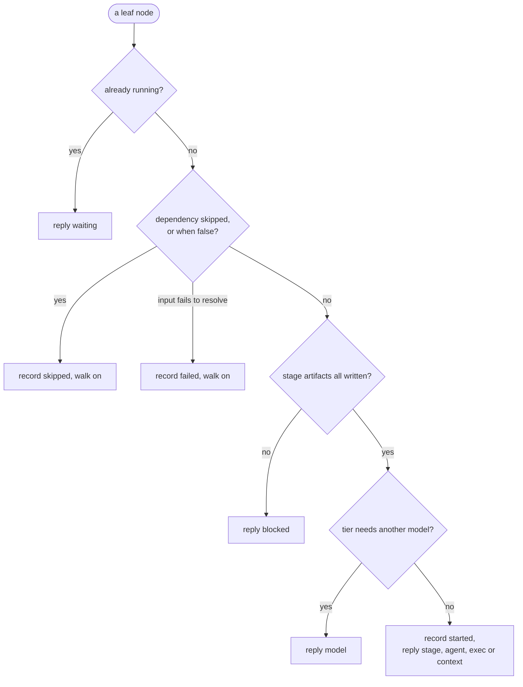
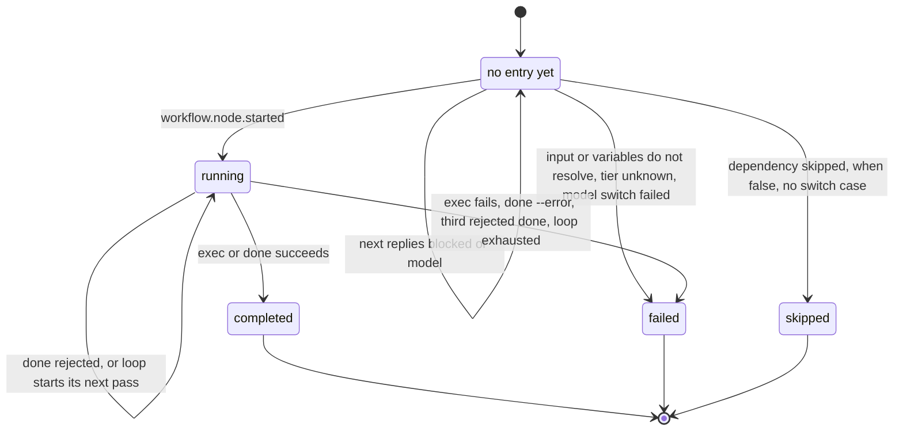

# 5. The workflow engine

[Index](README.md) · Previous: [Who calls what](04-who-calls-what.md) · Next: [Events and state](06-events-and-state.md)

The engine lives in [packages/core/src/workflow/](../../packages/core/src/workflow/). It reads a
workflow YAML file and answers one question each time it is asked: what should the session do
now? It does that in three moves. `compile` turns the YAML into a checked plan. `next` walks the
plan against the run's state and hands out one node. `exec` and `done` record how that node ended.

| File | What is in it |
|---|---|
| [types.ts](../../packages/core/src/workflow/types.ts) | Zod schemas for the YAML (`WorkflowSchema`, one schema per node type) and the compiled plan types |
| [compile.ts](../../packages/core/src/workflow/compile.ts) | `compileWorkflow`: YAML to `WorkflowPlan` |
| [evaluate.ts](../../packages/core/src/workflow/evaluate.ts) | The `{{ expression }}` parser and evaluator |
| [next.ts](../../packages/core/src/workflow/next.ts) | `decideNext`: the graph walk |
| [exec.ts](../../packages/core/src/workflow/exec.ts), [executors.ts](../../packages/core/src/workflow/executors.ts) | Running exec and wait nodes: scripts, functions, retries, timeouts |
| [done.ts](../../packages/core/src/workflow/done.ts) | Checks on a `done` call: output schema, artifact files |
| [verifiers.ts](../../packages/core/src/workflow/verifiers.ts) | A stage's own checks, run on each `done` |

The orchestrate glue that calls these (state on disk, reply shapes) is in
[runs.ts](../../packages/core/src/runs.ts). [Section 4](04-who-calls-what.md) shows who calls it.

## A workflow file

[workflows/task.yaml](../../workflows/task.yaml) is the default workflow and the running example
here. Its top level has four keys:

- `name`: the workflow's name, which the run records.
- `inputs`: what `harness run` may pass. Each has a `type` (`string`, `number`, `boolean`, `object`, `array`), and optionally `required` and `default`. `--prompt` becomes `inputs.prompt`; `--input KEY=VALUE` sets the others.
- `doctor`: things to check before the run starts, each a `check` (`env`, `binary`, `package` or `file`), a `key`, and a `fix` shown to the person. The doctor never runs the fix.
- `nodes`: the graph.

A workflow can also set `version`, `agent` (`claude` or `codex`), `tiers`, `env`, `envFile`,
`hooks` and `notifier`. Those belong to [section 6](06-events-and-state.md) and
[section 7](07-agents-and-hooks.md).

## Node types

Seven types, from `NodeTypeSchema` in [packages/sdk/src/contracts.ts](../../packages/sdk/src/contracts.ts).
Four are leaves, which the session runs. Three are containers, which the engine walks itself and
the session never sees.

| Type | Kind | What it does | Its own fields |
|---|---|---|---|
| `agent` | leaf | The session does a stage (a skill folder) or a free prompt | `stage` or `prompt`, `variables`, `tier`, `output` |
| `exec` | leaf | Runs a shell or Bun script, or calls an exported function | `runtime` + `script`, or `module` + `functionName`; `mode`, `output` |
| `wait` | leaf | Sleeps | `durationMs` |
| `context` | leaf | Gives the agent a fresh session (`new`) or compacts it (`compact`) | `action`, `prompt` (compact only) |
| `loop` | container | Runs its `nodes` again until a condition holds | `until`, `maxIterations` (1 to 1000), `nodes` |
| `switch` | container | Picks one list of nodes by value | `expression`, `cases`, `default` |
| `include` | container | Runs another workflow file as one node | `workflow` |

Every node has `id`, `type` and `input` (`context` defaults it to `null`). The rest are optional:

- `dependsOn`: ids of sibling nodes that must end first.
- `when`: an expression; false skips the node. Every type but `switch` has it.
- `allowFailure`: the node's failure does not stop the nodes after it and does not fail the run.
- `always`: the node starts even after an earlier node in its scope failed, or a dependency was skipped ([ADR 0008](../adr/0008-a-node-marked-always-still-starts-after-an-earlier-failure.md)).
- `cwd`, `timeoutMs`, `retry` (`maxAttempts`, `delayMs`): on `exec` and `agent`. Only exec acts on them today. An agent node accepts them and nothing reads them.

An agent node with `stage: ticket-fetcher` loads `skills/ticket-fetcher/SKILL.md` from the
harness. A stage name with a `/` in it, like `demo-workflows/stages/demo-brief`, is a folder in
your project instead (`findStageDir` in [stage.ts](../../packages/core/src/stage.ts)). A stage
node's `prompt` is extra instructions on top of the skill. `variables` fills in values the
skill's frontmatter declares. [Section 8](08-anatomy-of-a-stage.md) reads a SKILL.md top to bottom.

## How task.yaml runs



There is no edge from `qa` back to `implement`. The graph has no cycles, and compile refuses one.
The repeat comes from the `qa-loop` container. On pass 1, `fix` has `when: "{{ iteration.index > 1 }}"`,
so it is skipped and `qa` runs. After each pass the engine checks
`until: "{{ iteration.nodes.qa.output.status != 'FAIL' }}"`. If qa failed, it records a
`workflow.node.iterated` event, which clears the pass's children, and walks the body again. This
time `fix` runs the `implement` stage with `feedback: "{{ iteration.previous.bugs }}"`, the bugs
qa listed last pass. After 4 failing passes the loop fails with kind `exhausted`.

`fix` and `qa` have no `dependsOn` between them. They still run in that order, because the walk
hands out one leaf at a time in list order (see below). Giving `qa` a `dependsOn: [fix]` would
break it: `fix` is skipped on pass 1, and a node whose dependency was skipped is skipped too.

`retro` shows `always` and `allowFailure` together. If any stage fails, the nodes after it never
start, but `retro` does, so failed runs get audited. Its own failure never changes the run's status.

## Expressions

A string in `input`, `when`, `until`, a switch's `expression`, or a stage node's `variables` can
hold `{{ ... }}`. [evaluate.ts](../../packages/core/src/workflow/evaluate.ts) parses a small
language: paths, string, number, `true`, `false` and `null` literals, `== != < <= > >=`, `and`,
`or`, `not`, and parentheses. There is no arithmetic and there are no function calls.

What a path can read depends on where the node sits:

- `inputs.KEY`: at the top level, the workflow's inputs with defaults filled in. Inside a loop, switch or include, it is that container's own resolved `input`. This is why `qa-loop` passes `workspace`, `task` and `environment` in through its `input`: its children read them as `inputs.workspace`.
- `nodes.ID.input`, `nodes.ID.output...`, `nodes.ID.status`: a sibling in the same scope that this node depends on, directly or through a chain. Compile refuses anything else with `invalid-reference`. Reading the output of a node that did not complete fails the reader.
- `iteration.index` (from 1), `iteration.max`, `iteration.previous` (last pass's output, `null` on pass 1): inside a loop body.
- `iteration.nodes.ID...`: only in a loop's `until`, which may read nothing but `inputs` and `iteration`.

A value that is exactly one expression keeps its JSON type, so
`workspace: "{{ nodes.create-workspace.output }}"` passes an object. Text around an expression
makes a string, with non-strings JSON-encoded. `when`, `until` and `expression` must be exactly
one expression. A node marked `always` may not read `nodes.*` at all, since those nodes may never
have run.

## Compile

`compileWorkflow` in [compile.ts](../../packages/core/src/workflow/compile.ts) runs on
`harness verify WORKFLOW` (compile only, nothing starts), on `harness run`, again at `init`, and on every `next`, `exec` and `done`, each time against the
run's frozen `.harness/NAME/workflow.yaml`. It does this, scope by scope:

1. Parse the YAML and check it against `WorkflowSchema` (`yaml`, `schema` errors).
2. `validateScope`: ids unique, every `dependsOn` known, each guard a single expression, sort the nodes topologically (`cycle`), check every expression path (`invalid-reference`). Loops and switch cases are checked as scopes of their own.
3. `compileNode`: load each stage's SKILL.md into a `PlanStage` (its skill path, tier, `consumes`, `produces`, output schema, verifiers, variables), check the node's `variables` against it, load output schemas, and compile each included file. Includes nest at most 8 deep and expand to at most 1000 nodes.
4. `checkArtifacts`: every artifact a stage needs must come from a node it depends on, unless it is marked optional (`missing-artifact`).

The result is a frozen `WorkflowPlan`. Each compiled node carries `parents`, the ids of the
containers around it, which is also its path inside `state.json`. A compile error reaches the
person as `CODE: message` from `harness run`. The session gets it as JSON: `"kind": "compile"`
from `init`, `next` and `exec`, and `"kind": "configuration"` from `done`.

## Next

`decideNext` in [next.ts](../../packages/core/src/workflow/next.ts) walks the plan from the top
on every call. It keeps nothing between calls. It goes through each scope's nodes in sorted order
and, for each one that has not ended:

- Skips it if an earlier node in the scope failed without `allowFailure`, unless it is `always`.
- Starts a container (`workflow.node.started`) and walks into its children. When they are all done it ends the container, which takes the output of the last child it ran.
- For a leaf, goes through the checks below and stops the walk with a decision.



If the walk reaches the end, the run is over. It appends `workflow.completed`, or
`workflow.failed` when a top-level node failed without `allowFailure`, and replies `finished`.
The walk stops at the first leaf it hands out or finds running, so one leaf runs at a time, even
when two nodes do not depend on each other.

`runs.ts` turns the decision into the JSON the session reads. Every kind:

| `kind` | When | The session |
|---|---|---|
| `stage` | an agent node with a `stage` started | reads `skill` (and `extension`), does it, runs `done` |
| `agent` | an agent node with only a `prompt` started | does the prompt with `input`, runs `done` |
| `exec` | an exec or wait node started | runs `command`, which is `bun run orchestrate exec NODE_RUN_ID --run NAME` |
| `context` | a context node started | ends its turn, and the Stop hook does the rest |
| `model` | the next agent node's tier maps to another model | ends its turn, and gets restarted on `model` |
| `blocked` | a stage needs an artifact no finished node wrote | tells the person, stops |
| `waiting` | a leaf is still running | waits for its background task, asks again |
| `finished` | nothing left | reports `status`, stops |

A `stage` reply looks like this:

```json
{
  "kind": "stage",
  "nodeRunId": "nr-NODE_RUN_ID",
  "nodeId": "ticket-fetcher",
  "stage": "ticket-fetcher",
  "skill": "HARNESS_DIR/skills/ticket-fetcher/SKILL.md",
  "extension": null,
  "input": { "request": "add rate limiting" },
  "variables": {},
  "done": "bun run orchestrate done nr-NODE_RUN_ID --run add-rate-limiting"
}
```

## A node's lifecycle

A node run's `status` in `state.json` is `running`, `completed`, `failed` or `skipped`. The
schema also lists `cancelled` and `interrupted`, but nothing in the engine writes them today.
Before a node starts it has no entry at all.



## Ending a leaf: exec and done

`exec` ([exec.ts](../../packages/core/src/workflow/exec.ts)) runs the node from the orchestrate
process. A script gets the node's resolved `input` as JSON on stdin and runs as `sh -c SCRIPT` or
`bun -e SCRIPT`. A non-zero exit fails it. Without an `output` schema its output is stdout as
text; with one, stdout must be JSON that matches. A function node calls the module's export with
`(input, context)` and must return JSON. `retry` reruns a failed attempt, except a schema failure,
since the same code gives the same output. A wait node sleeps and outputs its input. `mode:
background` only tells the session to run the command as a background task, to get past its
tool timeout.

`done` is for agent nodes. `finishStep` in runs.ts checks, in order:

1. Output: plain text, unless the stage's SKILL.md declares `outputs` (or a prompt-only node sets `output`), in which case it must be JSON matching that schema (`readOutput`, `findDefaultIssues` in [done.ts](../../packages/core/src/workflow/done.ts)).
2. Artifacts: every `--artifact NAME=artifacts/PATH` must be a real file inside `.harness/NAME/artifacts/`, and every artifact the stage `produces` without `optional` must be listed.
3. Verifiers, only once 1 and 2 pass: the stage's own checks from its SKILL.md `verifiers:` list, a function or a script each, all run at once. Each returns `{ pass, findings }` and is logged as an `orchestrate.verifier` event. No shipped stage declares one yet; [orchestrate.e2e.test.ts](../../packages/core/src/orchestrate.e2e.test.ts) has working examples.

Any issue rejects the call with `retryable: true` and the node stays running, so the agent fixes
the work and calls `done` again. The third rejection fails the node with `verify-exhausted`.
`done --error -` fails it straight away. A `done` that names a node no longer running is refused,
so a late call cannot overwrite a result.

## Try every type

[demo-workflows/kitchen-sink.yaml](../../demo-workflows/kitchen-sink.yaml) uses exec, agent, loop,
switch and include, and its included file has a `wait`. The comment at its top lists what each
node should do on a default run. [context-demo.yaml](../../demo-workflows/context-demo.yaml)
covers `context` nodes. Run them from your checkout as [section 3](03-running-locally.md)
shows, then read `.harness/NAME/state.json` beside the YAML.

## Files to open

| What | Where |
|---|---|
| Every YAML field | [packages/core/src/workflow/types.ts](../../packages/core/src/workflow/types.ts) |
| Compile checks and error codes | [packages/core/src/workflow/compile.ts](../../packages/core/src/workflow/compile.ts) |
| The walk | `decideNext`, `executeNodes`, `executeLeaf`, `executeLoop` in [next.ts](../../packages/core/src/workflow/next.ts) |
| Reply shapes, `done` checks | `StepReply`, `buildLeafReply`, `finishStep` in [runs.ts](../../packages/core/src/runs.ts) |
| What expressions can read | `parsePath`, `readPath` in [evaluate.ts](../../packages/core/src/workflow/evaluate.ts) |
| Behaviour, as tests | [next.test.ts](../../packages/core/src/workflow/next.test.ts), [compile.test.ts](../../packages/core/src/workflow/compile.test.ts) |
| Terms | [GLOSSARY.md](../../GLOSSARY.md) |

[Index](README.md) · Previous: [Who calls what](04-who-calls-what.md) · Next: [Events and state](06-events-and-state.md)
