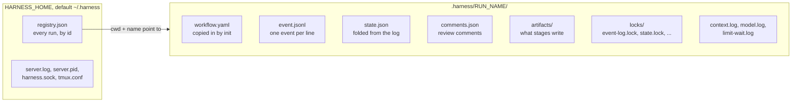
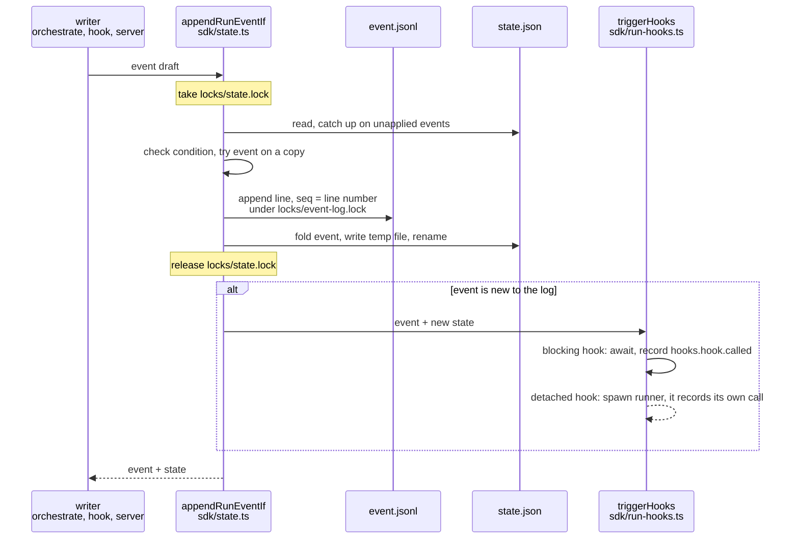

# 6. Events and state

[Index](README.md) · Previous: [The workflow engine](05-workflow-engine.md) · Next: [Agents and hooks](07-agents-and-hooks.md)

A run remembers everything in one folder, `.harness/RUN_NAME/`, inside the checkout it started
in. The event log in that folder is the truth. `state.json` is a summary folded from the log and
saved so nobody has to replay hundreds of events to find out where the run is. No process holds a
run in memory. That is why a session can crash, come back, and carry on with the next
`orchestrate next` ([ADR 0002](../adr/0002-session-drives-workflow-step-by-step-through-stateless-orchestrate-commands.md)).

## The run folder



| File | Written by | What it holds |
|---|---|---|
| `workflow.yaml` | `orchestrate init` | A copy of the workflow the run started from. The engine compiles this copy, not the original, so editing the source file mid-run changes nothing. |
| `event.jsonl` | anything that stores an event, through the SDK | Every event, one JSON object per line, in order. Append-only. |
| `state.json` | the SDK, after each append | The run as it stands now: status, inputs, `nodeRuns` (one entry per node, the latest run of it), workspace, active sessions, frozen hooks, tiers. |
| `comments.json` | the server and `orchestrate comments reply` | Review comments from the run's web page and their threads. Appears with the first comment. See [comments.ts](../../packages/core/src/comments.ts). |
| `artifacts/` | the stages | `design.md`, `plan.md` and whatever else a stage produces. [Section 8](08-anatomy-of-a-stage.md) covers how a stage hands them to `done`. |
| `locks/` | the lock helper | One directory per lock, each with an `owner` file holding the pid. |
| `context.log`, `model.log`, `limit-wait.log` | detached helpers | Logs from the helpers the agent's hooks start. Their stderr goes nowhere, so they log to a file here. See [section 7](07-agents-and-hooks.md). |

The server's own log is `server.log` under `HARNESS_HOME`, not in the run folder. The
orchestrate script logs to stderr, so its stdout stays clean JSON for the skill to parse.

## Events

An event is a JSON object checked by `EventSchema` in
[contracts.ts](../../packages/sdk/src/contracts.ts): `schemaVersion`, `seq`, `id`, `ts`, `type`,
`source`, `runId`, an optional `nodeId` and `nodeRunId` (always both or neither), an optional
`stage`, and a `payload`.

`seq` is the event's line number in `event.jsonl`, starting at 1. The store checks it on every
read: line 7 must say `seq: 7`, or reading the log throws. `id` is a UUID unless the writer passes
one. Writing an event whose `id` is already in the log stores nothing and hands back the first
one, so a retried write is safe. `init` uses this with the fixed id `workflow-started`.

The type must match one of these namespaces: `workflow`, `artifact`, `hooks`, `workspace`,
`forge`, `learning`, `agent`, `orchestrate`, `notification`, plus `stage.STAGE.NAME` and
`custom.WRITER.NAME`. On top of that, the types listed in the catalog in
[events.ts](../../packages/sdk/src/events.ts) get their payloads checked. Any other type in a valid
namespace is stored with its payload unchecked.

| Family | Types | Written by |
|---|---|---|
| Run lifecycle | `workflow.started`, `workflow.completed`, `workflow.failed`, `workflow.blocked` | `init`, `next` |
| Nodes | `workflow.node.started`, `.completed`, `.failed`, `.skipped`, `.cancelled`, `.iterated` | `next`, `exec`, `done` |
| Sessions and models | `workflow.session.replaced`, `workflow.context.started`, `workflow.model.requested`, `workflow.model.applied` | `next` and the context and model helpers |
| Workspace | `workspace.created`, `workspace.removed`, `workspace.repository.added`, `.removed`, and a `-failed` twin of each | the `create-workspace` skill's script |
| Orchestrate calls | `orchestrate.next`, `orchestrate.exec`, `orchestrate.done`, `orchestrate.verifier` | the orchestrate script, one per call, with its input and reply |
| Agent hooks | `hooks.stop.called`, `hooks.pre-tool-use.called`, `hooks.session-start.called` | the handlers in [section 7](07-agents-and-hooks.md) |
| Run hooks | `hooks.hook.called` | the SDK, one per hook call |
| Agent | `agent.limit.reached`, `.waiting`, `.resumed`, `agent.question.asked`, `.answered`, `agent.stopped`, `agent.stuck` | agent hooks and the limit-wait helper |
| Other | `notification.thread.started`, `custom.state.updated`, `artifact.comment.added`, `.delivered`, `.replied` | the notifier, any hook or skill, the server's viewer |

## How an event becomes state

Every write goes through `appendRunEventIf` in [state.ts](../../packages/sdk/src/state.ts).
`appendRunEvent` is the same call with no condition. It takes the run's state lock, and inside it:

1. Reads `state.json` and applies any events in the log past its `lastEventSeq`. A previous
   writer may have died between appending and saving.
2. Runs the caller's condition against that fresh state. Ending a step uses this: the end
   event is stored only if that node run is still running, so a second `done` for it fails.
3. Applies the new event to a copy of the state. If a handler throws, the event is refused. A
   stored event that cannot be applied would break every later sync, since each sync replays it.
4. Appends the line to `event.jsonl` under a second lock, `locks/event-log.lock`.
5. Folds the new event in and writes `state.json`: to a temp file, then a rename, so a reader
   never sees half a file.

Then it releases the state lock and calls the run hooks for the event.



Folding is a reduce. `projectEvents` walks the events in order and, for each, runs the built-in
handler for its type (`builtInHandlers` at the bottom of `events.ts`), then any extension
handlers the project lists under `eventHandlers` in `orchestrate.config.yaml`. `init` freezes
those handler module paths into `state.json`, so a config edit mid-run does not change how the
run folds. After each event the result is validated against `StateSchema` and `lastEventSeq` is
set to the event's `seq`. Events at or below `lastEventSeq` are skipped, which makes the fold safe
to run twice.

Most event types have no built-in handler. The `orchestrate.*` call records, for instance, are
never folded into state. They exist so you can read the log and see every `next` and `done` the
session made and what each one answered.

Model switches are a special case. Where a switch stands is never stored in `state.json`.
`foldModelSwitch` in `events.ts` folds it from the log each time it is needed. [Section 7](07-agents-and-hooks.md) explains why.

## The lock

`withLock` in [files.ts](../../packages/sdk/src/files.ts) is a directory lock. To take it, a
process makes a temp directory, writes its pid into an `owner` file, and renames the directory to
the lock path. The rename either wins or fails because the lock exists. A waiting process checks
the owner's pid. If that process is dead, it throws `Stale lock held by dead process PID; remove
PATH` instead of stealing the lock. You delete the directory by hand. That is deliberate: a dead
owner may have left the files half-changed, and a person should look first.

Every lock a run takes lives under `.harness/RUN_NAME/locks/`: `state.lock`, `event-log.lock`,
`comments.lock`, and `hook-HOOK_NAME.lock` for each detached hook. The context and model helpers
also drop one-shot claim files there (`context-NODE_RUN_ID.lock`, `model-SEQ.lock`) so only one
helper acts on a step.

## The registry

The run folder answers "what happened in this run". The registry answers "which runs exist and
where are they". It is one file, `registry.json` under `HARNESS_HOME` (default `~/.harness`), and
the code is [registry.ts](../../packages/sdk/src/registry.ts). Each entry is keyed by run id
(`r-` plus 8 hex characters) and holds the workflow, its path, the inputs, the `cwd` the run
started in, the agent sessions linked to it, the tmux session name, the config path, the resolved
tiers, and `name`, which stays `null` until `init` names the run.

Three processes write it, each for its own part:

- The server adds the run before it launches the agent, records the tmux session name after, and removes the run if the launch fails ([packages/server/src/run.ts](../../packages/server/src/run.ts)).
- `orchestrate init` sets the name and renames the tmux session ([packages/core/src/runs.ts](../../packages/core/src/runs.ts)).
- The agent's SessionStart hook links each new session id to the run.

They share the file through the same lock helper, at `registry.json.lock`. Each change reads the
file, applies one pure change function, and renames a temp file into place. A change that would
do nothing skips the write. The orchestrate script never asks the server for anything. It opens
the registry itself, which is how it works while the server is down.

Finding a run goes the other way. `--run-id ID` (or `$HARNESS_RUN_ID`) looks the id up. `--run
NAME` looks up runs with that name and keeps the one whose `cwd` belongs to the same main checkout
as yours, so two clones can each have a run called `fix-login`. `pickRun` in
[runs.ts](../../packages/sdk/src/runs.ts) holds the rules, and a flag always wins over the
variable.

## Who writes events, and ADR 0001

[ADR 0001](../adr/0001-skills-write-run-events-through-the-harness-server.md) said skills should
send events to the server, which would append them. [ADR 0002](../adr/0002-session-drives-workflow-step-by-step-through-stateless-orchestrate-commands.md)
superseded it, and 0001 is marked `inactive`. Today a skill stores an event with
`bun run orchestrate emit TYPE --run NAME --source SKILL --payload JSON`, and a skill's own
TypeScript script can import `emitRunEvent` from `@harness/sdk` and call it (the
`create-workspace` script does). Both append to the file directly. There is no `harness emit`
and no emit route on the server.

This matters when you add code. Do not add a server route for a skill to write events. The file
lock is what keeps concurrent writers safe, not a single owning process. The server, the
orchestrate script, the agent hooks and the run hooks all append through the same
`appendRunEventIf`.

`emit` refuses three prefixes, in `emitRunEvent`: `workflow.` (use `next`, `exec` or `done`),
`orchestrate.` and `hooks.`. The engine trusts those families to say what the run did, so a skill
cannot fake them. The agent's PreToolUse hook also refuses any tool call that writes, moves or
deletes a run's `state.json` or `event.jsonl`, or the registry. Reading them is fine.

## Run hooks

A run hook is project code that runs when an event is stored: post to a tracker, copy an artifact
somewhere, record a metric. [ADR 0005](../adr/0005-a-run-hook-is-a-module-export-or-shell-command-from-config-and-workflow.md)
says what one is, [ADR 0006](../adr/0006-the-sdk-calls-an-events-hooks-right-after-storing-it.md)
says when it runs, and [ADR 0007](../adr/0007-a-run-hook-fires-at-most-once-per-event.md) says
how often.

A hook is declared under `hooks`, keyed by event type, in `orchestrate.config.yaml` or in the
workflow file. It is either a module export or a shell command:

```yaml
hooks:
  workflow.node.completed:
    - name: tracker
      module: scripts/tracker-hook.ts
      handler: onNodeDone
    - name: archive
      command: ./scripts/archive.sh
      blocking: false
      timeoutSeconds: 120
```

Both get the same input, `{ event, state, run }`: the stored event, the state after it was
folded, and the run's id, cwd and name. A module export receives it as an argument (`RunHook` in
[hooks.ts](../../packages/sdk/src/hooks.ts)). A command reads it as JSON on stdin. Whatever the
hook returns or prints is recorded as the call's output.

At `init`, `freezeHooks` in [packages/core/src/runs.ts](../../packages/core/src/runs.ts) merges
the config's hooks first, then the workflow's, then the notifier's. Relative paths resolve against
the file that declared them. The result goes into `state.json` with absolute paths. A name used by
both the config and the workflow for one event type fails `init`. The name `notifier` is reserved,
and no project hook may listen to `hooks.hook.called`.

Blocking is the default. `triggerHooks` in [run-hooks.ts](../../packages/sdk/src/run-hooks.ts)
goes through an event's hooks in order:

- A blocking hook is awaited before the next one starts. A command runs under `sh -c`. A module runs in a child process (`run-hooks.ts` run as a script in `call` mode), so one that never returns dies with that process. The default timeout is 20 seconds and the most you can set is 25, because the call may happen inside an agent hook that Claude or Codex kills at 30.
- A hook with `blocking: false` is handed to a detached runner, `run-hooks.ts` started as a script. The runner takes `locks/hook-HOOK_NAME.lock` and first calls the hook for any earlier events still waiting for it, so one hook's calls never overlap and always run in `seq` order. Default timeout 60 seconds.

A hook never breaks the run. One that throws, exits non-zero or times out becomes a
`hooks.hook.called` event with `status: "failed"`, and the append that triggered it still
succeeds. A hook can store events of its own, since it runs after the state lock is released. To
keep values between calls, store `custom.state.updated`: each top-level key of its payload
replaces that key in `state.custom`.

Only the process that newly stored an event calls its hooks. If that process crashes between the
append and the call, the call is lost and never retried. Every call record has the id
`hook:EVENT_ID:HOOK_NAME`, so the same call is never recorded twice.

## The notifier

The notifier is a built-in run hook that posts a run's progress to a Slack thread. This repo turns
it on in its own [orchestrate.config.yaml](../../orchestrate.config.yaml) with
`notifier: { type: slack }`. A workflow's `notifier` block replaces the config's whole.

[notifier-hooks.ts](../../packages/core/src/notifier-hooks.ts) turns that block into one
non-blocking hook named `notifier` under each event type the notifier cares about. The module is
[notifier.ts](../../packages/core/src/notifier.ts) and the handler is the export `slack`. The
event list is the keys of `NOTICE_BY_EVENT`: run start, end and block, node start, done, failed
and skipped, rate-limit waits, questions the agent asks and their answers, `agent.stopped`,
`agent.stuck`, and failed `hooks.hook.called` records from other hooks.

The first post opens a thread, and the notifier stores `notification.thread.started` with its
`ts`. That event folds into `state.notification`, and every later post replies in the thread.
Completed nodes upload their artifacts, but only files whose real path is still inside
`artifacts/`. The token comes from the run's env: `SLACK_BOT_TOKEN` and `SLACK_CHANNEL_ID` are
required, and `SLACK_MEMBER_ID` adds an @-mention to the posts you need to act on. Keep them in
`.env`, not in a committed file.

## Files to open

| What | Where |
|---|---|
| Event schema, namespaces, state schema | [packages/sdk/src/contracts.ts](../../packages/sdk/src/contracts.ts) |
| Event catalog and built-in fold handlers | [packages/sdk/src/events.ts](../../packages/sdk/src/events.ts) |
| Reading and appending `event.jsonl` | [packages/sdk/src/event-store.ts](../../packages/sdk/src/event-store.ts) |
| Append, fold, write `state.json` | [packages/sdk/src/state.ts](../../packages/sdk/src/state.ts) |
| The lock | [packages/sdk/src/files.ts](../../packages/sdk/src/files.ts) |
| Registry | [packages/sdk/src/registry.ts](../../packages/sdk/src/registry.ts) |
| Finding a run by name or id | [packages/sdk/src/runs.ts](../../packages/sdk/src/runs.ts) |
| Calling run hooks | [packages/sdk/src/run-hooks.ts](../../packages/sdk/src/run-hooks.ts) |
| Freezing hooks at init | [packages/core/src/runs.ts](../../packages/core/src/runs.ts) |
| Notifier | [packages/core/src/notifier.ts](../../packages/core/src/notifier.ts) |

[Index](README.md) · Previous: [The workflow engine](05-workflow-engine.md) · Next: [Agents and hooks](07-agents-and-hooks.md)
