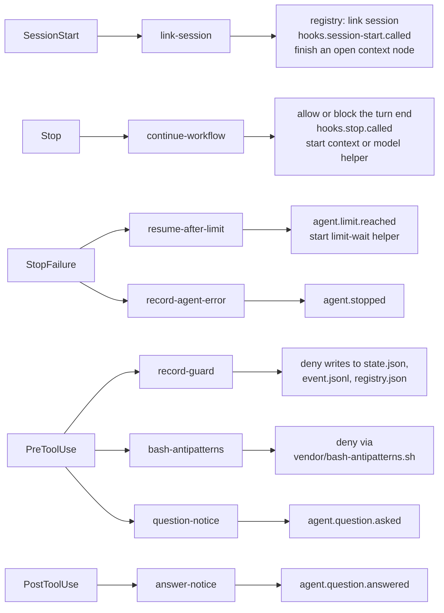
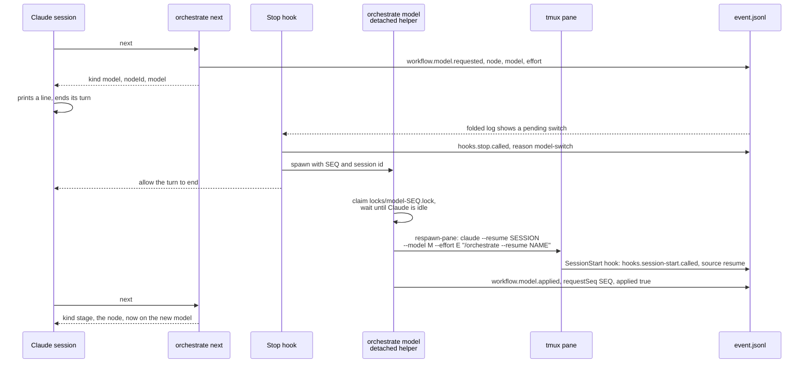

# 7. Agents and hooks

[Index](README.md) · Previous: [Events and state](06-events-and-state.md) · Next: [Anatomy of a stage](08-anatomy-of-a-stage.md)

The harness never calls a model API during a run. It starts the real `claude` or `codex` CLI in a
tmux pane and steers it from outside: command-line flags at launch, keys typed into the pane,
and hooks. A hook here means the agent's own hook feature: Claude Code and Codex both run a shell
command you configure at moments like "a turn ended" or "about to run a tool". The harness points
every one of those commands back at the orchestrate script, and that is how it keeps the session
on the workflow.

## Two objects per agent

Each agent has two pieces of code in [packages/core/src/agents/](../../packages/core/src/agents/).

The **provider** (`IAgentProvider`) drives the CLI: `launch`, `relaunch`, `prompt`,
`promptWhenReady`, `stop`, `limitResetWait`, and `run` for a one-shot headless call.
`agentProvider()` in [index.ts](../../packages/core/src/agents/index.ts) picks one by name. The
binaries are `claude` and `codex`, or whatever `HARNESS_CLAUDE_BIN` and `HARNESS_CODEX_BIN` say.

The **adapter** (`AgentAdapter`, in `agentAdapters`) speaks the agent's hook format. It parses
the JSON the agent writes to the hook's stdin into a shared shape, calls a handler, and turns the
handler's answer back into what that agent expects on stdout. The handlers themselves live in
[packages/core/src/hooks/](../../packages/core/src/hooks/) and are shared by both agents. So a new
rule for the Stop hook is written once, and a new agent needs only an adapter.

## Launching a session

`harness run` asks the server to start the run, and `startRun` in
[packages/server/src/run.ts](../../packages/server/src/run.ts) calls `provider.launch`. For Claude
the pane runs this, built by `claudeArgs` in [claude.ts](../../packages/core/src/agents/claude.ts):

```
claude --model claude-opus-5-5 --effort high --settings SETTINGS_JSON \
  '/orchestrate --workflow WORKFLOW_PATH --inputs INPUTS_JSON'
```

Codex gets the same idea in its own flags (`codexArgs` in
[codex.ts](../../packages/core/src/agents/codex.ts)): `--dangerously-bypass-hook-trust`, one
`-c hooks.EVENT=[...]` override per hook event, `-m MODEL`, `-c model_reasoning_effort=...`, and
the prompt `$orchestrate ...`. Codex invokes a skill with `$` where Claude uses `/`; that is the
provider's `skillPrefix`.

The first prompt is the last command-line argument. Nothing is typed to start a run. The agent
starts, runs its SessionStart hook, and reads the orchestrate skill as its first message.

The pane comes from [tmux.ts](../../packages/core/src/agents/tmux.ts). The harness runs its own
tmux server on the socket `harness` (or `HARNESS_TMUX_SOCKET`) with its own config,
[tmux.conf](../../packages/core/src/agents/tmux.conf), copied to `HARNESS_HOME/tmux.conf` and
passed with `-f`. That config removes the prefix key and the status bar so the pane feels like a
plain terminal, and keeps one key, `Ctrl-\`, to detach. The session is created detached at
200x50 with `new-session -d -P -F '#{pane_id}'`, and the harness keeps the pane id (`%3`, say) as
its address. The session starts with a random name, and `orchestrate init` renames it to
`AGENT-RUN_NAME-XXXX`, the last four characters of the run id. The pane id survives the rename.

The pane's env is the run's env plus two harness variables (`sessionEnv` in
[packages/sdk/src/env.ts](../../packages/sdk/src/env.ts)). The run's env is the project's `.env`,
then the config's `envFile` and `env`, then the workflow's, later layers winning. On top go
`HARNESS_RUN_ID` and `HARNESS_HOME`. Every hook and helper finds its run through
`HARNESS_RUN_ID`.

When the harness does need to type into a running session (a review comment, the `continue`
after a rate limit, a `/compact`), it uses `typeLine` in
[common.ts](../../packages/core/src/agents/common.ts): send the text, wait 150 ms, press Enter.
The tmux side strips control characters first, and multi-line text goes in as a bracketed paste
so a newline does not submit half a message. `promptWhenReady` reads the screen first and types
only when the agent shows an empty input box.

## The hooks the harness installs

Every hook command has the same shape:
`BUN ORCHESTRATE_SCRIPT hook EVENT --agent AGENT --handler HANDLER`, with a 30 second timeout.
`orchestrate hook` reads stdin, hands it to the agent's adapter with the named handler, and
prints the reply. Claude gets its hooks in the `--settings` JSON (`claudeSettings` in
[claude-hooks.ts](../../packages/core/src/agents/claude-hooks.ts)). Codex gets them as TOML
`-c` overrides (`codexHookOverrides` in
[codex-hooks.ts](../../packages/core/src/agents/codex-hooks.ts)).

| Agent event | Matcher | Handler | Claude | Codex |
|---|---|---|---|---|
| SessionStart | any | `link-session` | yes | yes |
| Stop | any | `continue-workflow` | yes | yes |
| StopFailure | `rate_limit` | `resume-after-limit` | yes | no such hook |
| StopFailure | `*` | `record-agent-error` | yes | no such hook |
| PreToolUse | tools that write files, and the shell | `record-guard` | yes | yes |
| PreToolUse | `Bash` | `bash-antipatterns` | yes | no |
| PreToolUse | `AskUserQuestion` | `question-notice` | yes | no |
| PostToolUse | `AskUserQuestion` | `answer-notice` | yes | no |



A handler that throws never traps the session. Each wrapper catches it, logs it, and answers
"allow" (or prints nothing, for hooks the agent ignores).

## What each handler does

**`link-session`** ([session-start.ts](../../packages/core/src/hooks/session-start.ts)) runs on
every session start. It links the session id to the run in the registry, using
`HARNESS_RUN_ID`. That works even before `init`, which matters because the first SessionStart
fires before the skill has run anything. Once the run has a name, it also stores
`hooks.session-start.called` and checks whether this start finishes an open context node (below).
The handlers that read or store run events find their run by looking for the session id among
the run's linked sessions. A session that was never linked is not a harness session, and they
leave it alone.

**`continue-workflow`** ([stop.ts](../../packages/core/src/hooks/stop.ts)) is the one that keeps
a run moving. When the agent tries to end its turn, `decideStop` reads `state.json` and the log
and answers with one of these reasons:

- `run-finished`: the run is over. Let the turn end.
- `context-node`: an open context node. Let the turn end and start the context helper.
- `model-switch`: between nodes, with a model switch requested. Let the turn end and start the model helper.
- `user-chat`: between nodes, and the transcript shows no orchestrate command since the person's last message. The person is chatting, so let them.
- `max-blocks-reached`: it has already sent the agent back the maximum number of times with no progress since. Let the turn end and store `agent.stuck`. The maximum is 1, or `HARNESS_STOP_MAX_BLOCKS`.
- `next-not-run`: between nodes. Block, and tell the agent to run `orchestrate next`.
- `node-not-done`: a node is open. Block, and tell the agent to finish it and call `done` (or `exec` for a script step).

Every decision is stored as `hooks.stop.called`, with a `blockStreak` that resets when any
non-hook event lands. A block prints `{"decision":"block","reason":"..."}`, which both agents
read as "keep going, here is why".

**`record-guard`** ([pre-tool-use.ts](../../packages/core/src/hooks/pre-tool-use.ts)) refuses a
tool call that writes, moves or deletes a run's `state.json` or `event.jsonl`, or the registry.
For a shell command it works out the write targets from the command text
([write-targets.ts](../../packages/core/src/hooks/write-targets.ts)): redirects, `cp`, `mv`,
`rm`, `sed -i`, `python -c` with `open(..., "w")`, and more. The refusal tells the agent which
orchestrate command to use instead. **`bash-antipatterns`** hands a Bash command to the vendored
`packages/core/vendor/bash-antipatterns.sh` and denies when it exits 2. Only denials are stored,
as `hooks.pre-tool-use.called`.

**`question-notice`** and **`answer-notice`** store the questions the agent asks with
`AskUserQuestion` and the person's answers. They never block. They exist so the notifier can
post "Waiting for you" to Slack ([section 6](06-events-and-state.md#the-notifier)).

**`resume-after-limit`** and **`record-agent-error`**
([stop-failure.ts](../../packages/core/src/hooks/stop-failure.ts)) split a failed turn in two.
A usage limit goes to the first. Any other API error (authentication, billing) becomes
`agent.stopped` and waits for a person.

## Rate limits

When Claude hits a plan's usage limit it ends the turn with a StopFailure whose error is
`rate_limit`. `resume-after-limit` stores `agent.limit.reached` and starts a detached helper,
`orchestrate limit-wait EVENT_ID --run-id RUN_ID --session-id SESSION_ID`. The helper runs
`runLimitWait` in [limit-wait.ts](../../packages/core/src/limit-wait.ts) and logs to
`limit-wait.log` in the run folder.

It works out when the limit resets with `readResetWait` in
[claude-limit.ts](../../packages/core/src/agents/claude-limit.ts). It tries the error message
first, then the limit lines on the pane's screen, and reads either "resets 3pm (Asia/Kolkata)"
or "try again in 2 hours". It adds a minute. If neither parses, it waits 15 minutes. It stores
`agent.limit.waiting` with `resumeAt` and where the time came from, then sleeps, checking every
minute whether the session has moved on (the session did something, or any session started). If
it has, the helper quits.

At the reset it types `continue`. Claude may be showing its limit menu, and on some versions a
bare Enter there picks "Upgrade your plan". So `limitMenuKeys` finds the cursor, moves it to
"Stop and wait for limit to reset", and confirms that instead. The helper types only into an
empty input box, then stores `agent.limit.resumed`. After more than 20 limits in a row it gives
up: that limit is one waiting will not clear.

Codex has no StopFailure hook, so a Codex run gets none of this.

## Model tiers

A tier is a name for a model and effort, such as `fast` or `deep`. A stage says which tier it
wants in its `SKILL.md` front matter (`tier: fast` in `ticket-fetcher`, `tier: deep` in
`implement`). [ADR 0009](../adr/0009-a-stage-tier-switches-the-live-claude-session-model-between-stages.md)
records how a run switches between them.

The run's tier set merges three layers in `resolveTiers` in
[packages/sdk/src/config.ts](../../packages/sdk/src/config.ts): the built-in set, then the
config's `agents.AGENT.tiers`, then the workflow's `tiers`. A later layer's model replaces an
earlier one of the same name, and the last `default` wins. The built-in Claude set is
`fast: claude-sonnet-5-5` and `deep: claude-opus-5-5` at high effort, default `deep`. The server
resolves the set once at launch, stores it on the registry record, and launches on the default
tier's model. `init` copies it into `state.json`. On a Claude run, `init` also fails if any agent
node names a tier the set does not have.

An agent node runs on the first tier set of: its own `tier:` in the workflow, its stage's
`tier:`, the run's default. Before handing out an agent node, `next` compares that tier's model
with the one the session is on. If they differ, it stores `workflow.model.requested` and replies
`{ kind: "model", nodeId, model, effort }` instead of the node. Then this happens:



The switch is a relaunch of the same session with `claude --resume`, not a typed `/model`.
`/model` would become the person's default model for every new Claude session. The helper waits
up to 60 seconds for the resumed session's SessionStart, because a respawned pane only proves
tmux restarted; a Claude that rejects the model never sends one. If the switch fails, the helper
stores `applied: false` with a reason, types the resume prompt into the old session, and the next
`next` fails that node.

Where a switch stands is never written to `state.json`. `foldModelSwitch` in
[events.ts](../../packages/sdk/src/events.ts) rebuilds it from the log each time: the current
model, the pending request, and a failed one. Each `workflow.model.applied` names the `seq` of
the request it answers, so a late answer to an old request is ignored.

Codex keeps its launch model for the whole run. Its adapter has `contextSteps: false`, so it is
left out of `MODEL_SWITCH_AGENTS` in [orchestrate.ts](../../packages/core/src/orchestrate.ts), and
`next` never sends it a `model` reply. Its provider also refuses to relaunch with `resume`. A
Codex run starts on its default tier, `gpt-6-sol` at high effort unless the config or workflow
changes it.

## Context reset

A workflow can clear or compact the session between stages with a `context` node
(`action: new` or `action: compact`). It uses the same machinery as a model switch, in
[context-step.ts](../../packages/core/src/context-step.ts). `next` replies `{ kind: "context" }`.
The skill ends its turn. The Stop hook sees the open context node, lets the turn end, and starts
`orchestrate context NODE_RUN_ID` detached.

For `new`, the helper waits for Claude to go idle, picks a new session id, links it in the
registry, stores `workflow.session.replaced` and `workflow.context.started`, and respawns the
pane with `claude --session-id NEW_ID ... "/orchestrate --resume NAME"`, keeping the model a
switch put it on. For `compact`, it types `/compact` plus the node's `prompt`. In both cases the
node is completed by the SessionStart hook (source `startup` or `compact`), not by the helper.
After a compact, that hook also types the resume prompt.

A context step that cannot happen still completes, with `applied: false` and a reason, and the
old session is sent the resume prompt. On Codex the Stop hook completes the node that way at once
and tells the agent to run `next`.

[docs/plans/context-reset.md](../plans/context-reset.md) has the design history. Only its
"Current design" section is current, and even there the code differs in one place: the
SessionStart hook completes a `new` node, not the helper before the respawn.

## The status line

[statusline.ts](../../packages/core/src/statusline.ts) renders one line for the session: the run
name, the running node with its stage and loop pass, a progress bar over the top-level nodes, the
time on the current node, the model, and Claude's context use. Claude runs
`orchestrate statusline` every 5 seconds through the `statusLine` entry in the same settings JSON,
passing its own JSON on stdin. Codex has no such setting, so the harness turns on the tmux status
bar for that one session and runs `orchestrate statusline --run-id RUN_ID` there instead. It
reads `state.json` without a lock, never writes, and always exits 0.

## Files to open

| What | Where |
|---|---|
| Picking a provider and adapter | [packages/core/src/agents/index.ts](../../packages/core/src/agents/index.ts) |
| Claude flags, launch, relaunch, screen reading | [packages/core/src/agents/claude.ts](../../packages/core/src/agents/claude.ts) |
| Codex flags and launch | [packages/core/src/agents/codex.ts](../../packages/core/src/agents/codex.ts) |
| Hooks installed in Claude, and its hook input | [packages/core/src/agents/claude-hooks.ts](../../packages/core/src/agents/claude-hooks.ts) |
| Hooks installed in Codex, and its hook input | [packages/core/src/agents/codex-hooks.ts](../../packages/core/src/agents/codex-hooks.ts) |
| tmux host and pane | [packages/core/src/agents/tmux.ts](../../packages/core/src/agents/tmux.ts) |
| Stop decision | [packages/core/src/hooks/stop.ts](../../packages/core/src/hooks/stop.ts) |
| Rate limit wait | [packages/core/src/limit-wait.ts](../../packages/core/src/limit-wait.ts) |
| Model and context helpers | [packages/core/src/context-step.ts](../../packages/core/src/context-step.ts) |
| Tier merge | [packages/sdk/src/config.ts](../../packages/sdk/src/config.ts) |
| The `model` reply | [packages/core/src/workflow/next.ts](../../packages/core/src/workflow/next.ts) |

[Index](README.md) · Previous: [Events and state](06-events-and-state.md) · Next: [Anatomy of a stage](08-anatomy-of-a-stage.md)
