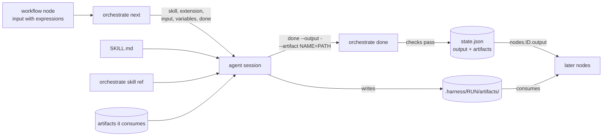
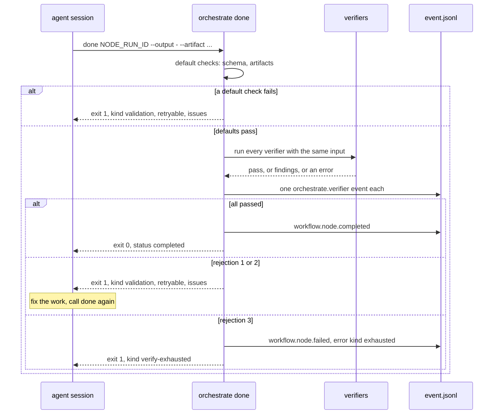

# 8. Anatomy of a stage

[Index](README.md) · Previous: [Agents and hooks](07-agents-and-hooks.md) · Next: [Adding a node to a workflow](09-adding-a-node.md)

A stage is a skill folder that a workflow node can run. It holds a `SKILL.md`. The frontmatter at
the top (the YAML between the two `---` lines) is the stage's contract: what goes in, what comes
out, which files it reads and writes, and how to check it did its job. The markdown below the
frontmatter is the instructions the agent session follows.

Not every folder under `skills/` is a stage. `adr`, `code-quality`, `orchestrate`, `refactor`,
`resolve-merge-conflict`, `tdd` and `writing-style` have only `name` and `description`. They are
ordinary skills that stages load. A folder is a stage when its frontmatter parses against
`StageSchema` in [stage.ts](../../packages/core/src/stage.ts).

## The frontmatter

`StageSchema` is a strict Zod object, so a misspelled key such as `produce:` fails the load
instead of being ignored. Compile loads every stage a workflow names, each time it compiles: on
`harness verify`, on `harness run`, and on every `orchestrate next` and `done`. A stage edit
takes effect on the next `next` call.

| Field | Required | What it does |
|---|---|---|
| `name` | yes | A slug. Must equal the folder name, or the load fails |
| `description` | yes | What the skill does and when it runs |
| `mode` | yes | `inline` or `subagent`. Parsed; the engine does not act on it today |
| `allowed-tools` | yes | Tool names. Parsed, not enforced |
| `protocols`, `scopes` | yes | Lists of slugs. Every stage today writes `[]` |
| `tier` | no | The model tier the stage runs on, such as `fast` or `deep`. A node's own `tier` wins. See [section 7](07-agents-and-hooks.md) |
| `inputs` | no | `{ description, schema }`. Describes the input. Compile does not load this schema, so the input is not validated |
| `outputs` | no | `{ description, schema, module }`. Compile imports `module` (relative to the skill folder) and takes its `schemas[schema]`. Without `outputs`, the output is plain text |
| `consumes` | no | `[{ artifact, optional }]`: files the stage needs before it starts |
| `produces` | no | `[{ artifact, optional }]`: files the stage must hand back on `done` |
| `references` | no | `KEY: { path, description }`. Each `path` must exist in the skill folder |
| `verifiers` | no | Checks that run when the stage calls `done` |
| `variables` | no | `NAME: { description, default }`. A workflow node sets them under `variables` |

A schema name must look like `create-workspace.output.v1`: dotted slugs ending in a version. The
module exports one record named `schemas`, keyed by those names. See
[workspace.ts](../../skills/create-workspace/scripts/workspace.ts), which exports
`schemas = { "create-workspace.output.v1": CreateWorkspaceOutputSchema }`.

An artifact is a file a stage writes under the run folder, `.harness/RUN_NAME/artifacts/`, for
later stages to read. `design` produces `design`, `planning` consumes `design` and produces
`plan`. Compile checks that every required `consumes` has a producer the node depends on.

## baseline, top to bottom

`skills/baseline` is the smallest stage that has its own code. It runs the project's baseline
scripts before any code changes, so later stages can tell a test that was already red from one
the run broke.

Beside `SKILL.md` sit `scripts/baseline.ts` (the script), `scripts/baseline.test.ts` (unit
tests that call `captureBaseline` on temp repos), `scripts/baseline.e2e.test.ts` (runs the script
as a process), `tsconfig.json` (extends `../../tsconfig.base.json` and includes `scripts/`) and
`evals/evals.json` (prompts and expectations for skill evals, which `bun test` does not run).

The frontmatter says: `mode: inline`, `allowed-tools: [Bash]`, `tier: fast` (it runs a script,
so it needs no deep model), and `produces: [{ artifact: baseline, optional: true }]`. The
artifact is optional because a project with no baseline command writes nothing. It has no
`outputs`, so whatever it passes to `done` is stored as a string. A later node cannot read
`nodes.baseline.output.path`, because the output is text, not an object.

It declares one reference, `script`, pointing at `scripts/baseline.ts`. That is why step 1 of
the body does not call the script directly:

```bash
bun "$(bun run --silent orchestrate skill ref --path baseline.script)" --run RUN
```

`skill ref --path` prints the file to run, after the project's changes. A project that needs a
different baseline replaces the script in its config, and the skill text stays the same.

The rest of the body is about failure. If the script exits non-zero, the stage stops and reports
the error as printed: a missing script or a missing workspace is the person's to fix. A non-zero
exit code inside the report is not a failure. A suite that is already red is exactly what a
baseline records.

[baseline.ts](../../skills/baseline/scripts/baseline.ts) reads like most scripts here. `main`
parses flags with `parseArgs`. `requireRun` finds the run from `--run`, `--run-id` or
`$HARNESS_RUN_ID`. `loadRunConfig` loads the config the run started with. `captureBaseline` then
finds the workspace folder (`--dir`, else `workspace.path` in `state.json`), collects the
top-level `baseline` command and each package's `commands.baseline`, runs them one at a time with
`CI=1`, and writes `artifacts/baseline.json`. Failures come back as a `Result` with a code
(`PACKAGE_UNKNOWN`, `STATE_MISSING`, `CONFIG_STALE`, `WORKTREE_MISSING`) and print to stderr as
`CODE: message`. Stdout carries only the JSON report, so the skill can parse it.

The tests name each case with an id, such as `BL4: a script that exits 1 is recorded as a
result`. The e2e test points `HARNESS_HOME` at a temp folder and clears `HARNESS_RUN_ID`, so it
never touches your real run registry.

## References and project extensions

A reference is a supporting file a skill lists in its frontmatter and loads only when it needs
it. The session reads one through the orchestrate script:

```bash
bun run orchestrate skill ref planning.plan-format     # print its text
bun run orchestrate skill ref --path baseline.script   # print the file path, to run it
bun run orchestrate skill ref --list ticket-fetcher    # list references, project ones too
```

The argument is `SKILL.REF`, split at the last dot, so a project stage at a path works too:
`stages/changelog.style`. An unknown key fails with `unknown reference "nope"; baseline has: script`.

A project changes a shipped skill without forking it, under `extensions` in
`orchestrate.config.yaml`. Paths are relative to the repo root.

```yaml
extensions:
  baseline:
    references:
      script: { replace: tools/our-baseline.ts }
  ticket-fetcher:
    skill: docs/harness/ticket-fetcher.md
    references:
      jira: { add: docs/harness/jira.md, description: "Jira keys like PROJ-12" }
      linear: { extend: docs/harness/linear-extra.md }
```

- `replace` serves the project's file instead of the skill's.
- `extend` appends the project's file after the skill's text. A reference used with `--path` cannot be extended: `a reference used by path can only be replaced, not extended`.
- `add` creates a key the skill does not have. Adding a key it has fails: `already has reference style; use replace or extend`.
- `skill` is a whole extra document. `next` puts its path in the stage reply's `extension` field. The orchestrate skill tells the session to read it after `SKILL.md` and to let it win where they disagree. `bun run orchestrate skill extension SKILL` prints it.

This is why a skill never tells the agent to open `references/foo.md` by path. A plain file read
gets the shipped text and skips every `replace`, `extend` and `add` the project set.
[orchestrate/SKILL.md](../../skills/orchestrate/SKILL.md) says it outright: "Never open a
reference file by its path, since that skips the project's changes to it." The code is
`resolveReference` and `resolveReferencePath` in [stage.ts](../../packages/core/src/stage.ts).

## How a stage hands back its result

The `next` reply for a stage carries a ready-made `done` command. When the work is finished, the
session runs it with the output on stdin, in a quoted heredoc so the shell leaves the text
alone:

```bash
bun run orchestrate done NODE_RUN_ID --run NAME --output - \
  --artifact baseline=artifacts/baseline.json <<'OUT'
{ "path": "/repo/.harness/feat-x/artifacts/baseline.json", "workspace": 0, "packages": {} }
OUT
```

`--artifact NAME=artifacts/PATH` is repeatable, with the path relative to the run folder. Pass
exactly one of `--output` and `--error`; `--error -` fails the node with the reason. The flags
live in `doneCommand` in [orchestrate.ts](../../packages/core/src/orchestrate.ts).



`done` checks the finish before it records it. These are the default checks, in `findDefaultIssues`
in [done.ts](../../packages/core/src/workflow/done.ts):

- When the stage declares `outputs`, the output must parse as JSON and match the schema (`output-schema`).
- Every `produces` entry not marked optional must be passed as an `--artifact` (`required-artifact`).
- Each artifact must be an existing file inside the run's `artifacts/` folder (`artifact-file`).
- No artifact name may appear twice (`artifact-name`).

## Verifiers

A verifier is a check a stage declares that runs on `done`, after the default checks pass. It
answers "did the stage really do its job", which a schema cannot: the file has one line, the
tests in it run, the PR body names the ticket. No shipped stage declares one yet. The tests in
[orchestrate.e2e.test.ts](../../packages/core/src/orchestrate.e2e.test.ts) under `stage verifiers`
show every case.

A verifier is either `{ id, module, functionName }` or `{ id, runtime, script }`, with optional
`args` (any JSON, passed through) and `timeoutMs` (default 60000). A module path is relative to
the skill folder, and compile imports it, so a missing export fails `harness verify` with
`missing-export: ... has no callable export "oneLiner"`. A script gets its input as JSON on stdin
and runs in the repo root the run started in. Both get the same input:

```json
{ "run": "feat-x", "nodeRunId": "nr-3f9c2a7d1b4e8a60", "output": { "ok": true },
  "artifacts": { "changelog": "/repo/.harness/feat-x/artifacts/changelog.md" }, "args": {} }
```

It returns `{ "pass": true }`, or `{ "pass": false, "findings": [...] }` where each finding is
`{ message, path?, line?, hint? }`. A failing result needs at least one finding. For more facts about the node, a script can run
`bun run orchestrate node show --node-run NODE_RUN_ID`; a module can import `getNodeRun` and
`getConsumed` from `@harness/core`.

[verifiers.ts](../../packages/core/src/workflow/verifiers.ts) runs them all at once and records each
run as an `orchestrate.verifier` event. A verifier that throws, times out, exits non-zero or
prints something that is not a result fails closed, with reason `threw`, `timeout`, `exit` or
`bad-output`.



A rejection leaves the node running, so the session fixes the work and calls `done` again with
the same id. The third rejected `done` for one node run fails the node for good
(`MAX_REJECTED_DONES` in [runs.ts](../../packages/core/src/runs.ts)). Rejections from the
default checks count toward the three.

## Add a new stage

1. Pick a home. A stage that ships with the harness goes in `skills/NAME/`, and a workflow names
   it bare: `stage: NAME`. A project's own stage can live in any folder of that project, and a
   workflow names it by a path with a `/`, resolved from the repo root: `stage: stages/changelog`
   (`findStageDir` in [stage.ts](../../packages/core/src/stage.ts)).
2. Write `SKILL.md`. Here is a small project stage that writes one changelog line:

   ```markdown
   ---
   name: changelog
   description: >
     Write one changelog line for the run's change and save it as the run's changelog artifact.
     Runs as a workflow stage after the code is written.
   mode: inline
   allowed-tools: [Bash, Read, Write]
   tier: fast
   outputs:
     description: The changelog line, and where it was written.
     schema: changelog.output.v1
     module: schemas.ts
   produces:
     - artifact: changelog
   protocols: []
   scopes: []
   references:
     style:
       path: references/style.md
       description: How a changelog line is worded.
   verifiers:
     - id: one-line
       module: verifiers.ts
       functionName: oneLine
   ---

   # Changelog

   RUN_NAME below is the run's name.

   1. Read the style guide with `bun run orchestrate skill ref stages/changelog.style`.
   2. Read `git diff` in the workspace folder the input names.
   3. Write the line to `.harness/RUN_NAME/artifacts/changelog.md`.
   4. Finish with `--artifact changelog=artifacts/changelog.md` and the output
      `{ "line": "THE LINE", "path": "artifacts/changelog.md" }`.
   ```

3. Add the files the frontmatter names. `references/style.md` is any markdown. `schemas.ts`:

   ```ts
   import { z } from "zod";

   export const schemas = {
     "changelog.output.v1": z.strictObject({ line: z.string().min(1), path: z.string() }),
   };
   ```

   `verifiers.ts`:

   ```ts
   import { readFileSync } from "node:fs";

   type Input = Readonly<{ artifacts: Readonly<Record<string, string>> }>;

   export const oneLine = ({ artifacts }: Input) => {
     const path = artifacts.changelog ?? "";
     const lines = readFileSync(path, "utf8").trim().split("\n").length;
     if (lines === 1) return { pass: true, findings: [] };
     return { pass: false, findings: [{ message: `changelog has ${lines} lines; write one`, path }] };
   };
   ```

4. Put it in a workflow (next section) and run `harness verify ./my-flow.yaml`. Compile loads
   the frontmatter, imports both modules and checks the artifacts, so most mistakes show here:
   `skill name "change-log" must match its folder changelog`, or `Invalid input: expected array,
   received undefined → at scopes` when you leave out `scopes: []`.
5. For a stage in `skills/` with its own scripts, do what baseline does: add a `tsconfig.json`,
   add the folder to the root `typecheck` and `test` scripts in
   [package.json](../../package.json), and to `files.includes` in [biome.json](../../biome.json).
   Write the script's tests first ([section 10](10-how-we-work.md)).

## Files to open

| What | Where |
|---|---|
| The stage contract, references, extensions | [packages/core/src/stage.ts](../../packages/core/src/stage.ts) |
| How compile loads a stage | `loadStage` in [compile.ts](../../packages/core/src/workflow/compile.ts) |
| The default `done` checks | [packages/core/src/workflow/done.ts](../../packages/core/src/workflow/done.ts) |
| Verifiers | [packages/core/src/workflow/verifiers.ts](../../packages/core/src/workflow/verifiers.ts) |
| Rejections and the three-strike rule | `checkCompletion`, `rejectDone` in [runs.ts](../../packages/core/src/runs.ts) |
| `done`, `skill ref`, `skill extension` | [packages/core/src/orchestrate.ts](../../packages/core/src/orchestrate.ts) |
| A small stage with a script | [skills/baseline/SKILL.md](../../skills/baseline/SKILL.md) |

[Index](README.md) · Previous: [Agents and hooks](07-agents-and-hooks.md) · Next: [Adding a node to a workflow](09-adding-a-node.md)
