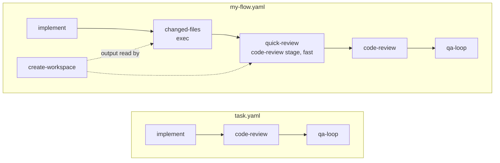

# 9. Adding a node to a workflow

[Index](README.md) · Previous: [Anatomy of a stage](08-anatomy-of-a-stage.md) · Next: [How we work here](10-how-we-work.md)

A workflow is a YAML file with a name, the inputs a run takes, and a list of nodes. A node is one
step: run a command, run a stage, wait, loop, branch. This section copies the default workflow,
adds two nodes to it, checks the result, and runs it. How the engine walks the nodes is in
[section 5](05-workflow-engine.md); the schema is `WorkflowSchema` in
[types.ts](../../packages/core/src/workflow/types.ts).

## Copy task.yaml

[workflows/task.yaml](../../workflows/task.yaml) is the workflow `harness run task` runs. A bare
name like `task` means one of the harness's own workflows, in `workflows/` beside its code. A name
with a `/` or ending in `.yaml` or `.yml` is a file, resolved from the folder you run in. That
rule is `findWorkflowPath` in [stage.ts](../../packages/core/src/stage.ts), and `harness run`,
`harness verify` and `harness doctor --workflow` all use it. So `harness run my-flow` does not
find your file; it looks in the harness install and fails:

```
missing-workflow: cannot read workflow /…/harness-engineering/workflows/my-flow.yaml: ENOENT: no such file or directory, …
```

Work from your repo root, because stage paths and include paths resolve from there too:

```bash
cp workflows/task.yaml my-flow.yaml   # then change `name: task` to `name: my-flow`
```

The middle of `task.yaml` is a straight line: `implement` writes the code, `code-review` reviews
it, `qa-loop` tests it.

## Add an exec node

An exec node runs a command without the agent thinking about it. This one lists the files
`implement` changed, so the reviews can start from that list. Put it after `implement`:

```yaml
  - id: changed-files
    type: exec
    runtime: sh
    script: git -C "$(jq -r .dir)" status --short
    dependsOn: [implement]
    input:
      dir: "{{ nodes.create-workspace.output.workspaceDir }}"
```

A few things about it, each one a rule in the code:

- The script gets the node's resolved `input` as JSON on stdin. That is why it reads the folder with `jq -r .dir`.
- It runs in the repo root the run started in, not in the run's worktree. The `cwd:` field is a fixed path relative to that root and takes no expression, so the worktree path comes in through `input`.
- Its stdout is its output, as text. Add `output: { zodSchema: Json }` and stdout is parsed as JSON instead, so later nodes can read fields out of it.
- A non-zero exit fails the node. `retry: { maxAttempts: 3, delayMs: 1000 }` reruns it; `allowFailure: true` lets the run carry on past a failure.
- `runtime: bun` runs the script with `bun -e`. `module` and `functionName` call an exported function instead of a script. A long command takes `mode: background`, so the session runs it as a background task.

It depends only on `implement`, but reads `create-workspace`. That is allowed: a node may read
`nodes.X` when X is a dependency, direct or through a chain, and `create-workspace` comes before
`implement`.

## Add an agent node that runs a stage

Now a quick review on the fast model before the deep one. It reuses the shipped `code-review`
stage:

```yaml
  - id: quick-review
    type: agent
    stage: code-review
    tier: fast
    dependsOn: [changed-files]
    input:
      workspace: "{{ nodes.create-workspace.output }}"
      changed: "{{ nodes.changed-files.output }}"
```

`code-review`'s `SKILL.md` says `tier: deep`. A node's own `tier` wins over the stage's, and the
stage's wins over the run's default (`pickNodeTier` in
[next.ts](../../packages/core/src/workflow/next.ts)). `code-review` declares no `inputs` schema,
so the engine hands the input over as it is, and the skill reads what it needs.

Then point the existing `code-review` node at the new one. Change its `dependsOn: [implement]` to
`dependsOn: [quick-review]`.



An agent node can also skip the stage and take a `prompt` instead. `kitchen-sink.yaml`'s `report`
node does that. A node with neither fails compile with `agent needs a prompt when it has no stage`.

## Input expressions

Any string in `input` can hold `{{ ... }}`. The paths it can read are `inputs.NAME`,
`nodes.ID.input`, `nodes.ID.output` and `nodes.ID.status`, and inside a loop `iteration.index`,
`iteration.max`, `iteration.previous` and `iteration.nodes.ID....`. A value that is exactly one
expression keeps its type, so `workspace` above is the whole object. Text around an expression
makes a string. `when:` and a loop's `until:` must be exactly one expression that gives a boolean,
with `==`, `!=`, `<`, `>`, `and`, `or`, `not` and quoted strings.

Inside a loop, switch or include, `inputs` means that container's own `input`. `task.yaml`'s
`qa-loop` passes `workspace` in, and its `qa` node reads `{{ inputs.workspace }}`.

Quote every expression. Unquoted, YAML reads `{{ x }}` as a nested map. The file still compiles,
with a warning about stringified keys, and the node gets a nonsense input. The compiler does not
catch this one.

## Check it

```bash
harness verify ./my-flow.yaml
```

prints `ok: workflow my-flow compiles (13 nodes)`. The count is the top-level nodes. From a
checkout, `bun run cli verify ./my-flow.yaml` runs the same code ([section 3](03-running-locally.md)).
`verify` loads every stage the file names, imports every schema and verifier module, and checks
ids, dependencies, expressions and artifacts. It does not start anything.

`harness doctor --workflow ./my-flow.yaml` runs the doctor (the health checks `harness run` does
before it starts a run) plus the checks the workflow declares. Two of `task.yaml`'s three:

```yaml
doctor:
  - check: env
    key: LINEAR_API_KEY
    fix: Set LINEAR_API_KEY in .env
  - check: binary
    key: bun
    fix: Install Bun
```

`check` is `env`, `binary`, `package` or `file`. Each shows as its own row, such as
`env:LINEAR_API_KEY`, and every declared check is required. An included workflow's checks are
added to the top one's. The doctor never runs a command for you; `fix` is advice it prints.

## Common mistakes compile catches

Every compile error prints as `CODE: message` and exits 1. The codes are `WorkflowErrorCodeSchema`
in [types.ts](../../packages/core/src/workflow/types.ts); the checks are in
[compile.ts](../../packages/core/src/workflow/compile.ts). These come from breaking `my-flow.yaml`
on purpose:

| Mistake | What `harness verify` prints |
|---|---|
| A typo in `dependsOn` | `missing-dependency: quick-review depends on unknown "changed-file"` |
| Reading a node you do not depend on | `invalid-reference: quick-review reads nodes.changed-files.output but does not depend on "changed-files"` |
| `planning` depending on `baseline` instead of `design` | `missing-artifact: planning needs artifact "design", but no node it depends on produces it; add dependsOn: [design]` |
| An exec node with no `script` | `schema: nodes.6: exec needs runtime + script, or module + functionName` |
| A node depending on a later node | `cycle: dependency cycle among: code-review, qa-loop, commit, pr, retro` |
| `output:` on a stage node | `schema: quick-review: stage output schema is declared in SKILL.md; remove the node output override` |
| A misspelled variable | `schema: qa: stage qa has no variable "envirnment"; it has: environment` |
| `always: true` on a node that reads another | `invalid-reference: quick-review is always: true, so it can start when "create-workspace" never ran; it cannot read nodes.create-workspace.output` |
| A loop `until` that reads `nodes` | `invalid-reference: qa-loop: until may read only inputs and iteration` |

A schema error names the path into the YAML, so `nodes.6` is the seventh node. A misspelled stage
name shows as `missing-stage: stage code-reveiw: …/skills/code-reveiw/SKILL.md: cannot read file`.
A tier name compile does not check: `tier: quick` passes `verify`, and `orchestrate init` refuses
it when the run's agent can switch models, with `quick-review has tier "quick"; the claude tiers are …`.

## Run it

```bash
harness run ./my-flow.yaml --prompt "add a --json flag to harness doctor"
```

`--input key=value` sets other inputs (repeatable), `--name` picks the run name, `--attach`
drops you into the session. The run copies the file to `.harness/RUN_NAME/workflow.yaml` at
`init`, and every `next` compiles that copy. Editing `my-flow.yaml` mid-run changes nothing for
that run. Editing a stage's `SKILL.md` does, on the next `next`.

## Workflow-level settings

Beside `nodes`, a workflow can set these. Only the top workflow's `tiers`, `env`, `hooks` and
`notifier` apply; an included workflow's are ignored.

```yaml
name: my-flow
agent: claude            # or codex
tiers:
  default: fast          # the tier a node with no tier runs on
  models:
    fast: { model: claude-sonnet-5-5 }
notifier: { enabled: false }
hooks:
  workflow.node.failed:
    - name: log-failure
      command: jq -c .event >> failures.jsonl
      blocking: false
```

`tiers` layers over the harness's built-in `fast` and `deep` and the config's
`agents.claude.tiers` ([section 7](07-agents-and-hooks.md)). `notifier` replaces the config's
whole notifier block. `hooks` maps an event type to a list of hooks, each a shell command that
reads `{ event, state, run }` as JSON on stdin, or a `module` and `handler`. A command runs in the
workflow file's folder unless it sets `cwd`. Workflow hooks run after the config's, and a name
both use for one event type is refused at `init` ([section 6](06-events-and-state.md),
[ADR 0005](../adr/0005-a-run-hook-is-a-module-export-or-shell-command-from-config-and-workflow.md)).
A key that is not an event type fails compile:
`schema: hooks.node.failed: Invalid key "node.failed": Unknown event namespace or invalid event name`.

## The demo workflows

[demo-workflows/](../../demo-workflows/) holds small workflows that exercise the engine. Read the
comment at the top of each; most list the result a run should give.

| File | What it shows |
|---|---|
| [kitchen-sink.yaml](../../demo-workflows/kitchen-sink.yaml) | Every node type: exec with a JSON output, `when` that skips, a node skipped because its dependency was, a retry loop, a switch with a default and one with no match, an include, and a prompt-only agent node |
| [kitchen-sink-include.yaml](../../demo-workflows/kitchen-sink-include.yaml) | The included half: a `wait` node, inputs with defaults, and the `review` stage. `verify` on it alone fails with `missing-artifact`, because its `brief` comes from the workflow that includes it |
| [step-demo.yaml](../../demo-workflows/step-demo.yaml) | Exec nodes only: a background exec, a skipped `when`, a `wait`, and a node that joins two branches |
| [context-demo.yaml](../../demo-workflows/context-demo.yaml) | `context` nodes: `action: new` gives a fresh session, `action: compact` compacts it, steered by `prompt` |
| [ticket-demo.yaml](../../demo-workflows/ticket-demo.yaml) | A stage `variables` value (`provider: demo`) and a project-added reference. It needs `extensions.ticket-fetcher.references.demo: { add: demo-workflows/references/demo-tickets.md }` in the config, which this repo's `orchestrate.config.yaml` does not have today |
| [stages/](../../demo-workflows/stages/) | Three tiny project stages (`demo-brief`, `demo-draft`, `demo-review`) named by path, with output schemas in `stages/schemas.ts` |

## Files to open

| What | Where |
|---|---|
| The workflow and node schemas | [packages/core/src/workflow/types.ts](../../packages/core/src/workflow/types.ts) |
| Every compile check | [packages/core/src/workflow/compile.ts](../../packages/core/src/workflow/compile.ts) |
| Expressions | [packages/core/src/workflow/evaluate.ts](../../packages/core/src/workflow/evaluate.ts) |
| `harness verify` | [packages/cli/src/verify.ts](../../packages/cli/src/verify.ts) |
| `harness doctor` and workflow checks | [packages/cli/src/doctor.ts](../../packages/cli/src/doctor.ts), `workflowChecks` in [packages/core/src/doctor.ts](../../packages/core/src/doctor.ts) |
| Name or path | `findWorkflowPath` in [packages/core/src/stage.ts](../../packages/core/src/stage.ts) |

[Index](README.md) · Previous: [Anatomy of a stage](08-anatomy-of-a-stage.md) · Next: [How we work here](10-how-we-work.md)
