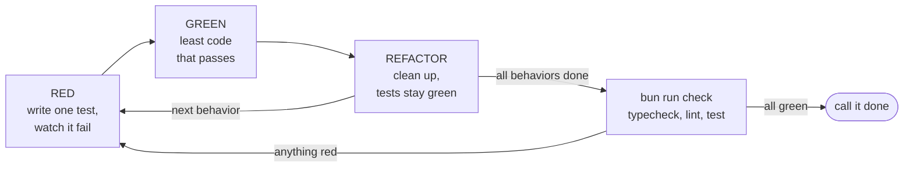
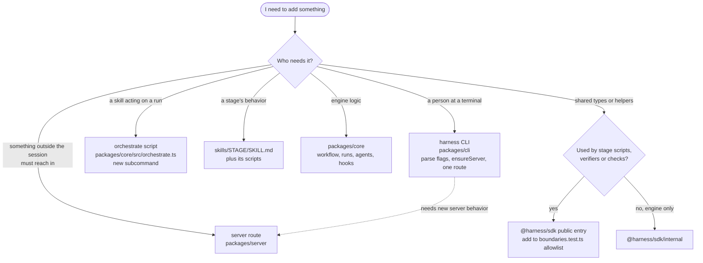

# 10. How we work here

[Index](README.md) · Previous: [Adding a node to a workflow](09-adding-a-node.md) · Next: [Releases and packaging](11-releases-and-packaging.md)

The rules for this repo live in two files at the root. [CLAUDE.md](../../CLAUDE.md) is what
Claude Code reads, [AGENTS.md](../../AGENTS.md) is what Codex reads, and both apply to you too.
They are short lists. This section gives the reason behind each rule and points at code that
follows it, so you can tell what a reviewer will ask for before they ask.

## Tests first, then the code

The repo is test-driven. You write one failing test, write the least code that makes it pass,
clean up, and go again. The [tdd skill](../../skills/tdd/SKILL.md) spells out the loop, and the
`implement` stage of a run loads it before touching code. Its one-line summary is "Every line of
production code is written in response to a failing test."



Tests sit next to the file they test. `packages/core/src/workflow/next.ts` has `next.test.ts` in
the same folder. A test that drives a real process ends in `.e2e.test.ts`: for example
[orchestrate.e2e.test.ts](../../packages/core/src/orchestrate.e2e.test.ts) makes a throwaway git
repo in a temp folder and spawns `orchestrate.ts` against it, and the CLI has
`run.e2e.test.ts`, `doctor.e2e.test.ts` and others in `packages/cli/src/`. There is no separate
e2e command. `bun test` matches both suffixes, so `bun run test` runs them together.

`bun run test` covers `./packages` and the skills that carry TypeScript (`create-workspace`,
`ticket-fetcher`, `baseline`, `qa`, `harness-retro`). The release scripts in `scripts/` and the
test in `hooks/` are left out. They have their own commands (`test:scripts`, `test:scripts:bun`,
`test:hooks`), mostly under `node --test`, because the release script must run under Node as
well as Bun. The release workflow runs those three. To run one file while you work, use
`bun test PATH_TO_FILE`.

Reviewers check two testing habits. Name a test by the claim it checks ("page 4 of 31 items
returns the final 1 item"), not by its topic; the tdd skill has examples. And test what the code
returns, writes or records, never what it logged
([no-log-assertions.md](../learnings/no-log-assertions.md)).

## `bun run check` before you call it done

CLAUDE.md says to run typecheck, tests and lint before calling a task finished.
[scripts/check.ts](../../scripts/check.ts) does all three in one go. It runs `bun run typecheck`,
`bun run lint` and `bun run test`, keeps going after a failure so you see every problem, and
prints one JSON summary:

```json
{
  "typecheck": { "exitCode": 0, "errors": 0 },
  "lint": { "exitCode": 0, "errors": 0, "warnings": 0 },
  "test": { "exitCode": 0, "passed": 0, "failed": 0 }
}
```

(The numbers above show the shape, not a real run.) It exits 1 if any of the three failed. The
same command is the `baseline` in [orchestrate.config.yaml](../../orchestrate.config.yaml), so a
run records this JSON before it changes anything and can tell later whether it made things worse.

If you work inside a nested worktree under `.worktrees/`, two things bite. Run
`bun install --frozen-lockfile` there first, or Bun may resolve the workspace packages from the
parent checkout and test the old code (AGENTS.md). And `bun run lint` checks nothing there,
because [biome.json](../../biome.json) excludes `.worktrees`. Lint with a temporary Biome config
that drops that line (CLAUDE.md).

## Biome and strict TypeScript

[Biome](https://biomejs.dev) is the formatter and linter. `biome.json` turns on the
`recommended` rule set, two-space indent, a 100-column line, and import sorting. It covers
`packages/**`, the TypeScript skills and the root JSON files. `bun run lint:fix` applies what it
can. The files under `scripts/` are outside its `includes`, which is why they use a different
style (no semicolons).

TypeScript runs in strict mode from [tsconfig.base.json](../../tsconfig.base.json), and every
package's `tsconfig.json` extends it. Beyond `strict`, three flags change how you write code:

- `noUncheckedIndexedAccess`: `array[0]` and `match[1]` are typed `T | undefined`. That is why
  `check.ts` writes `match?.[1] === undefined ? 0 : Number(match[1])`.
- `exactOptionalPropertyTypes`: an optional field may be missing but may not be set to
  `undefined`. So code builds objects without the key instead. `eventError` in
  [events.ts](../../packages/sdk/src/events.ts) returns `{ kind, message }` or
  `{ ...error, stack }`, never `stack: undefined`, and `pickTierModel` in
  [contracts.ts](../../packages/sdk/src/contracts.ts) does the same for `effort`.
- `verbatimModuleSyntax`: a type-only import must say `import type` or `type X` inline.

`bun run typecheck` runs `tsc --noEmit` in each package, then `tsc -p` over each TypeScript skill.

## Zod schemas, types inferred from them

Any data that crosses a boundary (a file on disk, a CLI flag, an HTTP body, a workflow YAML) gets
a [Zod](https://zod.dev) schema, and its TypeScript type comes from that schema with `z.infer`.
You never write the type by hand next to it, because then two definitions drift.
[contracts.ts](../../packages/sdk/src/contracts.ts) is where the shared ones live:

```ts
export const TierModelSchema = z.strictObject({
  model: NonEmptyStringSchema,
  effort: EffortSchema.optional(),
});
export type TierModel = z.infer<typeof TierModelSchema>;
```

A schema gets a name only when it adds something. `NameSchema` adds a regex,
`AbsolutePathSchema` adds a refine, `TierModelSchema` is an object shape used in several places.
A plain call such as `z.int().nonnegative()` stays inline where it is used, as in
`TokenUsageSchema`. Do not write `const IdSchema = z.string().min(1)`. For a non-empty string
use `NonEmptyStringSchema`, which is the one exception everyone shares.

## Expected failures are values

A failure the caller should handle (bad input, a missing file, an invalid event) comes back as a
`Result`, not a throw. The type is in `contracts.ts`:

```ts
export type Result<T, E = string> =
  | { readonly ok: true; readonly value: T }
  | { readonly ok: false; readonly error: E };
```

The compiler then makes the caller look at `ok` before it can touch `value`. `appendRunEvent` in
[state.ts](../../packages/sdk/src/state.ts) returns one, and the code that calls it bails early
with `if (!appended.ok) return appended;`. Exceptions are for bugs and for the workflow engine's
own control flow: `WorkflowError` and `NodeFailure` in
[types.ts](../../packages/core/src/workflow/types.ts) are thrown inside core and caught in
`next.ts` and `orchestrate.ts`, where they turn into a failed node or a JSON error reply. The
[code-quality skill](../../skills/code-quality/SKILL.md) has the full rule.

## Keep the stack

Never turn an `Error` into a string. When you wrap one, pass the original as `cause`:

```ts
throw new NodeFailure(failure.kind, failure.message, result, { cause: error });
```

That line is from [exec.ts](../../packages/core/src/workflow/exec.ts). `WorkflowError` and
`NodeFailure` both take `ErrorOptions` for this. When an error goes into an event payload or a
log, its stack goes with it: `stackOf` in `events.ts` picks the thrown error's own stack, since
"a wrapper's stack only says who caught it". The one place that shows only the message is the
`harness` CLI's terminal output. `fail` in [client.ts](../../packages/cli/src/client.ts) prints
the message, and the full chain of stacks only under `LOG_LEVEL=debug` or `trace`. The server's
logs keep every stack.

## One plain function, not a closure factory

Do not write `makeRunner(config)` that returns `{ run(input) }` with `config` captured. Write
`runX(config, input)` and pass everything. A captured argument is hidden from the reader of the
call site, and it makes the function harder to test with a different value.

The exception is an object that implements an interface. `jsonlEventStore(runDir)` in
[event-store.ts](../../packages/sdk/src/event-store.ts) returns an `IEventStore` with `runDir`
captured, and `claudeProvider(...)` returns an `IAgentProvider`. Holding config is the point of
those objects: the engine calls `read` and `append` without knowing which store it has.

## Comments say what the code cannot

Write a comment only for a reason the code cannot show: an outside constraint, a choice that
looks wrong but is not, or a trap for the next person. This one in `check.ts` earns its place:

```ts
// The test suite's output runs to megabytes; spawnSync's 1 MB default would cut it off.
const MAX_OUTPUT_BYTES = 64 * 1024 * 1024
```

Delete a comment that repeats the name below it, cites a ticket or plan step, or tells the
history of a fix. The commit message holds history. The code-quality skill has the full list.

## No backward compatibility

Nobody runs the harness in production yet, so nothing has to keep working for old run folders,
old `state.json` shapes, old registry entries or old configs. If a field should be required, make
it required. Do not keep an `.optional()` only so old data still parses, and do not write a
migration. A shim for data nobody has is code everyone has to read.

## Lessons from review: docs/learnings

[docs/learnings](../learnings/) holds short rules that came out of PR reviews. Nothing loads
them automatically, so read all four before your first PR:

- [naming.md](../learnings/naming.md): name a function by what it does (`parseJsonOrText`), not
  by what it returns (`outputOf`). Older `xOf` names such as `runDirOf` exist; do not copy them.
- [nested-ternaries.md](../learnings/nested-ternaries.md): one `a ? b : c` is fine, a ternary
  inside a ternary is not. Use a `switch` or early returns.
- [no-log-assertions.md](../learnings/no-log-assertions.md): tests never assert on log output.
  If it matters, it shows up in the result.
- [single-use-helpers.md](../learnings/single-use-helpers.md): inline a helper called from one
  place, unless it holds logic that reads better on its own under a precise name.

AGENTS.md also tells agents to search `.harness/knowledge/lessons/` before starting. That folder
is not in this checkout, and the `learn` skill that wrote to it was removed with the other v1
skills in PR #172. Treat `docs/learnings/` as the live list.

## Decisions that bind: ADRs

An ADR (architecture decision record) is a short file in [docs/adr](../adr/) that records one
decision, the options that lost, and why. It exists so the next person does not "fix" something
that was done on purpose. [INDEX.md](../adr/INDEX.md) lists every ADR on one line with its
status, date, tags and what it requires. Read the index before you change an area. An `active`
ADR is a decision already made: either follow it or write a new one that supersedes it, the way
[ADR 0002](../adr/0002-session-drives-workflow-step-by-step-through-stateless-orchestrate-commands.md)
replaced 0001.

Write one when a choice passes all four gates in the [adr skill](../../skills/adr/SKILL.md): it
is hard to undo, it would surprise a reader without context, two reasonable people could have
chosen differently, and it would change what the next person does. A lint rule or a library
picked for one helper does not qualify. Run the skill (`/harness:adr` with the plugin installed)
rather than writing the file by hand: it numbers the file, reuses tags from the index, and
updates `INDEX.md`. The `planning` stage calls it on its own for each decision a plan approves.

## Where does my change go

The split from [section 1](01-thirty-second-model.md) decides most of this.
[Section 2](02-repo-map.md) has the full folder map.



A few rules hold the boxes apart, and tests in
[boundaries.test.ts](../../packages/sdk/src/boundaries.test.ts) enforce them. The sdk never
imports core. No skill script imports `@harness/core` or `@harness/sdk/internal`: a skill acts on
a run through the orchestrate script or the sdk's public entry. A new public sdk export must be
added to the test's allowlist, which is how [ADR 0003](../adr/0003-sdk-public-entry-is-curated-engine-behind-internal.md)
keeps that entry short. Only `git.ts` in the sdk runs `git`, and only `state.ts` builds a path to
`state.json`.

## Ask first, explain the odd parts

CLAUDE.md asks agents to stop before a `git commit` and to ask before an architectural change.
The `git-commit` and `visual-pr` stages of a `harness run` are exempt: they commit, push and open
the PR without pausing, because the whole point of a run is that nobody is watching. When you
make a choice a reader would question, say why, in the PR or in a comment if it passes the test
above.

## Using the harness on itself

The repo is a valid harness project, so you can let the harness build the harness:

```bash
bun install
bun run cli run task --prompt "Make harness doctor report the tmux version"
```

[orchestrate.config.yaml](../../orchestrate.config.yaml) at the root sets this up. Its
`workspace` block makes a worktree at `.worktrees/BRANCH` from the `v2` branch and runs
`bun install` in it. Its `baseline` is `bun run check`. Its `packages` block lists `sdk`, `core`,
`server`, `cli` and `plugins` with the typecheck, lint and test commands each stage uses.
`.claude/skills/orchestrate` and `.agents/skills/orchestrate` are symlinks to
`skills/orchestrate`, so a session started in this checkout uses your local orchestrate skill and
not an older copy from an installed plugin.

Every task run ends with the `retro` node ([workflows/task.yaml](../../workflows/task.yaml)). It
runs even after a failure, reads the session transcripts, and writes
`.harness/RUN_NAME/artifacts/retro.md`: a ranked list of what the harness itself got wrong. When
you run the harness on its own code, that report is often your next ticket.

## Files to open

| What | Where |
|---|---|
| Rules for Claude Code | `CLAUDE.md` |
| Rules for Codex, plus worktree gotcha | `AGENTS.md` |
| One command for typecheck, lint, test | `scripts/check.ts` |
| Lint and format config | `biome.json` |
| Compiler flags | `tsconfig.base.json` |
| Shared schemas, `Result`, `NonEmptyStringSchema` | `packages/sdk/src/contracts.ts` |
| Package boundaries as tests | `packages/sdk/src/boundaries.test.ts` |
| The test-first loop | `skills/tdd/SKILL.md` |
| Code rules: comments, errors, injection | `skills/code-quality/SKILL.md` |
| Review lessons | `docs/learnings/` |
| Decisions and their index | `docs/adr/INDEX.md` |
| Config for running the harness here | `orchestrate.config.yaml` |

[Index](README.md) · Previous: [Adding a node to a workflow](09-adding-a-node.md) · Next: [Releases and packaging](11-releases-and-packaging.md)
