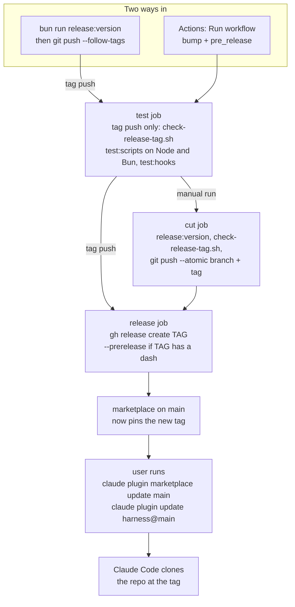

# 11. Releases and packaging

[Index](README.md) · Previous: [How we work here](10-how-we-work.md)

The harness ships as a plugin for Claude Code and for Codex. Nothing is published to npm and the
release does not build anything. A plugin install is a git checkout of this repo at a release
tag, and a release is a commit that bumps the version, a tag on that commit, and a GitHub release
for the tag. What users actually get is decided by one field: the `ref` a marketplace file on
`main` pins.

One thing to know before you read on. Every release so far was cut from `main`, and `main` still
holds the v1 plugin: skills, hooks and scripts, with no `packages/` folder. The v2 code the rest
of this walkthrough describes lives on the `v2` branch and is not in any release yet; no release
tag contains `packages/`. The release machinery below is the same on both branches, with two
small differences in the workflow file: `main` sets up Bun 1.2.19 instead of 1.4.2, and runs one
extra step, `npm run test:skills`. This section describes the files on `v2`.

## The files that make it a plugin

Five small JSON files turn the repo into something an agent can install.

| File | Read by | What it says |
|---|---|---|
| [.claude-plugin/plugin.json](../../.claude-plugin/plugin.json) | Claude Code | the plugin's name (`harness`), version, author, license |
| [.claude-plugin/marketplace.json](../../.claude-plugin/marketplace.json) | Claude Code | the stable marketplace, named `main`: install `harness` from this repo's git URL at `ref` |
| [.claude-plugin/pre-release/marketplace.json](../../.claude-plugin/pre-release/marketplace.json) | Claude Code | the same, as the `harness-pre-release` marketplace, pinning the newest tag of any kind |
| [.codex-plugin/plugin.json](../../.codex-plugin/plugin.json) | Codex | name, version, `"skills": "./skills/"`, and the display text Codex shows |
| [.agents/plugins/marketplace.json](../../.agents/plugins/marketplace.json) | Codex | the `harness` marketplace, pointing at this repo's git URL |

A marketplace (a catalog file that lists plugins and where to fetch each one) is how both agents
find the plugin. In the Claude files the source looks like this:

```json
"source": {
  "source": "url",
  "url": "https://github.com/vertexcover-io/harness-engineering.git",
  "ref": "v1.32.0"
}
```

So installing `harness@main` clones the repo at that tag. The installed copy is the whole tree at
the tag, not a curated subset: `~/.claude/plugins/cache/main/harness/VERSION/` holds the same
top-level folders as the repo did at that tag, minus `.git`. Claude Code loads the skills from
`skills/`; nothing in `plugin.json` lists them.

On `v2` the tree also carries `packages/`. The `harness` CLI and the orchestrate script are
TypeScript there, and Bun runs them from source. Core finds the skills beside its own code
(`harnessSkillsDir` in [stage.ts](../../packages/core/src/stage.ts), overridable with
`HARNESS_SKILLS_DIR`). You can compile the CLI into one binary with
`bun run --filter @harness/cli build`, which writes `packages/cli/dist/harness` with
`--no-compile-autoload-dotenv` so a repo's `.env` never leaks into the server it starts. No
release step builds or attaches that binary.

The Codex side differs in two ways. Its marketplace names no `ref`, so the release script never
touches it and nothing pins Codex users to a tag. And [scripts/version.ts](../../scripts/version.ts)
does not bump `.codex-plugin/plugin.json`. It says `1.31.1` on both `main` and `v2`, while
`package.json` says `1.33.1` on `main`. If you need Codex versions to line up, that file is the
gap.

There is also a symlink pair you will see in the tree: `.claude/skills/orchestrate` and
`.agents/skills/orchestrate` both point at `skills/orchestrate`. They are not part of the plugin
manifest. They make a session started inside this checkout use the local orchestrate skill
instead of an installed plugin's older copy ([section 10](10-how-we-work.md#using-the-harness-on-itself)).

## Three ways to install

```bash
# Claude Code: the stable channel
claude plugin marketplace add vertexcover-io/harness-engineering
claude plugin install harness@main

# Codex
codex plugin marketplace add vertexcover-io/harness-engineering
codex plugin add harness --marketplace harness

# Any agent, skills only
npx skills add vertexcover-io/harness-engineering --agent claude-code
```

The third line uses the open [`skills` CLI](https://github.com/vercel-labs/skills). It finds every
`SKILL.md` in the repo and copies those folders into the agent, with no manifest involved. You
get the skills and nothing else: no `harness` CLI, no server, no orchestrate script. That is
fine for skills you call on their own, like `/tdd` or `/code-review`. It is not enough for
`harness run`. Neither marketplace applies, so no release tag pins what it installs.

## Two channels

Users install whatever tag the marketplace file on `main` pins, so `main` can run ahead of any
release. There are two files and two channels:

- Stable (`.claude-plugin/marketplace.json`, marketplace `main`) pins the latest stable tag, such as `v1.32.0`.
- Pre-release (`.claude-plugin/pre-release/marketplace.json`, marketplace `harness-pre-release`) pins the latest tag of any kind, including candidates like `v1.32.0-rc.1`.

A pre-release moves only the pre-release pin. A stable release moves both, so a shipped version
replaces its own candidates in the pre-release channel too. To try a pre-release, add that
marketplace by its raw URL and install `harness@harness-pre-release` (the README has the exact
commands). Keep only one of `harness@main` and `harness@harness-pre-release` installed: when both
are, both load.

## Bumping the version

`bun run release:version` runs [scripts/version.ts](../../scripts/version.ts). It takes a bump
(`major`, `minor`, `patch`), an explicit `x.y.z`, or nothing, plus `--pre-release` and `--no-git`:

```bash
bun run release:version minor --pre-release   # 1.31.1 -> 1.32.0-rc.1
bun run release:version --pre-release         # 1.32.0-rc.1 -> 1.32.0-rc.2
bun run release:version minor                 # 1.32.0-rc.2 -> 1.32.0, the real release
```

The bump follows npm's `semver.inc`: a candidate is a candidate for its own version, so `minor`
on `1.32.0-rc.2` ships `1.32.0` instead of skipping to `1.33.0`. Under npm, put `--` before the
arguments (`npm run release:version -- minor`); there is also `release:version:node`, because the
script is meant to run under Node as well as Bun.

In order, the script:

1. Reads the version from `package.json` and `.claude-plugin/plugin.json` and stops with
   `manifests have drifted: A vs B` if they disagree. Bumping from whichever it read first could
   renumber a drifted tree downward and tag it.
2. Stops with `working tree is dirty` if a tracked file has changes (`git status --porcelain -uno`;
   untracked files are ignored).
3. Writes the new version into both manifests by rewriting the `"version"` field in place, so no
   file gets reformatted.
4. Sets `ref` to `vVERSION` in the pre-release marketplace, and in the stable one too unless the
   version has a `-` in it.
5. Commits as `chore(release): vVERSION`, makes an annotated tag `vVERSION`, and prints the
   `git push origin BRANCH --follow-tags` you run next.

`--no-git` stops after step 4. Its tests are in [version.test.ts](../../scripts/version.test.ts).

[scripts/check-release-tag.sh](../../scripts/check-release-tag.sh) is the guard. Given a tag
(`bash scripts/check-release-tag.sh v1.32.0`), it checks that both manifests carry that version
and that each marketplace that should pin it does, then prints every mismatch, not only the
first. A tag that disagrees with `plugin.json` would install as a version it is not, and a
pre-release must never move the stable pin.

## The release workflow

[.github/workflows/release.yml](../../.github/workflows/release.yml) is the only GitHub Actions
workflow in the repo. It starts two ways: someone pushes a `v*` tag, or someone runs it by hand
from Actions → Release → Run workflow, picking a bump (`patch`, `minor`, `major`, or `none` to
count up the current candidate) and ticking pre-release if they want one.



The **test** job runs first on the commit that triggered the workflow. For a pushed tag it runs
`check-release-tag.sh` on that tag, since the tag already exists and this is the earliest point a
mismatch can stop it. Then it runs `npm run test:scripts` (Node), `npm run test:scripts:bun`
(Bun 1.4.2) and `npm run test:hooks`. Note what it does not run: no typecheck, no lint, no
`bun run test`. Run `bun run check` yourself before you cut a release.

The **cut** job runs only for a manual run. It checks out the exact commit the test job passed,
runs `bun run release:version` with the inputs, checks the new tag, and pushes the commit and tag
together with `git push --atomic origin HEAD:BRANCH TAG`. If the branch moved since the run
started, the push is rejected rather than releasing untested code. Cutting the tag here, instead
of letting a tag push start a second run, is forced by GitHub: a tag pushed with the workflow's
own `GITHUB_TOKEN` starts no workflow run.

The **release** job publishes with `gh release create TAG --verify-tag --generate-notes`. A tag
with a dash (`v1.32.0-rc.1`) gets `--prerelease`, so it never shows as Latest on GitHub.

## How users get the new version

Publishing a GitHub release changes nothing for users. What changes things is the pinned `ref`
in the marketplace file on `main`. The workflow pushes the release commit to the branch it ran
on, and a local release goes wherever you push it. Until that commit reaches `main`, users stay
on the old pin. Cut from `main` if you want users to see it right away.

Once the pin is on `main`, a Claude Code user moves to it with:

```bash
claude plugin marketplace update main
claude plugin update harness@main
```

Codex users update the marketplace and restart Codex. The Codex marketplace names no `ref`, so
the release flow does not decide which commit Codex installs.

## Files to open

| What | Where |
|---|---|
| Claude plugin manifest | `.claude-plugin/plugin.json` |
| Stable and pre-release pins | `.claude-plugin/marketplace.json`, `.claude-plugin/pre-release/marketplace.json` |
| Codex manifest and marketplace | `.codex-plugin/plugin.json`, `.agents/plugins/marketplace.json` |
| Version bump and repin | `scripts/version.ts` |
| Tag consistency check | `scripts/check-release-tag.sh` |
| Release workflow | `.github/workflows/release.yml` |
| Install and pre-release commands for users | `README.md`, "Installation" |

[Index](README.md) · Previous: [How we work here](10-how-we-work.md)
