# Orchestrate: Multi-Agent Development Pipeline

Runs a full development pipeline in 9 stages. Brainstorm and Q&A run interactively in the main conversation. All other stages are dispatched as sub-agents via the `Agent` tool.

**Announce at start:** "Using the orchestrate skill to run the full development pipeline."

---

## Input Detection

The argument is either an **inline prompt** or a **spec file path**.

**Detection logic:**
1. Check if the argument is a path to an existing file (use `Bash` to test with `[ -f "<arg>" ]`)
2. If file exists → read its contents as the task spec
3. If not a file → treat the argument as an inline task prompt

Store the resolved input as `TASK_CONTEXT` — this is passed to every stage.

### Dashboard Bootstrap (MUST be the very first action)

Before ANY Skill or Agent call, write the dashboard session file. This enables hooks to track pipeline progress from the very first stage.

1. Generate a temporary spec name from the task prompt: lowercase, replace spaces with hyphens, truncate to 30 chars. Example: `"Add user auth system"` → `"add-user-auth-system"`
2. Write the session file:
   ```
   Bash("echo '{\"specName\":\"<TEMP_SPEC_NAME>\",\"task\":\"<TASK_CONTEXT summary>\",\"branch\":\"unknown\",\"worktree\":\"unknown\"}' > /tmp/orchestrate-session.json")
   ```
3. After Stage 0 completes and you have the real `SPEC_NAME`, `BRANCH_NAME`, and `WORKTREE_PATH`, update the session file and rename the dashboard directory:
   ```
   Bash("echo '{\"specName\":\"<SPEC_NAME>\",\"task\":\"<TASK_CONTEXT summary>\",\"branch\":\"<BRANCH_NAME>\",\"worktree\":\"<WORKTREE_PATH>\"}' > /tmp/orchestrate-session.json && [ -d /tmp/orchestrate-<TEMP_SPEC_NAME> ] && mv /tmp/orchestrate-<TEMP_SPEC_NAME> /tmp/orchestrate-<SPEC_NAME> || true")
   ```

This ensures the dashboard opens immediately when Stage 0 begins.

---

## Pipeline Stages

| # | Stage | Execution | Output |
|---|-------|-----------|--------|
| 0 | Setup | **Main conversation** | Worktree path, baseline metrics, spec directory |
| 1 | Brainstorm + Spec | **Main conversation** | `docs/spec/<name>/spec.md` |
| 2 | Q&A | **Main conversation** | `docs/spec/<name>/qa.md` |
| 3 | Planner | Sub-agent | `docs/spec/<name>/plan.md` + `phase-*.md` |
| 4 | Coder | Sub-agent (parallelizable) | Implementation + tests |
| 5 | Quality Gate | Sub-agent | PASS/BLOCKED verdict |
| 6 | Sync Docs | Sub-agent | Updated/created docs list |
| 7 | Capture Learnings | Sub-agent | `docs/solutions/<category>/<learning>.md` |
| 8 | Commit & PR | Sub-agent | Commits + PR URL |

---

## Execution Rules

### Sub-Agent Prompt Preamble

Every sub-agent prompt MUST start with this preamble (referred to as `[PREAMBLE]` in stage templates below):

```
You are working in the worktree at <WORKTREE_PATH>.
Your working directory is <WORKTREE_PATH>.

## Constitution
<CONSTITUTION>
```

### Stages 0-2 Run in Main Conversation

Stages 0 (Setup), 1 (Brainstorm + Spec), and 2 (Q&A) run directly in the main conversation — NOT as sub-agents.

- **Stage 0** runs in main so we can `cd` into the worktree and set the working directory for everything that follows.
- **Stage 1** runs in main because brainstorm requires interactive dialogue with the user.
- **Stage 2** runs in main because Q&A requires interactive dialogue with the user.

Invoke their respective skills directly using the `Skill` tool. All other stages (3-8) run as sub-agents via the `Agent` tool.

### Pipeline Flow

```dot
digraph pipeline {
  rankdir=LR
  node [shape=box]

  stage_0 [label="0: Setup"]
  stage_1 [label="1: Brainstorm"]
  stage_2 [label="2: Q&A"]
  stage_3 [label="3: Planner"]
  stage_4 [label="4: Coder"]
  stage_5 [label="5: Quality Gate"]
  stage_6 [label="6: Sync Docs"]
  stage_7 [label="7: Learnings"]
  stage_8 [label="8: Commit & PR"]

  stage_0 -> stage_1 -> stage_2 -> stage_3 -> stage_4
  stage_4 -> stage_5 -> stage_6 -> stage_7 -> stage_8
}
```



Stage 4 (Coder) is the only stage with internal parallelism — see "Parallel When Possible" below.

### Parallel When Possible

After Stage 3, read the **phase graph** from plan.md (DOT digraph) and dispatch in waves:

**Phase waves:** Compute **ready nodes** = phases with no incomplete predecessors. Dispatch all ready phases in parallel. After each wave completes, recompute → dispatch next wave.

**Per phase, choose ONE strategy:**
- **Has step graph** in `phase-N.md` → dispatch steps in waves (same ready-node logic), skip phase-level agent
- **No step graph** → single agent for the whole phase

**To parallelize:** Send multiple `Agent` tool calls in a single message.

---

## Sub-Agent Dispatch

### Stage 0: Setup (Main Conversation)

1. Invoke the `pipeline-setup` skill using the `Skill` tool, passing `TASK_CONTEXT`
2. `cd` into the worktree

Store from result: `WORKTREE_PATH`, `BRANCH_NAME`, `CONSTITUTION`, `SPEC_NAME`, `SPEC_DIR`, `BASELINE_PATH`

3. Update the dashboard session file with real values and rename the dashboard directory (see "Dashboard Bootstrap" above).

### Stage 1: Brainstorm (Main Conversation)

1. Invoke the `brainstorm` skill using the `Skill` tool
2. After design approval, invoke the `spec-generation` skill (still in main session — it's quick and needs the brainstorm context)
3. Move/save spec output to `docs/spec/<SPEC_NAME>/spec.md`
4. Store `SPEC_PATH`

Then continue to Stage 2.

### Stage 2: Q&A (Main Conversation)

1. Invoke the `qa` skill using the `Skill` tool
2. Q&A explores the codebase and asks the user implementation-level questions interactively
3. After all questions are resolved, Q&A writes output to `docs/spec/<SPEC_NAME>/qa.md`
4. Store `QA_PATH`

Then continue to Stage 3 as a sub-agent.

### Stage 3: Planner

```
Agent(prompt="
  [PREAMBLE]
  Invoke the planning skill.
  Spec: <SPEC_PATH>. Q&A: <QA_PATH>. Write all outputs to docs/spec/<SPEC_NAME>/.
  Task context: <TASK_CONTEXT>
  Return: plan directory path, phase graph (DOT digraph from plan.md), summary.
")
```

**Extract from result:** `PLAN_DIR`, phase graph (DOT), phase count

### Stage 4: Coder

Dispatch based on phase and step dependency graphs. Two-level parallelism:

**Phase level:** Parse the phase graph from plan.md. Dispatch all ready nodes (no incomplete predecessors) in parallel. After each wave, recompute and dispatch next wave.

**Step level:** For each phase, read `phase-N.md` for a step graph. If present, apply the same wave-based dispatch. If absent, single agent for the whole phase.

For each phase, choose **one** dispatch strategy:

**A) Phase has no Steps section** → single agent for the whole phase:

```
Agent(prompt="
  [PREAMBLE]
  Invoke the tdd skill.
  Spec: <SPEC_PATH>. Plan: docs/spec/<SPEC_NAME>/plan.md. Phase: <PHASE_N>
  Return: files created/modified, tests with pass/fail and REQ/EDGE coverage, phase completed or blocked.
")
```

**B) Phase has Steps section** → dispatch per-step, parallelizing independent steps:

```
Agent(prompt="
  [PREAMBLE]
  Invoke the tdd and testing skill.
  Spec: <SPEC_PATH>. Plan: docs/spec/<SPEC_NAME>/plan.md.
  Phase: <PHASE_N>. Step: <STEP_DETAILS>
  Scope: Only implement and test what this step describes. Do not touch files outside this step's scope.
  Return: files created/modified, tests with pass/fail, step completed or blocked.
")
```

Dispatch in waves: send all independent steps in parallel → wait for completion → dispatch next wave of steps whose dependencies are satisfied → repeat until all steps in the phase are done.

### Stage 5: Quality Gate

Single quality gate after all coding is complete:

```
Agent(prompt="
  [PREAMBLE]
  Invoke the quality-gate skill.
  Baseline file: docs/spec/<SPEC_NAME>/baseline.json
  Plan dir: docs/spec/<SPEC_NAME>/
  Stage: post-tdd
  Return: gate report path, verdict (PASS/BLOCKED/STAGNATION).
")
```

**Extract from result:** verdict (PASS/BLOCKED/STAGNATION), gate report path

**If BLOCKED → stop pipeline and report what failed and potential ways to solve it. Do not proceed to Stage 6.**

**If STAGNATION → stop pipeline entirely. Do not retry. Report which check stagnated and the repeated error. This signals a fundamental issue that retrying won't fix.**

### Stage 6: Sync Docs

```
Agent(prompt="
  [PREAMBLE]
  Invoke the sync-docs skill.
  Spec dir: docs/spec/<SPEC_NAME>/
  Plan dir: docs/spec/<SPEC_NAME>/
  Return: list of docs updated/created.
")
```

**Extract from result:** list of docs updated/created

### Stage 7: Capture Learnings

```
Agent(prompt="
  [PREAMBLE]
  Invoke the learn skill.
  Focus on pipeline friction from this run — stalls, wrong assumptions, human interventions, retries.
  Spec dir: docs/spec/<SPEC_NAME>/
  If nothing went wrong, skip.
  Return: doc path written (or 'none').
")
```

**Extract from result:** learning doc path (if any)

### Stage 8: Commit & PR

```
Agent(prompt="
  [PREAMBLE]
  Invoke the git-commit skill to create commits.
  Then push: git push -u origin <BRANCH_NAME>
  Then create PR: gh pr create referencing task summary, spec, and plan.
  Return: commits list, PR URL.
")
```

**Extract from result:** commits, `PR_URL`

---

## Summary

After all stages complete, present a compact summary:

```markdown
## Pipeline Complete

**Task:** <TASK_CONTEXT summary>
**Worktree:** <WORKTREE_PATH> (branch: <BRANCH_NAME>)

| Stage | Result |
|-------|--------|
| 0. Setup | Worktree at <path>, baseline captured |
| 1. Brainstorm | Spec: docs/spec/<name>/spec.md |
| 2. Q&A | qa.md: <question_count> questions resolved |
| 3. Plan | <phase_count> phases, <parallel> parallel |
| 4. TDD | <files> files, <tests> tests passing |
| 5. Gate | <PASS/BLOCKED/STAGNATION> |
| 6. Sync Docs | <docs_count> docs updated |
| 7. Learnings | <doc_path or "none"> |
| 8. PR | <PR_URL> |

**Issues:** <any retries, failures, stagnation, or "None">
```

---

## Error Handling

- If any sub-agent fails or returns an error, **stop the pipeline** and report which stage failed and why
- If the quality gate returns BLOCKED, **stop the pipeline** and report what failed
- If the quality gate returns STAGNATION, **stop the pipeline entirely** — do not retry. Report which check stagnated, the repeated error signature, and that manual intervention is required
- Do not proceed to the next stage if the current one failed
- Present what was accomplished so far and suggest next steps
- Worktree is preserved for manual intervention on failure

---

## Key Principles

- **Each stage is isolated** — sub-agents don't share context, so pass all necessary information in the prompt
- **Constitution is universal** — every sub-agent gets the same rules via `[PREAMBLE]`, no exceptions
- **Extract artifacts** — after each sub-agent returns, extract file paths and key info to pass forward
- **Gate is a hard stop** — a BLOCKED verdict stops the pipeline, no workarounds
- **Parallelize from the graph** — dispatch ready nodes (no incomplete predecessors) in parallel, at both phase and step level
- **Stagnation stops early** — coder detects repeated failures and stops itself, don't loop endlessly
- **Spec folder structure** — all artifacts for a task live in `docs/spec/<name>/` for traceability
- **Dashboard is automatic** — hooks handle all dashboard updates. The only manual step is writing `/tmp/orchestrate-session.json` during Setup. If the dashboard fails, the pipeline continues unaffected.
