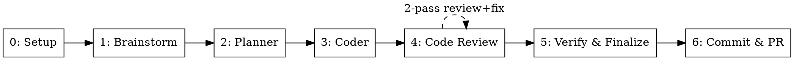

# Orchestrate: Multi-Agent Development Pipeline

Runs a full development pipeline in 7 stages. Brainstorm, Planner, and Commit & PR run in the main conversation. All other stages are dispatched as sub-agents via the `Agent` tool.

**Announce at start:** "Using the orchestrate skill to run the full development pipeline."

**CRITICAL: Do NOT explore the codebase, read project files, or fetch URLs before completing the Initialization steps below. The very first actions are: detect input, check for auto mode, then start the dashboard. No exceptions.**

**CRITICAL: Do NOT stop, pause, or present a summary until ALL pipeline stages (0-6) have completed or a stage has explicitly failed/blocked. Each stage flows directly into the next. The only permitted pause is the plan approval gate after Stage 2.**

---

## Initialization (do these first, in order, before anything else)

### Step 1: Input Detection

The argument is either an **inline prompt** or a **spec file path**.

1. Check if the argument contains `--auto`. If present, set `AUTO_MODE=true` and strip `--auto` from the argument.
2. Check if the remaining argument is a path to an existing file (use `Bash` to test with `[ -f "<arg>" ]`)
3. If file exists → read its contents as the task spec
4. If not a file → treat the argument as an inline task prompt
5. Store the resolved input as `TASK_CONTEXT` — this is passed to every stage.

When `AUTO_MODE=true`:
- **Skip all AskUserQuestion calls** — Claude decides autonomously, auto-approves designs and plans
- **Skip worktree creation** — use current working directory (e.g., GitHub Actions already checked out the PR branch)
- **Skip all `dag-update` calls** — no live dashboard in CI
- **Skip PR creation in Stage 6** — only commit and push; caller handles PR interaction
- **All artifacts still produced** (design docs, specs, plans) for auditability

### Step 2: DAG Dashboard Bootstrap

The dashboard script path is: !`echo "${CLAUDE_PLUGIN_ROOT}/skills/orchestrate/dashboard/dag-update.sh"`
Store the path above as `DAG_SCRIPT`. All Bash calls below use this resolved path.

Start the dashboard immediately. Do NOT read files, explore the codebase, or invoke any Skill or Agent before this.

1. Generate a spec name from the task prompt: lowercase, replace spaces with hyphens, truncate to 30 chars. Example: `"Add user auth system"` → `"add-user-auth-system"`
2. Initialize the DAG and start the dashboard:
   ```
   Bash("
     export HARNESS_DIR=$(/usr/bin/env bash '<DAG_SCRIPT>' init '<SPEC_NAME>' '<TASK_CONTEXT summary>' unknown unknown)
     D='/usr/bin/env bash <DAG_SCRIPT>'
     $D add-node setup 'Setup'
     $D add-node worktree 'Create Worktree' --parent setup
     $D add-node baseline 'Baseline Metrics' --parent setup --depends-on worktree
     $D add-node brainstorm 'Brainstorm & Spec' --depends-on setup
     $D add-node planning 'Planning' --depends-on brainstorm
     $D add-node coder 'Coder' --depends-on planning
     $D add-node code-review 'Code Review' --depends-on coder
     $D add-node verify-finalize 'Verify & Finalize' --depends-on code-review
     $D add-node commit-pr 'Commit & PR' --depends-on verify-finalize
     $D serve
   ")
   ```
   Note: Phase nodes are added as children of `coder` after planning (Stage 2) when phases are known.
3. Store `HARNESS_DIR` for use in all subsequent `dag-update` calls.

**DAG shorthand:** All dag-update calls use this pattern where `$D` = `/usr/bin/env bash "<DAG_SCRIPT>"`:
`Bash("export HARNESS_DIR='<HARNESS_DIR>' && $D <command> <args>")`

---

## Pipeline Stages

| # | Stage | Execution | Output |
|---|-------|-----------|--------|
| 0 | Setup | **Main conversation** | Worktree path, baseline metrics, spec directory |
| 1 | Brainstorm + Spec | **Main conversation** | `docs/spec/<name>/spec.md` |
| 2 | Planner | **Main conversation** | `docs/spec/<name>/plan.md` + `phase-*.md` |
| 3 | Coder | Sub-agent (parallelizable) | Implementation + tests |
| 4 | Code Review | Sub-agent (2-pass) | REVIEW.md verdict, fixes applied |
| 5 | Verify & Finalize | Sub-agent | Functional verification, quality gate PASS/BLOCKED, synced docs, learnings captured |
| 6 | Commit & PR | **Main conversation** | Commits + PR URL |

---

## Stage Skip Rules

After resolving the input (TASK_CONTEXT), determine which stages to skip **before** starting execution. Stages not listed here are **never skippable** — they run unconditionally every time.

### Skip Decision Logic

```
For each skippable stage:
  1. If input EXPLICITLY says "skip <stage>" → skip unconditionally (trust the caller)
  2. Else if a spec/context file is provided → read it and evaluate:
     - Is the problem clearly defined with specific scope?
     - Are the files/changes to make listed explicitly?
     - Are acceptance criteria present?
     → If ALL yes → skip (the stage would add no value)
     → If ANY no → run the stage to fill the gaps
  3. Else (bare prompt, no spec) → always run the stage
```

### Skippable Stages

| Stage | Skip condition |
|-------|---------------|
| 1: Brainstorm + Spec | Explicit skip instruction from caller, OR agent evaluates input has complete context (clear problem definition, specific scope, acceptance criteria) |
| 2: Planner | Explicit skip instruction from caller, OR agent evaluates task is straightforward enough (single-phase work, per-file instructions already provided) |

### Mandatory Stages (never skip)

| Stage | Why |
|-------|-----|
| 0: Setup | Worktree and baseline are always required |
| 3: Coder | Core implementation — the whole point of the pipeline |
| 4: Code Review | Semantic verification gate — catches bugs that metrics can't |
| 5: Verify & Finalize | Functional verification + quality gate + docs + learnings — always runs as single consolidated stage |
| 6: Commit & PR | Always runs to finalize work (runs in main conversation) |

### Handling Skipped Stages

For each skipped stage:
1. Set its DAG status to `skipped` (using the full `export HARNESS_DIR=... && DU=...` preamble pattern)
2. Log: "Skipping Stage N (<name>) — <reason>"
3. Proceed to the next stage in order

**Even when stages are skipped, all mandatory stages MUST execute in order.** Skipping brainstorm does not skip setup. Skipping planning does not skip coder, code review, quality gate, or commit.

---

## Execution Rules

### HARD RULE: Questions and Approvals

**Every question to the user MUST use the `AskUserQuestion` tool — never output questions as plain text.** In auto mode, skip all `AskUserQuestion` calls entirely.

**Single approval gate:** The only approval gate in the pipeline is after Stage 2 (Planner). Present the plan and wait for user approval before proceeding to Stage 3. All other stages flow without approval gates.

**Waiting status:** A PreToolUse/PostToolUse hook automatically sets the current running node to `waiting` (purple) before any `AskUserQuestion` call, and back to `running` after the user responds. No manual dag-update calls needed for this.

### Sub-Agent Prompt Preamble

Every sub-agent prompt MUST start with this preamble (referred to as `[PREAMBLE]` in stage templates below):

```
You are working in the worktree at <WORKTREE_PATH>.
Your working directory is <WORKTREE_PATH>.
```

### Stages 0-2 Run in Main Conversation

Stages 0 (Setup), 1 (Brainstorm + Spec), and 2 (Planner) run directly in the main conversation — NOT as sub-agents.

- **Stage 0** runs in main so we can `cd` into the worktree and set the working directory for everything that follows.
- **Stage 1** runs in main because brainstorm needs conversation context and flows into spec generation.
- **Stage 2** runs in main because the planner explores the codebase interactively and holds the only approval gate.

Invoke their respective skills directly using the `Skill` tool. All other stages (3-5) run as sub-agents via the `Agent` tool.

### Pipeline Flow



Stage 3 (Coder) is the only stage with internal parallelism — see "Parallel When Possible" below. Stage 4 (Code Review) has a two-pass review — see Stage 4 dispatch below.

### Parallel When Possible

After Stage 2, read the **phase graph** from plan.md (DOT digraph) and dispatch in waves:

**Phase waves:** Compute **ready nodes** = phases with no incomplete predecessors. Dispatch all ready phases in parallel. After each wave completes, recompute → dispatch next wave.

**Per phase, choose ONE strategy:**
- **Has step graph** in `phase-N.md` → dispatch steps in waves (same ready-node logic), skip phase-level agent
- **No step graph** → single agent for the whole phase

**To parallelize:** Send multiple `Agent` tool calls in a single message.

---

## Local Skill Override Resolution

Before dispatching any stage that invokes a named skill, check for a project-local override in the current working directory:

```
<cwd>/.claude/skills/<skill-name>/SKILL.md
```

Resolution order:
1. `<cwd>/.claude/skills/<skill-name>/SKILL.md` — project-local (wins)
2. Global harness skill — fallback

Applies to: `quality-gate`, `tdd`, `testing`, `code-review`.
Does NOT apply to `orchestrate` itself (no recursive override).

When a local override is found, log:
> "Using local skill override: .claude/skills/\<skill-name\>/SKILL.md"

The local skill is loaded and followed exactly in place of the global one. The local skill is responsible for emitting compatible verdict comments so orchestrate can parse the result:
- `<!-- QG:VERDICT:PASS -->` or `<!-- QG:VERDICT:BLOCKED -->`
- `<!-- QG:CHECK:N:PASS -->` or `<!-- QG:CHECK:N:BLOCKED -->` (N = 1–9)

---

## Sub-Agent Dispatch

### Stage 0: Setup (Main Conversation)

**Worktree sub-step:**
1. Run FIRST: `Bash("export HARNESS_DIR='<HARNESS_DIR>' && $D set-status setup running && $D set-status worktree running")`
2. Invoke the `using-git-worktrees` skill via `Skill` tool to create the worktree
3. `cd` into worktree. Store: `WORKTREE_PATH`, `BRANCH_NAME`
4. After worktree ready: `Bash("export HARNESS_DIR='<HARNESS_DIR>' && $D write-report worktree '# Worktree\n- **Path:** <WORKTREE_PATH>\n- **Branch:** <BRANCH_NAME>' && $D set-status worktree done")`

**Baseline sub-step:**
5. `Bash("export HARNESS_DIR='<HARNESS_DIR>' && $D set-status baseline running")`
6. Derive `SPEC_NAME` from task, create `docs/spec/<SPEC_NAME>/` directory
7. Auto-detect project tooling: check `CLAUDE.md` first, then `package.json`, `pyproject.toml`, `go.mod`, `Cargo.toml`
8. Run baseline metrics (typecheck, lint, test, coverage), write to `docs/spec/<SPEC_NAME>/baseline.json`
9. Store: `SPEC_NAME`, `SPEC_DIR`, `BASELINE_PATH`
10. After baseline: `Bash("export HARNESS_DIR='<HARNESS_DIR>' && $D write-report baseline '# Baseline\n- **Spec:** <SPEC_NAME>\n- **Baseline:** <BASELINE_PATH>' && $D set-status baseline done && $D set-status setup done")`

### Stage 1: Brainstorm (Main Conversation)

1. `Bash("export HARNESS_DIR='<HARNESS_DIR>' && $D set-status brainstorm running")`
2. Invoke `brainstorm` skill via `Skill` tool — no approval gate, design flows straight through
3. Invoke `spec-generation` skill (main session — needs brainstorm context)
4. Save spec to `docs/spec/<SPEC_NAME>/spec.md`, store `SPEC_PATH`
5. Copy artifacts and mark done:
   `Bash("export HARNESS_DIR='<HARNESS_DIR>' && $D write-report brainstorm '# Brainstorm' && $D set-status brainstorm done")`

### Stage 2: Planner (Main Conversation)

1. `Bash("export HARNESS_DIR='<HARNESS_DIR>' && $D set-status planning running")`
2. Invoke `planning` skill via `Skill` tool — it reads design doc + spec internally
3. Planner explores codebase, asks interactive questions, designs phases
4. **APPROVAL GATE:** Use `AskUserQuestion` — hook auto-handles waiting status
5. Output: `docs/spec/<SPEC_NAME>/plan.md` + `phase-*.md`. Store `PLAN_DIR`
6. Add phase DAG nodes as children of `coder`, mark planning done:
   `Bash("export HARNESS_DIR='<HARNESS_DIR>' && $D set-status planning done")`
7. Add phase nodes: `Bash("export HARNESS_DIR='<HARNESS_DIR>' && $D add-node phase-1 'Phase 1: <label>' --parent coder && $D add-node phase-2 'Phase 2: <label>' --parent coder --depends-on phase-1")`

**Extract:** `PLAN_DIR`, phase graph (DOT from plan.md), phase count

### Stage 3: Coder

Dispatch based on phase and step dependency graphs. Two-level parallelism:

**Parallelism heuristic:** Only parallelize phases touching 3+ files or having a Steps section. Serialize smaller phases.

**Phase level:** Parse the phase graph from plan.md. Dispatch ready nodes (no incomplete predecessors) in waves.

**Step level:** For each phase, read `phase-N.md`. If it has a step graph → dispatch steps in waves. If not → single agent for the phase.

DAG transitions (use `$D` shorthand):
- Before dispatching: `Bash("export HARNESS_DIR='<HARNESS_DIR>' && $D set-status coder running")`
- Before each phase: `Bash("export HARNESS_DIR='<HARNESS_DIR>' && $D set-status <phase-node> running")`
- After each phase: `Bash("export HARNESS_DIR='<HARNESS_DIR>' && $D set-status <phase-node> done")`
- After all phases: `Bash("export HARNESS_DIR='<HARNESS_DIR>' && $D set-status coder done")`

**A) Phase has no Steps section** → single agent:
```
Agent(model="sonnet", prompt="
  [PREAMBLE]
  Invoke tdd skill. Spec: <SPEC_PATH>. Plan: docs/spec/<SPEC_NAME>/plan.md. Phase: <PHASE_N>.
  For dashboard updates: export HARNESS_DIR='<HARNESS_DIR>' NODE_ID='<phase-node-id>';
  D='/usr/bin/env bash <DAG_SCRIPT>'; use $D add-node for sub-tasks, $D set-status for progress.
  When done, write a phase report following the 'Coder Phase Report' format in
  references/dashboard-report-formats.md.
")
```

**B) Phase has Steps section** → dispatch per-step, parallelizing independent steps:
```
Agent(model="sonnet", prompt="
  [PREAMBLE]
  Invoke tdd and testing skills. Spec: <SPEC_PATH>. Plan: docs/spec/<SPEC_NAME>/plan.md.
  Phase: <PHASE_N>. Step: <STEP_DETAILS>.
  Scope: Only this step's files. Return: files created/modified, test results, step completed or blocked.
")
```

Dispatch in waves: send all independent steps in parallel → wait → dispatch next wave → repeat.

### Stage 4: Code Review Loop

Two-pass review: a review+fix agent addresses defects directly, then a final review validates.

`Bash("export HARNESS_DIR='<HARNESS_DIR>' && $D set-status code-review running")`

**Pass 1 — Review & Fix:**

```
Agent(model="sonnet", prompt="
  [PREAMBLE]
  Invoke code-review skill. Plan: docs/spec/<SPEC_NAME>/plan.md.
  Scope: --commits <BASE_BRANCH>..HEAD.

  After completing the review:
  — If verdict is APPROVE or APPROVE WITH SUGGESTIONS: skip fixing, just write the review report.
  — If verdict is REQUEST CHANGES: FIX all Critical and Important defects you found.
    Invoke tdd skill. Run tests after each fix. Then write a combined review+fix report.

  Write dashboard reports following 'Code Review Report' and 'Fix Report' formats in
  references/dashboard-report-formats.md.
  Return: verdict, defects found, defects fixed, files modified.
")
```

`Bash("export HARNESS_DIR='<HARNESS_DIR>' && $D set-status review-1 done")`

**Pass 2 — Final Review:**

```
Agent(model="sonnet", prompt="
  [PREAMBLE]
  Invoke code-review skill. Plan: docs/spec/<SPEC_NAME>/plan.md.
  Scope: --commits <BASE_BRANCH>..HEAD. This is the FINAL review pass.

  If verdict is REQUEST CHANGES: fix any remaining Critical/Important defects yourself.
  Then re-review the fix. Your output is the definitive verdict.

  Write dashboard report following 'Code Review Report' format in
  references/dashboard-report-formats.md.
  Return: final verdict, any defects fixed in this pass.
")
```

`Bash("export HARNESS_DIR='<HARNESS_DIR>' && $D set-status code-review done")`

**Verdict parsing:** Match `REQUEST CHANGES` first, then `APPROVE WITH SUGGESTIONS`, then `APPROVE`.

### Stage 5: Verify & Finalize

Single consolidated sub-agent that runs functional verification, quality gate, syncs docs, and captures learnings.

`Bash("export HARNESS_DIR='<HARNESS_DIR>' && $D set-status verify-finalize running")`

```
Agent(model="sonnet", prompt="
  [PREAMBLE]
  Run these in order. Stop and return failure immediately if any step fails.

  1. FUNCTIONAL VERIFICATION: Invoke functional-verify skill.
     Spec: docs/spec/<SPEC_NAME>/spec.md. Plan dir: docs/spec/<SPEC_NAME>/.
     Phase files: docs/spec/<SPEC_NAME>/phase-*.md.
     Write dashboard report following 'Verification Report' format in
     references/dashboard-report-formats.md.
     If FAILED: stop entirely, return failure with which scenarios failed and why.
     Evidence is saved to docs/spec/<SPEC_NAME>/verification/ — do NOT delete it.

  2. QUALITY GATE: Invoke quality-gate skill.
     Baseline: docs/spec/<SPEC_NAME>/baseline.json. Plan: docs/spec/<SPEC_NAME>/. Stage: post-tdd.
     Write dashboard report following 'Quality Gate Report' format in
     references/dashboard-report-formats.md.
     If BLOCKED or STAGNATION: stop entire pipeline, return verdict + failure details.

  3. SYNC DOCS: Invoke sync-docs skill.
     Spec dir: docs/spec/<SPEC_NAME>/. Plan dir: docs/spec/<SPEC_NAME>/.
     Write dashboard report following 'Sync Docs Report' format in
     references/dashboard-report-formats.md.

  4. CAPTURE LEARNINGS: Invoke learn skill.
     Focus on pipeline friction — stalls, wrong assumptions, retries.
     Spec dir: docs/spec/<SPEC_NAME>/. If nothing went wrong, skip.
     Write dashboard report following 'Learnings Report' format in
     references/dashboard-report-formats.md.

  Return: verification verdict, gate verdict, docs list, learning doc path (or 'none').
")
```

`Bash("export HARNESS_DIR='<HARNESS_DIR>' && $D set-status verify-finalize done")`

**If functional verification FAILED → stop pipeline and report which scenarios failed.**
**If quality gate BLOCKED → stop pipeline and report what failed.**
**If STAGNATION → stop pipeline entirely, do not retry.**

### Stage 6: Commit & PR (Main Conversation)

`Bash("export HARNESS_DIR='<HARNESS_DIR>' && $D set-status commit-pr running")`

Do these directly (no sub-agent):

1. Invoke the `git-commit` skill via `Skill` tool to create structured commits.
2. `Bash("git push -u origin <BRANCH_NAME>")`
3. If PR desired (not --no-pr): `Bash("gh pr create --title '<spec title>' --body 'Closes: docs/spec/<SPEC_NAME>' --base main --head <BRANCH_NAME>")`
4. Write dashboard report following 'Commit & PR Report' format in references/dashboard-report-formats.md.
   Use: `Bash("export HARNESS_DIR='<HARNESS_DIR>' && $D write-report commit-pr '...'")`
5. `Bash("export HARNESS_DIR='<HARNESS_DIR>' && $D set-status commit-pr done")`

**Extract:** commits, `PR_URL`

---

## Summary

After all stages complete, present a compact summary:

```markdown
## Pipeline Complete

**Task:** <TASK_CONTEXT summary>
**Worktree:** <WORKTREE_PATH> (branch: <BRANCH_NAME>)

| Stage | Result |
|-------|--------|
| 0. Setup | Worktree at <path>, baseline captured |
| 1. Brainstorm | Spec: docs/spec/<name>/spec.md |
| 2. Plan | <phase_count> phases |
| 3. Coder | <files> files, <tests> tests |
| 4. Review | <verdict> (2-pass) |
| 5. Verify & Finalize | Verify: <PASSED/FAILED>, Gate: <PASS/BLOCKED>, docs: <N> updated, learnings: <path or none> |
| 6. PR | <PR_URL> |

**Issues:** <any retries, failures, stagnation, or "None">
```

Finalize: `Bash("export HARNESS_DIR='<HARNESS_DIR>' && $D finalize done")`

---

## Error Handling

- If any sub-agent fails or returns an error, **stop the pipeline** and report which stage failed and why
- If functional verification fails (any scenario), **stop the pipeline** — the feature doesn't work as specified
- If the review pass 2 still returns `REQUEST CHANGES` after its own fix attempt, **log a warning but proceed** to Stage 5 — verification and gate catch remaining violations
- If a review agent fails, **stop the pipeline** — do not continue
- If the quality gate returns BLOCKED, **stop the pipeline** and report what failed
- If the quality gate returns STAGNATION, **stop the pipeline entirely** — do not retry. Report which check stagnated, the repeated error signature, and that manual intervention is required
- Do not proceed to the next stage if the current one failed
- Present what was accomplished so far and suggest next steps
- Worktree is preserved for manual intervention on failure

---

## Key Principles

- **Each stage is isolated** — sub-agents don't share context, so pass all necessary information in the prompt
- **Extract artifacts** — after each sub-agent returns, extract file paths and key info to pass forward
- **Verify before gate** — functional verification runs the app and tests features live BEFORE the quality gate runs metrics. A feature that doesn't work is caught early, with evidence.
- **Gate is a hard stop** — a BLOCKED verdict stops the pipeline, no workarounds
- **Parallelize from the graph** — dispatch ready nodes (no incomplete predecessors) in parallel, at both phase and step level. Only parallelize phases touching 3+ files
- **Stagnation stops early** — coder detects repeated failures and stops itself, don't loop endlessly
- **Spec folder structure** — all artifacts for a task live in `docs/spec/<name>/` for traceability
- **Dashboard** — orchestrator calls `$D set-status` at each stage transition. Sub-agents use `$D add-node` and `$D write-report` for sub-task tracking. Formats live in `references/dashboard-report-formats.md`.
