# Orchestrate: Multi-Agent Development Pipeline

Runs a full development pipeline in 8 stages. Brainstorm and Planner run interactively in the main conversation. All other stages are dispatched as sub-agents via the `Agent` tool.

**Announce at start:** "Using the orchestrate skill to run the full development pipeline."

---

## Input Detection

The argument is either an **inline prompt** or a **spec file path**.

**Detection logic:**
1. Check if the argument is a path to an existing file (use `Bash` to test with `[ -f "<arg>" ]`)
2. If file exists → read its contents as the task spec
3. If not a file → treat the argument as an inline task prompt

Store the resolved input as `TASK_CONTEXT` — this is passed to every stage.

### Auto Mode Detection

Check if the argument contains `--auto`:
1. If `--auto` is present, set `AUTO_MODE=true` and strip `--auto` from the argument
2. In auto mode:
   - All interactive approval gates are bypassed — Claude answers its own questions and auto-approves designs and plans
   - **Stage 0 (Setup):** Skip worktree creation — assume the current working directory is already the correct checkout (e.g., GitHub Actions has already checked out the PR branch). Still run baseline metrics and create the spec directory.
   - **DAG Dashboard:** Skip `dag-update serve` — no live dashboard needed in CI. Still track node status for reporting if `HARNESS_DIR` is available, otherwise skip all `dag-update` calls.
   - **Stage 7 (Commit & PR):** Skip PR creation — only commit and push. The caller (e.g., review-fixer skill) handles PR interaction.
3. All artifacts (design docs, specs, plans) are still produced for auditability

Auto mode is designed for CI/CD pipelines and automated workflows where no human is available for interactive approval.

### DAG Dashboard Bootstrap (MUST be the very first action)

Before ANY Skill or Agent call, initialize the DAG dashboard. This starts the live visualization.

1. Generate a spec name from the task prompt: lowercase, replace spaces with hyphens, truncate to 30 chars. Example: `"Add user auth system"` → `"add-user-auth-system"`
2. Initialize the DAG and start the dashboard:
   ```
   Bash("
     export HARNESS_DIR=$(/usr/bin/env bash \"$CLAUDE_SKILL_DIR/dashboard/dag-update.sh\" init '<SPEC_NAME>' '<TASK_CONTEXT summary>' unknown unknown)
     DU='/usr/bin/env bash $CLAUDE_SKILL_DIR/dashboard/dag-update.sh'
     $DU add-node setup 'Setup'
     $DU add-node brainstorm 'Brainstorm & Spec' --depends-on setup
     $DU add-node planning 'Planning' --depends-on brainstorm
     $DU add-node coder 'Coder' --depends-on planning
     $DU add-node quality-gate 'Quality Gate' --depends-on coder
     $DU add-node docs 'Sync Docs' --depends-on quality-gate
     $DU add-node learnings 'Capture Learnings' --depends-on quality-gate
     $DU add-node commit-pr 'Commit & PR' --depends-on docs,learnings
     $DU serve
   ")
   ```
   Note: Phase nodes are added as children of `coder` after planning (Stage 2) when phases are known.
3. Store `HARNESS_DIR` for use in all subsequent `dag-update` calls.

---

## Pipeline Stages

| # | Stage | Execution | Output |
|---|-------|-----------|--------|
| 0 | Setup | **Main conversation** | Worktree path, baseline metrics, spec directory |
| 1 | Brainstorm + Spec | **Main conversation** | `docs/spec/<name>/spec.md` |
| 2 | Planner | **Main conversation** | `docs/spec/<name>/plan.md` + `phase-*.md` |
| 3 | Coder | Sub-agent (parallelizable) | Implementation + tests |
| 4 | Quality Gate | Sub-agent | PASS/BLOCKED verdict |
| 5 | Sync Docs | Sub-agent | Updated/created docs list |
| 6 | Capture Learnings | Sub-agent | `docs/solutions/<category>/<learning>.md` |
| 7 | Commit & PR | Sub-agent | Commits + PR URL |

---

## Stage Skip Rules

After resolving the input (TASK_CONTEXT), determine which stages to skip **before** starting execution. Stages not listed here are **never skippable** — they run unconditionally every time.

### Skip Decision Logic

```
For each skippable stage:
  1. If input EXPLICITLY says "skip <stage>" → skip unconditionally (trust the caller)
  2. Else if a spec/context file is provided → read it and evaluate:
     - Is the problem clearly defined with specific scope?
     - Are the files/changes to make listed explicitly?
     - Are acceptance criteria present?
     → If ALL yes → skip (the stage would add no value)
     → If ANY no → run the stage to fill the gaps
  3. Else (bare prompt, no spec) → always run the stage
```

### Skippable Stages

| Stage | Skip condition |
|-------|---------------|
| 1: Brainstorm + Spec | Explicit skip instruction from caller, OR agent evaluates input has complete context (clear problem definition, specific scope, acceptance criteria) |
| 2: Planner | Explicit skip instruction from caller, OR agent evaluates task is straightforward enough (single-phase work, per-file instructions already provided) |
| 5: Sync Docs | Explicit skip instruction from caller, OR the task itself is documentation fixes |

### Mandatory Stages (never skip)

| Stage | Why |
|-------|-----|
| 0: Setup | Worktree and baseline are always required |
| 3: Coder | Core implementation — the whole point of the pipeline |
| 4: Quality Gate | Hard verification gate — no exceptions |
| 6: Capture Learnings | Always runs (agent skips internally if nothing to capture) |
| 7: Commit & PR | Always runs to finalize work |

### Handling Skipped Stages

For each skipped stage:
1. Set its DAG status to `skipped`: `dag-update set-status <node> skipped`
2. Log: "Skipping Stage N (<name>) — <reason>"
3. Proceed to the next stage in order

**Even when stages are skipped, all mandatory stages MUST execute in order.** Skipping brainstorm does not skip setup. Skipping planning does not skip coder, quality gate, or commit.

---

## Execution Rules

### Sub-Agent Prompt Preamble

Every sub-agent prompt MUST start with this preamble (referred to as `[PREAMBLE]` in stage templates below):

```
You are working in the worktree at <WORKTREE_PATH>.
Your working directory is <WORKTREE_PATH>.
```

### Stages 0-2 Run in Main Conversation

Stages 0 (Setup), 1 (Brainstorm + Spec), and 2 (Planner) run directly in the main conversation — NOT as sub-agents.

- **Stage 0** runs in main so we can `cd` into the worktree and set the working directory for everything that follows.
- **Stage 1** runs in main because brainstorm requires interactive dialogue with the user.
- **Stage 2** runs in main because the planner explores the codebase and asks the user implementation questions interactively.

Invoke their respective skills directly using the `Skill` tool. All other stages (3-7) run as sub-agents via the `Agent` tool.

### Pipeline Flow

```dot
digraph pipeline {
  rankdir=LR
  node [shape=box]

  stage_0 [label="0: Setup"]
  stage_1 [label="1: Brainstorm"]
  stage_2 [label="2: Planner"]
  stage_3 [label="3: Coder"]
  stage_4 [label="4: Quality Gate"]
  stage_5 [label="5: Sync Docs"]
  stage_6 [label="6: Learnings"]
  stage_7 [label="7: Commit & PR"]

  stage_0 -> stage_1 -> stage_2 -> stage_3
  stage_3 -> stage_4 -> stage_5 -> stage_6 -> stage_7
}
```



Stage 3 (Coder) is the only stage with internal parallelism — see "Parallel When Possible" below.

### Parallel When Possible

After Stage 2, read the **phase graph** from plan.md (DOT digraph) and dispatch in waves:

**Phase waves:** Compute **ready nodes** = phases with no incomplete predecessors. Dispatch all ready phases in parallel. After each wave completes, recompute → dispatch next wave.

**Per phase, choose ONE strategy:**
- **Has step graph** in `phase-N.md` → dispatch steps in waves (same ready-node logic), skip phase-level agent
- **No step graph** → single agent for the whole phase

**To parallelize:** Send multiple `Agent` tool calls in a single message.

---

## Sub-Agent Dispatch

### Stage 0: Setup (Main Conversation)

1. `dag-update set-status setup running`
2. Invoke the `pipeline-setup` skill using the `Skill` tool, passing `TASK_CONTEXT`
3. `cd` into the worktree
4. Store from result: `WORKTREE_PATH`, `BRANCH_NAME`, `SPEC_NAME`, `SPEC_DIR`, `BASELINE_PATH`
5. `dag-update set-status setup done`

**Auto mode (Stage 0):** When `AUTO_MODE=true`:
- Skip worktree creation — use the current working directory as `WORKTREE_PATH`
- Skip `dag-update` calls (no dashboard in CI)
- Still run baseline metrics capture if tooling is available
- Still create the spec directory: `docs/spec/<SPEC_NAME>/`
- Set `BRANCH_NAME` from `git branch --show-current`

### Stage 1: Brainstorm (Main Conversation)

1. `dag-update set-status brainstorm running`
2. Invoke the `brainstorm` skill using the `Skill` tool
3. After design approval, invoke the `spec-generation` skill (still in main session — it's quick and needs the brainstorm context)
4. Move/save spec output to `docs/spec/<SPEC_NAME>/spec.md`
5. Store `SPEC_PATH`
6. `dag-update set-status brainstorm done`
7. Copy design doc and spec into dashboard reports and set artifacts (only set artifact if copy succeeds):
   ```
   cp docs/plans/YYYY-MM-DD-<topic>-design.md $HARNESS_DIR/reports/design.md && \
     dag-update set-artifact brainstorm report reports/design.md
   cp docs/spec/<SPEC_NAME>/spec.md $HARNESS_DIR/reports/spec.md && \
     dag-update set-artifact brainstorm phases reports/spec.md
   # Only set tabs-title if both artifacts were linked
   [ -f "$HARNESS_DIR/reports/design.md" ] && [ -f "$HARNESS_DIR/reports/spec.md" ] && \
     dag-update set-artifact brainstorm tabs-title "Brainstorm Artifacts"
   ```

Then continue to Stage 2.

**Auto mode (Stage 1):** When `AUTO_MODE=true`:
- Skip the interactive brainstorm skill
- Instead, Claude generates the design directly from `TASK_CONTEXT`:
  1. Analyze the task context to understand what needs to be built
  2. Write a concise design doc covering: problem, approach, components, data flow
  3. Save to the design doc path — same location as interactive mode
  4. Auto-approve (no user gate)
  5. Proceed to spec generation as normal
- Still invoke `spec-generation` skill to produce `spec.md`
- Skip `dag-update` calls

### Stage 2: Planner (Main Conversation)

1. `dag-update set-status planning running`
2. Read the design doc (`docs/plans/YYYY-MM-DD-<topic>-design.md`) and spec (`docs/spec/<SPEC_NAME>/spec.md`) so the planner has full context from the brainstorm stage
3. Invoke the `planning` skill using the `Skill` tool, referencing both files
4. The planner explores the codebase deeply, asks the user implementation questions interactively, then designs phases
5. After plan approval, plan output is in `docs/spec/<SPEC_NAME>/plan.md` + `phase-*.md`
6. Store `PLAN_DIR`
7. `dag-update set-status planning done`
8. Copy plan and phase files into dashboard reports (only set artifact if copy succeeds):
   ```
   cp docs/spec/<SPEC_NAME>/plan.md $HARNESS_DIR/reports/planning-report.md && \
     dag-update set-artifact planning report reports/planning-report.md
   PHASE_REPORTS=""
   for f in docs/spec/<SPEC_NAME>/phase-*.md; do
     if cp "$f" "$HARNESS_DIR/reports/$(basename "$f")"; then
       [ -n "$PHASE_REPORTS" ] && PHASE_REPORTS="$PHASE_REPORTS,"
       PHASE_REPORTS="${PHASE_REPORTS}reports/$(basename "$f")"
     fi
   done
   [ -n "$PHASE_REPORTS" ] && \
     dag-update set-artifact planning phases "$PHASE_REPORTS" && \
     dag-update set-artifact planning tabs-title "Phase Details"
   ```

**Extract:** `PLAN_DIR`, phase graph (DOT from plan.md), phase count

**Add phase nodes as children of coder and link their report artifacts:**
```
DU='/usr/bin/env bash $CLAUDE_SKILL_DIR/dashboard/dag-update.sh'
$DU add-node phase-1 'Phase 1: <label>' --parent coder
$DU add-node phase-2 'Phase 2: <label>' --parent coder --depends-on phase-1
# ... for each phase from the plan

# Link each phase node to its report file (only if the file exists)
[ -f "$HARNESS_DIR/reports/phase-1.md" ] && $DU set-artifact phase-1 report reports/phase-1.md
[ -f "$HARNESS_DIR/reports/phase-2.md" ] && $DU set-artifact phase-2 report reports/phase-2.md
# ... for each phase
```

Then continue to Stage 3 as sub-agents.

**Auto mode (Stage 2):** When `AUTO_MODE=true`:
- Invoke the `planning` skill as normal, but the skill runs without asking the user questions
- Claude makes all implementation decisions autonomously
- Auto-approve the plan (no user gate)
- All plan artifacts (plan.md, phase-*.md) are still produced
- Skip `dag-update` calls

### Stage 3: Coder

Dispatch based on phase and step dependency graphs. Two-level parallelism:

**Phase level:** Parse the phase graph from plan.md. Dispatch all ready nodes (no incomplete predecessors) in parallel. After each wave, recompute and dispatch next wave.

**Step level:** For each phase, read `phase-N.md` for a step graph. If present, apply the same wave-based dispatch. If absent, single agent for the whole phase.

For each phase, choose **one** dispatch strategy:

Before dispatching any phase agents: `dag-update set-status coder running`
Before each phase: `dag-update set-status <phase-node> running`
After each phase returns: `dag-update set-status <phase-node> done` (or `failed`)
After all phases complete: `dag-update set-status coder done`

**A) Phase has no Steps section** → single agent for the whole phase:

```
Agent(prompt="
  [PREAMBLE]
  Invoke the tdd skill.
  Spec: <SPEC_PATH>. Plan: docs/spec/<SPEC_NAME>/plan.md. Phase: <PHASE_N>

  Dashboard updates (use these to register sub-tasks and report progress):
    export HARNESS_DIR='<HARNESS_DIR>' NODE_ID='<phase-node-id>'
    DU='/usr/bin/env bash $CLAUDE_SKILL_DIR/dashboard/dag-update.sh'
    # Register sub-tasks as you discover them (phases are children of coder):
    $DU add-node '$NODE_ID.task-1' '<label>' --parent '$NODE_ID'
    $DU set-status '$NODE_ID.task-1' running
    # When done with the phase, write a detailed report using this format:
    $DU write-report '$NODE_ID' '# Phase N: <name>

## Summary
2-3 sentences on what was accomplished.

## Files Changed
- `path/to/file.ts` — created/modified (what changed)

## Tests
- X tests added, all passing
- Coverage: X%

## Key Decisions
- Decision and reasoning

## Issues Encountered
- Issue and resolution (or "None")'

  Return: files created/modified, tests with pass/fail and REQ/EDGE coverage, phase completed or blocked.
")
```

**B) Phase has Steps section** → dispatch per-step, parallelizing independent steps:

```
Agent(prompt="
  [PREAMBLE]
  Invoke the tdd and testing skill.
  Spec: <SPEC_PATH>. Plan: docs/spec/<SPEC_NAME>/plan.md.
  Phase: <PHASE_N>. Step: <STEP_DETAILS>
  Scope: Only implement and test what this step describes. Do not touch files outside this step's scope.
  Return: files created/modified, tests with pass/fail, step completed or blocked.
")
```

Dispatch in waves: send all independent steps in parallel → wait for completion → dispatch next wave of steps whose dependencies are satisfied → repeat until all steps in the phase are done.

### Stage 4: Quality Gate

`dag-update set-status quality-gate running` before dispatching.

```
Agent(prompt="
  [PREAMBLE]
  Invoke the quality-gate skill.
  Baseline file: docs/spec/<SPEC_NAME>/baseline.json
  Plan dir: docs/spec/<SPEC_NAME>/
  Stage: post-tdd

  When done, write a report using this format:
    export HARNESS_DIR='<HARNESS_DIR>'
    /usr/bin/env bash '$CLAUDE_SKILL_DIR/dashboard/dag-update.sh' write-report quality-gate '# Quality Gate

## Verdict: PASS/BLOCKED/STAGNATION

## Metrics Comparison
| Metric | Baseline | Current | Status |
|--------|----------|---------|--------|
| Type check | 0 errors | X errors | PASS/FAIL |
| Lint | X warnings | Y warnings | PASS/FAIL |
| Tests | X passed | Y passed | PASS/FAIL |
| Coverage | X% | Y% | PASS/FAIL |

## Failures
- Details of any failures (or "None")'

  Return: gate report path, verdict (PASS/BLOCKED/STAGNATION).
")
```

**Extract from result:** verdict (PASS/BLOCKED/STAGNATION), gate report path

**If BLOCKED → stop pipeline and report what failed and potential ways to solve it. Do not proceed to Stage 5.**

**If STAGNATION → stop pipeline entirely. Do not retry. Report which check stagnated and the repeated error. This signals a fundamental issue that retrying won't fix.**

### Stage 5: Sync Docs

`dag-update set-status docs running` before dispatching.

```
Agent(prompt="
  [PREAMBLE]
  Invoke the sync-docs skill.
  Spec dir: docs/spec/<SPEC_NAME>/
  Plan dir: docs/spec/<SPEC_NAME>/

  When done, write a report using this format:
    export HARNESS_DIR='<HARNESS_DIR>'
    /usr/bin/env bash '$CLAUDE_SKILL_DIR/dashboard/dag-update.sh' write-report docs '# Sync Docs

## Documents Updated
- `path/to/doc.md` — what changed

## Documents Created
- `path/to/new-doc.md` — what it covers'

  Return: list of docs updated/created.
")
```

**Extract from result:** list of docs updated/created

### Stage 6: Capture Learnings

`dag-update set-status learnings running` before dispatching.

```
Agent(prompt="
  [PREAMBLE]
  Invoke the learn skill.
  Focus on pipeline friction from this run — stalls, wrong assumptions, human interventions, retries.
  Spec dir: docs/spec/<SPEC_NAME>/
  If nothing went wrong, skip.

  When done, write a report using this format:
    export HARNESS_DIR='<HARNESS_DIR>'
    /usr/bin/env bash '$CLAUDE_SKILL_DIR/dashboard/dag-update.sh' write-report learnings '# Learnings

## Friction Points
- What caused delays or confusion

## Patterns Documented
- `path/to/learning.md` — what it covers

## Recommendations
- Suggestions for future runs (or "None — clean run")'

  Return: doc path written (or 'none').
")
```

**Extract from result:** learning doc path (if any)

### Stage 7: Commit & PR

`dag-update set-status commit-pr running` before dispatching.

```
Agent(prompt="
  [PREAMBLE]
  Invoke the git-commit skill to create commits.
  Then push: git push -u origin <BRANCH_NAME>
  Then create PR: gh pr create referencing task summary, spec, and plan.

  When done, write a report using this format:
    export HARNESS_DIR='<HARNESS_DIR>'
    /usr/bin/env bash '$CLAUDE_SKILL_DIR/dashboard/dag-update.sh' write-report commit-pr '# Commit & PR

## Commits
- `abc1234` — commit message 1
- `def5678` — commit message 2

## Pull Request
- URL: <PR_URL>
- Title: <PR title>
- Branch: <branch> → main'

  Return: commits list, PR URL.
")
```

**Extract from result:** commits, `PR_URL`

**Auto mode (Stage 7):** When `AUTO_MODE=true`:
- Invoke `git-commit` skill as normal to create commits
- Push to current branch: `git push`
- **Skip PR creation** — the PR already exists (caller is responsible for PR interaction)
- Return: commits list only (no PR URL)

---

## Summary

After all stages complete, present a compact summary:

```markdown
## Pipeline Complete

**Task:** <TASK_CONTEXT summary>
**Worktree:** <WORKTREE_PATH> (branch: <BRANCH_NAME>)

| Stage | Result |
|-------|--------|
| 0. Setup | Worktree at <path>, baseline captured |
| 1. Brainstorm | Spec: docs/spec/<name>/spec.md |
| 2. Plan | <phase_count> phases, <parallel> parallel |
| 3. TDD | <files> files, <tests> tests passing |
| 4. Gate | <PASS/BLOCKED/STAGNATION> |
| 5. Sync Docs | <docs_count> docs updated |
| 6. Learnings | <doc_path or "none"> |
| 7. PR | <PR_URL> |

**Issues:** <any retries, failures, stagnation, or "None">
```

After presenting the summary, finalize the dashboard:
```
Bash("export HARNESS_DIR='<HARNESS_DIR>' && /usr/bin/env bash \"$CLAUDE_SKILL_DIR/dashboard/dag-update.sh\" finalize done")
```

---

## Error Handling

- If any sub-agent fails or returns an error, **stop the pipeline** and report which stage failed and why
- If the quality gate returns BLOCKED, **stop the pipeline** and report what failed
- If the quality gate returns STAGNATION, **stop the pipeline entirely** — do not retry. Report which check stagnated, the repeated error signature, and that manual intervention is required
- Do not proceed to the next stage if the current one failed
- Present what was accomplished so far and suggest next steps
- Worktree is preserved for manual intervention on failure

---

## Key Principles

- **Each stage is isolated** — sub-agents don't share context, so pass all necessary information in the prompt
- **Extract artifacts** — after each sub-agent returns, extract file paths and key info to pass forward
- **Gate is a hard stop** — a BLOCKED verdict stops the pipeline, no workarounds
- **Parallelize from the graph** — dispatch ready nodes (no incomplete predecessors) in parallel, at both phase and step level
- **Stagnation stops early** — coder detects repeated failures and stops itself, don't loop endlessly
- **Spec folder structure** — all artifacts for a task live in `docs/spec/<name>/` for traceability
- **Dashboard is explicit** — the orchestrator calls `dag-update set-status` at each stage transition. Sub-agents call `dag-update add-node` and `dag-update write-report` for sub-task tracking. A `SessionEnd` hook provides safety-net finalization if the session terminates unexpectedly.
