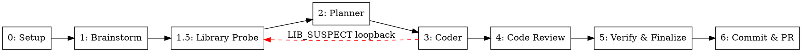

# Orchestrate: Multi-Agent Development Pipeline

Runs a full development pipeline in 7 stages. Brainstorm, Planner, Code Review, and Commit & PR run in the main conversation. All other stages are dispatched as sub-agents via the `Agent` tool.

**Announce at start:** "Using the orchestrate skill to run the full development pipeline."

## Invariants

1. **Initialize before anything else.** Do NOT explore the codebase, read project files, or fetch URLs before the Initialization steps below. First actions: detect input, check for auto mode, gate on the plugin version, create the worktree, start the dashboard inside it.
2. **No pause after Stage 2.** Two skills own approval gates of their own — `brainstorm` (its design gate, Stage 1) and `planning` (its plan gate, Stage 2). Those are the only pauses, they belong to the skills, and both self-bypass in `--auto`. Once the plan is approved, run every remaining stage (3 → 4 → 5 → 6, ending in commit + PR) back-to-back with NO stopping, pausing, questions, or interim summaries. The orchestrator adds no gate of its own. Internal corrective re-dispatches (e.g. LIB_SUSPECT loopback) are NOT pauses — perform them automatically and keep going.
3. **Halt only on a genuine BLOCK/FAIL** (functional verification FAILED, quality gate BLOCKED/STAGNATION, review hard-standards failure, library-probe BLOCKED, or a sub-agent error). On halt, report which stage failed and why. Reaching Stage 6 (PR created) is the only successful terminal state.
4. **Every question uses `AskUserQuestion`** — never plain text. In `--auto` mode, skip all `AskUserQuestion` calls.
5. **Invoke the stage's resolved skill. Never hand-roll its output.** Every stage runs a skill — resolve *which* per `references/config.md` (config override → project skill → global default), then invoke it via the `Skill` tool. Do this even when you believe you already know what it would say: your recollection is not the contract, and a project may have swapped the skill out from under you. This binds main-conversation stages exactly as it binds sub-agents — writing `plan.md` yourself instead of invoking the planning stage's skill, or a design instead of the brainstorm stage's, is a pipeline violation, not a shortcut. **Before leaving a stage, confirm you invoked its skill.** If you didn't, the stage did not run.
6. **The skill owns the contract; the dispatch owns the variables.** When telling a sub-agent what to do, name the resolved skill and pass what only this run knows (paths, ids, ranges). Do NOT restate what the skill already says — a second copy is a second source of truth, and it will drift. If a sub-agent needs a rule that no skill states, add it to the skill rather than the prompt.

---

## Initialization (do these first, in order, before anything else)

### Step 1: Input Detection

The argument is either an **inline prompt** or a **path to a document describing the work** — a PRD, an issue export, a brief, or an existing design doc. (There is no `spec.md` stage in this pipeline; the requirement namespace belongs to the PRD and to `plan.md`.)

1. If the argument contains `--auto`, set `AUTO_MODE=true` and strip `--auto`.
2. Test whether the remaining argument is an existing file (`[ -f "<arg>" ]`).
3. If file → read its contents as the task description. If not → treat it as an inline task prompt.
4. Store the resolved input as `TASK_CONTEXT` — passed to every stage.
5. **Tech-debt manifest mode.** If the input is (or points to) a `findings.json` from `tech-debt-finder`, do NOT re-summarize it into prose. Read the manifest directly and follow `tech-debt-finder/references/auto-fix-handoff.md`: fix only `auto_fixable: true` findings, and before Stage 6 write `fix-manifest.json` giving every finding a terminal disposition (`fixed`/`issue`/`suppressed`/`dropped`, reason required for `dropped`). BLOCK the commit if any `auto_fixable` finding was dropped without a reason. Include the disposition table in the commit/PR body.

When `AUTO_MODE=true`:
- Skip all `AskUserQuestion` calls — Claude decides autonomously, auto-approves designs and plans.
- Skip worktree creation — use current working directory (CI already checked out the branch).
- Skip all `dag-update` calls — no live dashboard.
- Skip PR creation in Stage 6 — only commit and push; caller handles PR.
- All artifacts still produced (design docs, specs, plans) for auditability.

### Step 2: Plugin Version Gate

A stale harness runs stale contracts. Check the installed plugin against the published one **before the worktree exists**, so a halt here leaves nothing to clean up:

```bash
semver() { case "$1" in ''|*[!0-9.]*|.*|*.) return 1 ;; esac; }
LOCAL=$(jq -er '.version // empty' "${CODEX_PLUGIN_ROOT:-${CLAUDE_PLUGIN_ROOT}}/.claude-plugin/plugin.json" 2>/dev/null) || LOCAL=''
REMOTE=$(curl -fsSL --max-time 10 https://raw.githubusercontent.com/vertexcover-io/harness-engineering/main/.claude-plugin/plugin.json 2>/dev/null | jq -er '.version // empty' 2>/dev/null) || REMOTE=''
semver "$LOCAL" || LOCAL=''; semver "$REMOTE" || REMOTE=''
if [ -z "$LOCAL" ] || [ -z "$REMOTE" ]; then echo "VERSION_GATE=UNKNOWN local=${LOCAL:-?} remote=${REMOTE:-?}"
elif [ "$(printf '%s\n%s\n' "$LOCAL" "$REMOTE" | sort -t. -k1,1n -k2,2n -k3,3n | tail -1)" = "$LOCAL" ]; then echo "VERSION_GATE=OK local=$LOCAL remote=$REMOTE"
else echo "VERSION_GATE=STALE local=$LOCAL remote=$REMOTE"; fi
```

Act on the printed verdict — do not re-derive it:

- `OK` (equal, or local ahead — a dev checkout) → continue.
- `UNKNOWN` → log one warning line and continue. Either side may be missing for reasons that have nothing to do with staleness — offline, a proxy or rate-limit page returning JSON with no `version`, an unreadable manifest — and none of them justify blocking a ticket. The gate only ever halts on a version it actually read.
- `STALE` → **stop before creating anything.** Report both versions and tell the user to update the harness plugin (`/plugin`), then reload the session or restart Claude and re-run the same orchestrate command. In `--auto` mode, log the same warning and continue — CI cannot reload a session.

Both versions are validated as dotted numerics before they are compared, and the comparison is a POSIX field-wise numeric sort — `1.20.0` correctly outranks `1.9.0`, and `sort -V` (absent on some BSD userlands) is not required.

### Step 3: Create Worktree, then Bootstrap the DAG Dashboard

DAG commands, the init block, and the transition pattern all live in **`references/dag-commands.md`**. Resolve `DAG_SCRIPT` first:

The dashboard script path is: !`echo "${CODEX_PLUGIN_ROOT:-${CLAUDE_PLUGIN_ROOT}}/skills/orchestrate/dashboard/dag-update.mjs"`

**Create the worktree FIRST, then start the dashboard from inside it** — `init` writes `.harness/<SPEC_NAME>/` relative to cwd, so it must run with the worktree as cwd (else the dashboard and the phase/claims files split across two checkouts). The worktree skill is the one Skill to invoke before the dashboard.

(In `--auto` mode, skip this whole step — no worktree, no dashboard.)

1. Generate a spec name from the prompt: lowercase, spaces → hyphens, truncate to 30 chars. `"Add user auth system"` → `"add-user-auth-system"`. Then, **while cwd is still the launch directory** (before the worktree `cd`), capture the top-level session id so Stage 5 can publish artifacts against the real session: `SESSION_ID=$(basename "$(ls -t ~/.claude/projects/"$(pwd | sed 's#/#-#g')"/*.jsonl 2>/dev/null | head -1)" .jsonl 2>/dev/null)`. Store `SESSION_ID` (empty is fine — capture may be off; the verify skill then derives its own).
2. **Create the worktree.** Use the project's own worktree skill when it has one — check `CLAUDE.md` and the available skills for one that sets up a worktree — otherwise invoke `using-git-worktrees`. Either way, `cd` into it and store `WORKTREE_PATH`, `BRANCH_NAME`.
3. **From inside the worktree**, run the DAG init block (see `references/dag-commands.md`). Store the printed `HARNESS_DIR`.
4. Start the dashboard server as a **background job**: `Bash("export HARNESS_DIR='<HARNESS_DIR>' && node '<DAG_SCRIPT>' serve", run_in_background=true)`.
5. Record the existing worktree on the dashboard: `set-status setup running`, `write-report worktree` (path + branch), `set-status worktree done`.

---

## Pipeline Stages

| # | Stage | Execution | Output |
|---|-------|-----------|--------|
| 0 | Setup | **Main conversation** | Worktree path, baseline metrics, feature directory |
| 1 | Brainstorm | **Main conversation** | `.harness/<name>/design.md` with declared dependency + fallback chain |
| 1.5 | Library Probe | **Main conversation** | `.harness/<name>/library-probe.md` + verified probe scripts (`.harness/<name>/probes/`) |
| 2 | Planner | **Main conversation** | `.harness/<name>/plan.md` + `.harness/<name>/phases/phase-*.md` |
| 3 | Coder | Sub-agent (parallelizable) | Implementation + tests + `phase-<N>-claims.json` + `e2e-report.json` |
| 4 | Code Review | **Main conversation** | `.harness/<name>/review/review.md` — per-axis findings + verdict (review only, no source edits) |
| 5 | Verify & Finalize | Sub-agent | Functional verification, quality gate PASS/BLOCKED, synced docs, learnings captured |
| 6 | Commit & PR | **Main conversation** | Commits + PR URL |

**Every stage runs a skill, and which one is never hardcoded here** — `references/config.md` owns the
stage → default-skill table and the resolution order (config override → project skill → global
default). Resolve it there, then invoke it (Invariant 5).

Stages 0 (Setup), 1 (Brainstorm), and 2 (Planner) run directly in the main conversation — not as sub-agents — because Stage 0 sets the working directory, Stage 1 needs conversation context, and Stage 2 explores the codebase interactively and holds the only approval gate. All other stages (3–5) run as sub-agents via `Agent`.

---

## Stage Skip Rules

After resolving `TASK_CONTEXT`, decide which stages to skip **before** starting execution. Stages not listed here are never skippable.

```
For each skippable stage:
  1. Input EXPLICITLY says "skip <stage>" → skip unconditionally (trust the caller)
  2. Else if a spec/context file is provided → read it and evaluate:
     - Problem clearly defined with specific scope?  Files/changes listed?  Acceptance criteria present?
     → ALL yes → skip (stage adds no value);  ANY no → run the stage
  3. Else (bare prompt) → always run the stage
```

| Stage | Skip condition |
|-------|---------------|
| 1: Brainstorm | Explicit skip instruction, OR input has complete context (clear problem, specific scope, acceptance criteria) |

**Mandatory (never skip):** 0 Setup, 1.5 Library Probe (trust gate — every external dep verified before code), 2 Planner, 3 Coder, 4 Code Review (semantic gate), 5 Verify & Finalize, 6 Commit & PR. Planning owns its own "is a plan warranted?" gate — it fires after recon, inside the skill, and may route genuinely atomic work to `implement`; the orchestrator never pre-empts it. A skipped brainstorm means planning receives the prompt instead of a `design.md` and establishes the requirement ids itself.

**Handling skipped stages:** set the DAG node to `skipped`, log `"Skipping Stage N (<name>) — <reason>"`, proceed. Skipping brainstorm does not skip setup.

`disabled` in `orchestrate.config.json` (see below) is honored only on the skippable stage (`brainstorm`).

---

## Execution Rules

**Single approval gate:** the only gate is after Stage 2 (Planner) — present the plan and wait for approval before Stage 3. All other stages flow without gates or interim summaries (Invariant 2).

**Waiting status:** a PreToolUse/PostToolUse hook sets the running node to `waiting` before any `AskUserQuestion` and back to `running` after — no manual dag-update needed.

**Sub-agent prompts:** every sub-agent prompt starts with `[PREAMBLE]` (worktree path + a pointer to `baseline.json` for tooling commands), then names the stage's resolved skill and passes this run's variables. Dispatch blocks: **`references/stage-prompts.md`** — and per Invariant 6, do not add to them what a skill already says.

**DAG transitions:** `set-status running` before each stage, `done` after, `write-report` on completion — exact invocations in **`references/dag-commands.md`**.

### Pipeline Flow


```dot
digraph pipeline {
  rankdir=LR
  node [shape=box]
  stage_0 [label="0: Setup"]; stage_1 [label="1: Brainstorm"]
  stage_15 [label="1.5: Library Probe"]
  stage_2 [label="2: Planner"]; stage_3 [label="3: Coder"]
  stage_4 [label="4: Code Review"]; stage_5 [label="5: Verify & Finalize"]
  stage_6 [label="6: Commit & PR"]
  stage_0 -> stage_1 -> stage_15 -> stage_2 -> stage_3
  stage_3 -> stage_4 -> stage_5 -> stage_6
  stage_3 -> stage_15 [label="LIB_SUSPECT loopback" style=dashed color=red]
}
```

### Parallel When Possible

Parallelism is **graph-driven**, not file-count-driven. Under vertical slicing (see the `planning` skill) each phase is an independent capability, so dispatch comes straight from the phase graph:

**Phase waves:** read the DOT phase graph from plan.md's `## Structure Outline`. Compute **ready nodes** = phases with no incomplete predecessors. Dispatch all ready phases in parallel (multiple `Agent` calls in one message). After each wave, recompute → dispatch the next wave.

**One phase = one coder dispatch** — the phase file is the unit: one TDD cycle, one commit. There is no step-level dispatch; a phase too large for one agent is a plan defect (re-slice), not a dispatch strategy.

---

## Per-stage Config: `orchestrate.config.json`

Optional file at the **repo root**, read once in Stage 0. Its `stages` map keys each stage ID (or default skill name) to `{ skill?, model?, disabled? }`. `skill` swaps the stage's skill (name only); `model` retargets sub-agent stages (`coder`/`verify-finalize`); `disabled` skips — honored only on the skippable stage (`brainstorm`), rejected on mandatory ones. Full resolution rules, the gate-contract table, and an example: **`references/config.md`**. Does NOT apply to `orchestrate` itself.

---

## Sub-Agent Dispatch

### Stage 0: Setup (Main Conversation)

Worktree already created in Step 3 (`WORKTREE_PATH`, `BRANCH_NAME` stored; in `--auto` the caller's cwd is used). Then:

1. `set-status baseline running`.
2. **Invoke `pipeline-setup` via `Skill`** — it owns tooling detection, baseline metrics, the artifact directory, and lesson routing. Do not hand-roll any of it (Invariant 5). **Pass it `WORKTREE_PATH`**: the worktree already exists from Step 3, and the skill adopts a caller-supplied path instead of creating a second one.
3. Store what it returns: `SPEC_NAME`, `SPEC_DIR` (`.harness/<SPEC_NAME>/`), `BASELINE_PATH`, `MANIFEST_PATH`, and **`ROUTED_LESSONS`** (`.harness/<SPEC_NAME>/relevant-lessons.md` — may hold the no-match sentinel, which is still a valid path to pass on). Every later stage that takes a `Lessons:` path takes this one; there is no other producer of it.
4. Create the directories `pipeline-setup` does not: `.harness/<SPEC_NAME>/verification/screenshots/`, `.harness/<SPEC_NAME>/verify-staging/`, `.harness/<SPEC_NAME>/review/`, and `.harness/<SPEC_NAME>/phases/` (`reports/` already created by dashboard init). The verification layout is functional-verify's — `verification/` flat with a single `screenshots/` under it, and `verify-staging/` as its **sibling**, not a child. The whole `.harness/` tree is gitignored — artifacts reach reviewers out-of-band.
5. **Load stage config.** If `orchestrate.config.json` exists at the worktree root, `Read` its `stages` map into `STAGE_CONFIG`; else `STAGE_CONFIG = {}`. Resolve `skill`/`model`/`disabled` per stage from `references/config.md`.
6. `write-report baseline`, `set-status baseline done`, `set-status setup done`.

### Stage 1: Brainstorm (Main Conversation)

`set-status brainstorm running` → invoke `brainstorm` via `Skill` → `write-report brainstorm`, `set-status brainstorm done`.

**Brainstorm owns its own approval gate** (its `## Approval gate` — one pause, presenting the design for approval). That gate is the pipeline's *design* gate and it is real: outside `--auto`, expect the run to pause here as well as at Stage 2. Do not try to suppress it, and do not treat the pause as a stage failure. In `--auto` the skill bypasses it itself; pass no extra instruction.

If the design names any external library, API, or service, it must carry an `## External Dependencies & Fallback Chain` section (shape: the brainstorm skill's `references/design-sections.md`). That section is library-probe's input contract — without it Stage 1.5 blocks. If brainstorm returns a design that names a dependency and omits the section, send it back before advancing rather than walking into the block.

### Stage 1.5: Library Probe (Main Conversation)

The trust gate — every external dependency verified before planning builds on it.

1. `set-status library-probe running`.
2. Invoke `library-probe` via `Skill`. Pass design-doc path and `SPEC_DIR`; pass `--auto` if `AUTO_MODE`.
3. Read the verdict marker from `.harness/<SPEC_NAME>/library-probe.md`:
   - `<!-- LP:VERDICT:PASS -->` or `NOT_APPLICABLE` (no external deps) → continue.
   - `<!-- LP:VERDICT:BLOCKED -->` → **stop the pipeline.** Report which library failed and the user's choice (or missing creds in `--auto`).
4. `write-report library-probe`, `set-status library-probe done`.

### Stage 2: Planner (Main Conversation)

1. `set-status planning running`.
2. Invoke `planning` via `Skill` — it reads `design.md` + `dossier.md` (or the prompt, when brainstorm was skipped) internally before exploring code. Include `Lessons: <ROUTED_LESSONS>` — known pitfalls matching this spec become plan steps.
3. Planner runs recon, asks interactive questions, designs **vertical-slice** phases, and holds **its own approval gate** (the skill's `## Approval gate`). The orchestrator does not add a second `AskUserQuestion` here — the skill owns the pause, and the PreToolUse hook handles the `waiting` status.
4. Output: `.harness/<SPEC_NAME>/plan.md` + `.harness/<SPEC_NAME>/phases/phase-*.md`. Store `PLAN_PATH`, `PHASE_DIR`.
5. Add phase DAG nodes as children of `coder` (see `references/dag-commands.md`), `set-status planning done`.

**If planning routed to `implement` instead of writing a plan.** Its "is a plan warranted?" gate may hand genuinely atomic work straight to the `implement` skill, producing **no `plan.md` and no phase files**. That is a valid outcome, not a stage failure. When it happens:

- Mark the `planning` node `done` and record the route in its report.
- **Skip Stages 3 and 4 entirely** — there is no phase graph to dispatch from and no slice to review at. Set both DAG nodes to `skipped`.
- Invoke `implement` via `Skill` with the recon findings planning handed back, then go to **Stage 5**. Stage 5's claims checks (`MISSING_CLAIMS_FILE`, `E2E_NOT_EXECUTED`) do not apply — there are no phase claims — so run functional-verify, quality-gate, sync-docs, and learn, and enforce only the `proof-report.html` artifact contract.
- Stage 6 runs unchanged.

**Extract:** `PLAN_PATH`, `PHASE_DIR`, phase graph (DOT from plan.md), phase count — or the `implement` route.

### Stage 3: Coder

Dispatch from the phase graph (see "Parallel When Possible") using the Stage 3 block in `references/stage-prompts.md` — one agent per phase file.

**The coder agent invokes exactly one skill: `<SKILL:coder>`, defaulting to `implement`** — dispatch shape in `references/stage-prompts.md`. Handing it the phase file is what puts it in pipeline mode.

Coder writes, per phase, **both** `phase-<N>-claims.json` (structured claim ledger — the `coder-e2e-gate` hook reads it per phase, quality-gate's Check 9 reads the aggregate) **and** `e2e-report.json` (raw run summary — quality-gate reads this). Neither is an input to functional-verify: that skill derives its scenarios from the feature's docs, not from claims.

DAG: `set-status coder running` before dispatch; per phase `set-status <phase-node> running`/`done`; after all phases `set-status coder done`.

**Coder-e2e-gate breadcrumb (mandatory before EVERY coder dispatch):** before dispatching any coder sub-agent, write the active-phase breadcrumb so the `coder-e2e-gate` SubagentStop hook can verify the phase report after the agent returns. Without this file the hook no-ops and the phase is unprotected:

```bash
START_SHA="$(git rev-parse HEAD)"
cat > .harness/current-phase <<EOF
SPEC_NAME=<SPEC_NAME>
PHASE_N=<PHASE_N>
START_SHA=$START_SHA
EOF
```

After each phase completes, delete the breadcrumb (`rm -f .harness/current-phase`) so later-stage subagents don't trigger the gate.

**Nomination signals (learning loop, all of stages 3–5):** stages nominate lesson candidates to `.harness/<SPEC_NAME>/lesson-candidates.jsonl`; the stage-5 curator judges them. Format, taxonomy and rules: the `learn` skill's **Nominate mode** — pass every stage sub-agent that path, not a copy of the format.

**Claims aggregation (mandatory, after the last phase completes):** aggregate every `phase-*-claims.json` into a single `.harness/<SPEC_NAME>/claims.json`. Schema + exact `jq` command: `references/claims-aggregation-format.md` — invoke verbatim. If aggregation fails (`MISSING_PHASE_CLAIMS`), stop the pipeline. The aggregated `claims.json` is what verify reads; phase files are kept for audit.

### LIB_SUSPECT Loopback (Stage 3 → 1.5)

After every coder sub-agent returns, scan its report for `<!-- LIB_SUSPECT:<lib>:<class> -->`. If present:

1. Increment a session-level `LOOPBACK_COUNT` (start 0). Cap at **2** — beyond 2 → stop with `BLOCKED:repeated-lib-failure`.
2. Mark the failed phase node `blocked`.
3. Re-invoke `library-probe` with `--lib <lib>` (append `--auto` if `AUTO_MODE`).
4. Read `library-probe.md`:
   - `<!-- LP:VERDICT:BLOCKED -->` → stop the pipeline (no viable alternative).
   - `## Re-plan Required` present → re-invoke `planning` scoped to the affected phase(s); it reads the new library from `library-probe.md` and rewrites the relevant `phase-N.md`.
5. Re-dispatch the affected phase. Skip phases already done.

This is the only automatic retry loop — library failure is the one class where retrying the *same* code is futile; swap the tool, don't iterate the call.

### Stage 4: Code Review

`set-status code-review running`. Invoke `<SKILL:code-review>` **in this conversation** — it dispatches its own reviewer personas, so there is no sub-agent to dispatch and no model to retarget. It reviews only and edits no source. Pass what only this run knows:

- Plan `.harness/<SPEC_NAME>/plan.md`, scope `--commits <BASE_BRANCH>..HEAD`
- `--output .harness/<SPEC_NAME>/review/review.md`
- Lessons `.harness/<SPEC_NAME>/relevant-lessons.md`, nomination log `.harness/<SPEC_NAME>/lesson-candidates.jsonl`

`set-status code-review done`.

**Verdict parsing:** match `REQUEST CHANGES` first, then `APPROVE WITH SUGGESTIONS`, then `APPROVE`.

### Stage 5: Verify & Finalize

Single consolidated sub-agent: functional verification → quality gate → sync docs → curate learnings. `set-status verify-finalize running`. Dispatch the Stage 5 template from `references/stage-prompts.md`; model = verify-finalize model (`sonnet` default).

**After the sub-agent returns, enforce the artifact + e2e-execution contracts before trusting the verdict:**

```
Bash("
  test -f .harness/<SPEC_NAME>/verification/proof-report.html ||
  { echo 'MISSING_VERIFICATION_ARTIFACTS'; exit 1; }
")
```

If the file is missing → verification FAILED regardless of the returned verdict; stop the pipeline. A "PASSED" verdict without the artifact means the gate was skipped.

**E2E execution check (mandatory):** run the aggregated-claims check from `references/claims-aggregation-format.md`. It enforces `claims.json` exists, `executed > 0`, `failed = 0`.

Failure modes (stop the pipeline):
- `MISSING_PHASE_CLAIMS` / `MISSING_CLAIMS_FILE` — coder or aggregation skipped.
- `E2E_NOT_EXECUTED` / `E2E_FAILED` — phase suites did not run or had failures.

**Verification itself is not gated.** functional-verify writes `proof-report.html` — an HTML workbench whose prose is written for a human and carries no claim ids, so there is no verdict here to grep for; see *Why verification is not gated* in `references/claims-aggregation-format.md`. Read the verdict and the bugs it reports back, and judge them. A passing phase `.spec.ts` is NOT sufficient evidence a feature works: the verifier must have driven a real browser via the `agent-browser` CLI and filmed each scenario.

`set-status verify-finalize done`.

### Stage 6: Commit & PR (Main Conversation)

`set-status commit-pr running`. Do these directly (no sub-agent):

1. **Generate `.harness/<SPEC_NAME>/README.md`** — the reviewer index: title + the final verification verdict stated inline; one-paragraph summary; TOC naming each artifact (`design.md`, `plan.md`, `phases/`, `library-probe.md`, `learnings.md` if present); library-probe verdict line (selected lib + alternatives); PR link placeholder. Nothing under `.harness/` is committed — reviewers read this index and its artifacts out-of-band (directly, or uploaded to the tracker).
2. Invoke `git-commit` via `Skill` for the feature changes. `.harness/` paths are gitignored and never staged — if `git status` shows them, fix `.gitignore` instead of committing.
3. `git push -u origin <BRANCH_NAME>`.
4. If PR desired (not `--no-pr`): `gh pr create --title '<spec title>' --body '<one-paragraph summary; note that design/plan/verification artifacts live in .harness/<SPEC_NAME>/ on the worktree>' --base main --head <BRANCH_NAME>`.
5. Update `manifest.json` with `pr_number` + `completed_at`. Backfill the PR URL into README.md.
6. `write-report commit-pr`, `set-status commit-pr done`.

**Extract:** commits, `PR_URL`.

---

## Terminal BLOCK/FAIL conditions

Stop the pipeline and report which stage failed and why on any of:

| Condition | Detail |
|-----------|--------|
| Sub-agent error | Any sub-agent fails or returns an error |
| Functional verification FAILED | Feature doesn't work as specified — report which scenarios failed |
| Missing verification artifacts | `proof-report.html` absent → `MISSING_VERIFICATION_ARTIFACTS` |
| Quality gate BLOCKED | Report what failed |
| Quality gate STAGNATION | Do NOT retry — report the stagnated check, repeated error signature, need for manual intervention |
| Library-probe BLOCKED | No viable alternative; or `BLOCKED:repeated-lib-failure` after 2 loopbacks |
| Review hard-standards failure | `REQUEST CHANGES` **and** `review.md` has a hard violation (a breach of a documented standard, cited to its source file + rule) → stop; report the cited rule + `file:line` |

`REQUEST CHANGES` with only judgement-call defects (no cited standard) → **log a warning but proceed** to Stage 5; verification and gate catch the rest. On any halt, the worktree is preserved for manual intervention — present what was accomplished and suggest next steps.

---

## Summary

Present ONLY after Stage 6 completes, or after a genuine BLOCK/FAIL halt — never between stages.

```markdown
## Pipeline Complete

**Task:** <TASK_CONTEXT summary>
**Worktree:** <WORKTREE_PATH> (branch: <BRANCH_NAME>)

| Stage | Result |
|-------|--------|
| 0. Setup | Worktree at <path>, baseline captured |
| 1. Brainstorm | Design: .harness/<name>/design.md |
| 2. Plan | <phase_count> phases |
| 3. Coder | <files> files, <tests> tests |
| 4. Review | <verdict> (<findings> findings) |
| 5. Verify & Finalize | Verify: <PASSED/FAILED>, Gate: <PASS/BLOCKED>, docs: <N> updated |
| Learning loop | lessons: retrieved <N> / matched <M> / captured <P> (stale: <count or 0>) |
| 6. PR | <PR_URL> |

**Issues:** <any retries, failures, stagnation, or "None">
```

Finalize: `Bash("export HARNESS_DIR='<HARNESS_DIR>' && node '<DAG_SCRIPT>' finalize done")`

---

## Key Principles

- **Each stage is isolated** — sub-agents don't share context; pass all necessary info in the prompt, and extract file paths + key info from each return to pass forward.
- **Verify before gate** — functional verification runs the app and tests features live BEFORE the quality gate runs metrics. A broken feature is caught early, with evidence.
- **Gate is a hard stop** — a BLOCKED verdict stops the pipeline, no workarounds.
- **Parallelize from the graph** — dispatch ready nodes (no incomplete predecessors) at the phase level; vertical slices are independent by construction.
- **Stagnation stops early** — the coder detects repeated failures and stops itself; don't loop endlessly.
- **One feature directory** — everything for a run lives in `.harness/<name>/` (design, dossier, plan, phases/, library-probe, baseline, claims, e2e-report, gate-reports, review/, probes/, verification/, manifest), all gitignored; reviewers read artifacts out-of-band.
