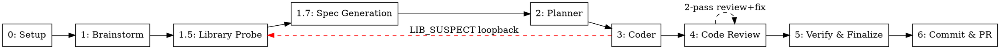

# Orchestrate: Multi-Agent Development Pipeline

Runs a full development pipeline in 7 stages. Brainstorm, Planner, and Commit & PR run in the main conversation. All other stages are dispatched as sub-agents via the `Agent` tool.

**Announce at start:** "Using the orchestrate skill to run the full development pipeline."

## Invariants

1. **Initialize before anything else.** Do NOT explore the codebase, read project files, or fetch URLs before the Initialization steps below. First actions: detect input, check for auto mode, create the worktree, start the dashboard inside it.
2. **Exactly ONE pause — the plan-approval gate after Stage 2.** After the plan is approved, run every remaining stage (3 → 4 → 5 → 6, ending in commit + PR) back-to-back with NO stopping, pausing, questions, or interim summaries. Internal corrective re-dispatches (e.g. LIB_SUSPECT loopback) are NOT pauses — perform them automatically and keep going.
3. **Halt only on a genuine BLOCK/FAIL** (functional verification FAILED, quality gate BLOCKED/STAGNATION, review hard-standards failure, library-probe BLOCKED, or a sub-agent error). On halt, report which stage failed and why. Reaching Stage 6 (PR created) is the only successful terminal state.
4. **Every question uses `AskUserQuestion`** — never plain text. In `--auto` mode, skip all `AskUserQuestion` calls.
5. **Invoke the stage's resolved skill. Never hand-roll its output.** Every stage runs a skill — resolve *which* per `references/config.md` (config override → project skill → global default), then invoke it via the `Skill` tool. Do this even when you believe you already know what it would say: your recollection is not the contract, and a project may have swapped the skill out from under you. This binds main-conversation stages exactly as it binds sub-agents — writing `plan.md` yourself instead of invoking the planning stage's skill, or a design instead of the brainstorm stage's, is a pipeline violation, not a shortcut. **Before leaving a stage, confirm you invoked its skill.** If you didn't, the stage did not run.
6. **The skill owns the contract; the dispatch owns the variables.** When telling a sub-agent what to do, name the resolved skill and pass what only this run knows (paths, ids, ranges). Do NOT restate what the skill already says — a second copy is a second source of truth, and it will drift. If a sub-agent needs a rule that no skill states, add it to the skill rather than the prompt.

---

## Initialization (do these first, in order, before anything else)

### Step 1: Input Detection

The argument is either an **inline prompt** or a **spec file path**.

1. If the argument contains `--auto`, set `AUTO_MODE=true` and strip `--auto`.
2. Test whether the remaining argument is an existing file (`[ -f "<arg>" ]`).
3. If file → read its contents as the task spec. If not → treat it as an inline task prompt.
4. Store the resolved input as `TASK_CONTEXT` — passed to every stage.
5. **Tech-debt manifest mode.** If the input is (or points to) a `findings.json` from `tech-debt-finder`, do NOT re-summarize it into prose. Read the manifest directly and follow `tech-debt-finder/references/auto-fix-handoff.md`: fix only `auto_fixable: true` findings, and before Stage 6 write `fix-manifest.json` giving every finding a terminal disposition (`fixed`/`issue`/`suppressed`/`dropped`, reason required for `dropped`). BLOCK the commit if any `auto_fixable` finding was dropped without a reason. Include the disposition table in the commit/PR body.

When `AUTO_MODE=true`:
- Skip all `AskUserQuestion` calls — Claude decides autonomously, auto-approves designs and plans.
- Skip worktree creation — use current working directory (CI already checked out the branch).
- Skip all `dag-update` calls — no live dashboard.
- Skip PR creation in Stage 6 — only commit and push; caller handles PR.
- All artifacts still produced (design docs, specs, plans) for auditability.

### Step 2: Create Worktree, then Bootstrap the DAG Dashboard

DAG commands, the init block, and the transition pattern all live in **`references/dag-commands.md`**. Resolve `DAG_SCRIPT` first:

The dashboard script path is: !`echo "${CODEX_PLUGIN_ROOT:-${CLAUDE_PLUGIN_ROOT}}/skills/orchestrate/dashboard/dag-update.mjs"`

**Create the worktree FIRST, then start the dashboard from inside it** — `init` writes `.harness/runtime/<SPEC_NAME>/` relative to cwd, so it must run with the worktree as cwd (else the dashboard and the phase/claims files split across two checkouts). The ONLY Skill you may invoke before the dashboard is `using-git-worktrees`.

(In `--auto` mode, skip this whole step — no worktree, no dashboard.)

1. Generate a spec name from the prompt: lowercase, spaces → hyphens, truncate to 30 chars. `"Add user auth system"` → `"add-user-auth-system"`. Then, **while cwd is still the launch directory** (before the worktree `cd`), capture the top-level session id so Stage 5 can publish artifacts against the real session: `SESSION_ID=$(basename "$(ls -t ~/.claude/projects/"$(pwd | sed 's#/#-#g')"/*.jsonl 2>/dev/null | head -1)" .jsonl 2>/dev/null)`. Store `SESSION_ID` (empty is fine — capture may be off; the verify skill then derives its own).
2. **Create the worktree.** Invoke `using-git-worktrees` via `Skill`, then `cd` into it. Store `WORKTREE_PATH`, `BRANCH_NAME`.
3. **From inside the worktree**, run the DAG init block (see `references/dag-commands.md`). Store the printed `HARNESS_DIR`.
4. Start the dashboard server as a **background job**: `Bash("export HARNESS_DIR='<HARNESS_DIR>' && node '<DAG_SCRIPT>' serve", run_in_background=true)`.
5. Record the existing worktree on the dashboard: `set-status setup running`, `write-report worktree` (path + branch), `set-status worktree done`.

---

## Pipeline Stages

| # | Stage | Execution | Output |
|---|-------|-----------|--------|
| 0 | Setup | **Main conversation** | Worktree path, baseline metrics, spec directory |
| 1 | Brainstorm | **Main conversation** | `.harness/features/<name>/design.md` with declared dependency + fallback chain |
| 1.5 | Library Probe | **Main conversation** | `.harness/features/<name>/library-probe.md` + verified probe scripts (`.harness/runtime/<name>/probes/`) |
| 1.7 | Spec Generation | **Main conversation** | `.harness/features/<name>/spec.md` (folds VS-0 probe scenarios in) |
| 2 | Planner | **Main conversation** | `.harness/features/<name>/plan.md` (committed) + `.harness/runtime/<name>/phase-*.md` (gitignored) |
| 3 | Coder | Sub-agent (parallelizable) | Implementation + tests + `phase-<N>-claims.json` + `e2e-report.json` |
| 4 | Code Review | Sub-agent (2-pass) | `.harness/runtime/<name>/review/pass-{1,2}.md` verdicts, fixes applied |
| 5 | Verify & Finalize | Sub-agent | Functional verification, quality gate PASS/BLOCKED, synced docs, learnings captured |
| 6 | Commit & PR | **Main conversation** | Commits + PR URL |

**Every stage runs a skill, and which one is never hardcoded here** — `references/config.md` owns the
stage → default-skill table and the resolution order (config override → project skill → global
default). Resolve it there, then invoke it (Invariant 5).

Stages 0 (Setup), 1 (Brainstorm + Spec), and 2 (Planner) run directly in the main conversation — not as sub-agents — because Stage 0 sets the working directory, Stage 1 needs conversation context and flows into spec generation, and Stage 2 explores the codebase interactively and holds the only approval gate. All other stages (3–5) run as sub-agents via `Agent`.

---

## Stage Skip Rules

After resolving `TASK_CONTEXT`, decide which stages to skip **before** starting execution. Stages not listed here are never skippable.

```
For each skippable stage:
  1. Input EXPLICITLY says "skip <stage>" → skip unconditionally (trust the caller)
  2. Else if a spec/context file is provided → read it and evaluate:
     - Problem clearly defined with specific scope?  Files/changes listed?  Acceptance criteria present?
     → ALL yes → skip (stage adds no value);  ANY no → run the stage
  3. Else (bare prompt) → always run the stage
```

| Stage | Skip condition |
|-------|---------------|
| 1: Brainstorm + Spec | Explicit skip instruction, OR input has complete context (clear problem, specific scope, acceptance criteria) |
| 2: Planner | Explicit skip instruction, OR task is straightforward (single-phase, per-file instructions already provided) |

**Mandatory (never skip):** 0 Setup, 1.5 Library Probe (trust gate — every external dep verified before code), 3 Coder, 4 Code Review (semantic gate), 5 Verify & Finalize, 6 Commit & PR.

**Handling skipped stages:** set the DAG node to `skipped`, log `"Skipping Stage N (<name>) — <reason>"`, proceed. Skipping brainstorm does not skip setup; skipping planning does not skip coder, review, gate, or commit.

`disabled` in `orchestrate.config.json` (see below) is honored only on the two skippable stages.

---

## Execution Rules

**Single approval gate:** the only gate is after Stage 2 (Planner) — present the plan and wait for approval before Stage 3. All other stages flow without gates or interim summaries (Invariant 2).

**Waiting status:** a PreToolUse/PostToolUse hook sets the running node to `waiting` before any `AskUserQuestion` and back to `running` after — no manual dag-update needed.

**Sub-agent prompts:** every sub-agent prompt starts with `[PREAMBLE]` (worktree path + a pointer to `baseline.json` for tooling commands), then names the stage's resolved skill and passes this run's variables. Dispatch blocks: **`references/stage-prompts.md`** — and per Invariant 6, do not add to them what a skill already says.

**DAG transitions:** `set-status running` before each stage, `done` after, `write-report` on completion — exact invocations in **`references/dag-commands.md`**.

### Pipeline Flow


```dot
digraph pipeline {
  rankdir=LR
  node [shape=box]
  stage_0 [label="0: Setup"]; stage_1 [label="1: Brainstorm"]
  stage_15 [label="1.5: Library Probe"]; stage_17 [label="1.7: Spec Generation"]
  stage_2 [label="2: Planner"]; stage_3 [label="3: Coder"]
  stage_4 [label="4: Code Review"]; stage_5 [label="5: Verify & Finalize"]
  stage_6 [label="6: Commit & PR"]
  stage_0 -> stage_1 -> stage_15 -> stage_17 -> stage_2 -> stage_3
  stage_3 -> stage_4 -> stage_5 -> stage_6
  stage_4 -> stage_4 [label="2-pass review+fix" style=dashed]
  stage_3 -> stage_15 [label="LIB_SUSPECT loopback" style=dashed color=red]
}
```

### Parallel When Possible

Parallelism is **graph-driven**, not file-count-driven. Under vertical slicing (see the `planning` skill) each phase is an independent capability, so dispatch comes straight from the phase graph:

**Phase waves:** read the DOT phase graph from plan.md. Compute **ready nodes** = phases with no incomplete predecessors. Dispatch all ready phases in parallel (multiple `Agent` calls in one message). After each wave, recompute → dispatch the next wave.

**Per phase, choose ONE strategy:**
- **Has step graph** in `phase-N.md` → dispatch steps in waves (same ready-node logic), skip the phase-level agent.
- **No step graph** → single agent for the whole phase.

---

## Per-stage Config: `orchestrate.config.json`

Optional file at the **repo root**, read once in Stage 0. Its `stages` map keys each stage ID (or default skill name) to `{ skill?, model?, disabled? }`. `skill` swaps the stage's skill (name only); `model` retargets sub-agent stages (`coder`/`code-review`/`verify-finalize`); `disabled` skips — honored only on the skippable stages (`brainstorm`, `planning`), rejected on mandatory ones. Full resolution rules, the gate-contract table, and an example: **`references/config.md`**. Does NOT apply to `orchestrate` itself.

---

## Sub-Agent Dispatch

### Stage 0: Setup (Main Conversation)

Worktree already created in Step 2 (`WORKTREE_PATH`, `BRANCH_NAME` stored; in `--auto` the caller's cwd is used). Then:

1. `set-status baseline running`.
2. Create dirs: `.harness/features/<SPEC_NAME>/verification/{screenshots,traces,recording}/` (committed) and `.harness/runtime/<SPEC_NAME>/review/` (gitignored; `reports/` already created by dashboard init).
3. Auto-detect tooling: `CLAUDE.md` first, then `package.json`, `pyproject.toml`, `go.mod`, `Cargo.toml`.
4. Run baseline metrics (typecheck, lint, test, coverage) → `.harness/runtime/<SPEC_NAME>/baseline.json`.
5. Write `.harness/runtime/<SPEC_NAME>/manifest.json` skeleton `{spec_name, branch, worktree, started_at, pr_number: null, stages: {}}`.
6. Store `SPEC_NAME`, `SPEC_DIR` (`.harness/features/<SPEC_NAME>/`), `HARNESS_SPEC_DIR` (`.harness/runtime/<SPEC_NAME>/`), `BASELINE_PATH`, `MANIFEST_PATH`.
7. **Load stage config.** If `orchestrate.config.json` exists at the worktree root, `Read` its `stages` map into `STAGE_CONFIG`; else `STAGE_CONFIG = {}`. Resolve `skill`/`model`/`disabled` per stage from `references/config.md`.
8. `write-report baseline`, `set-status baseline done`, `set-status setup done`.

### Stage 1: Brainstorm (Main Conversation)

`set-status brainstorm running` → invoke `brainstorm` via `Skill` (no approval gate, design flows straight through) → `write-report brainstorm`, `set-status brainstorm done`.

The brainstorm skill's own `## External Dependency Declaration` section must produce an `## External Dependencies & Fallback Chain` section in the design doc — that design-doc section is library-probe's input contract; without it, library-probe blocks.

### Stage 1.5: Library Probe (Main Conversation)

The trust gate. Runs *before* spec generation so verified probes fold into the spec as VS-0 scenarios.

1. `set-status library-probe running`.
2. Invoke `library-probe` via `Skill`. Pass design-doc path and `SPEC_DIR`; pass `--auto` if `AUTO_MODE`.
3. Read the verdict marker from `.harness/features/<SPEC_NAME>/library-probe.md`:
   - `<!-- LP:VERDICT:PASS -->` or `NOT_APPLICABLE` (no external deps) → continue.
   - `<!-- LP:VERDICT:BLOCKED -->` → **stop the pipeline.** Report which library failed and the user's choice (or missing creds in `--auto`).
4. `write-report library-probe`, `set-status library-probe done`.

### Stage 1.7: Spec Generation (Main Conversation)

`set-status spec-gen running` → invoke `spec-generation` (it reads `design.md` + `library-probe.md` + the probe stubs at `verification/verification-stubs.md` and folds them into the spec's `## Verification Scenarios`) → save to `.harness/features/<SPEC_NAME>/spec.md`, store `SPEC_PATH` → `set-status spec-gen done`.

### Stage 2: Planner (Main Conversation)

1. `set-status planning running`.
2. Invoke `planning` via `Skill` — it reads design doc + spec internally before exploring code. Include `Lessons: <ROUTED_LESSONS>` — known pitfalls matching this spec become plan steps.
3. Planner explores the codebase, asks interactive questions, designs **vertical-slice** phases.
4. **APPROVAL GATE:** use `AskUserQuestion` (hook auto-handles waiting status).
5. Output: `.harness/features/<SPEC_NAME>/plan.md` (committed) + `.harness/runtime/<SPEC_NAME>/phase-*.md` (gitignored). Store `PLAN_PATH`, `PHASE_DIR`.
6. Add phase DAG nodes as children of `coder` (see `references/dag-commands.md`), `set-status planning done`.

**Extract:** `PLAN_PATH`, `PHASE_DIR`, phase graph (DOT from plan.md), phase count.

### Stage 3: Coder

Dispatch from the phase graph (see "Parallel When Possible") using the Stage 3 block in `references/stage-prompts.md` — one agent per phase, or per step in waves where the phase file has a Steps section. Coder writes, per phase, **both** `phase-<N>-claims.json` (structured claim ledger — the `coder-e2e-gate` hook + functional-verify read this) **and** `e2e-report.json` (raw run summary — quality-gate reads this).

DAG: `set-status coder running` before dispatch; per phase `set-status <phase-node> running`/`done`; after all phases `set-status coder done`.

**Coder-e2e-gate breadcrumb (mandatory before EVERY coder dispatch):** before dispatching any coder sub-agent (phase- or step-level), write the active-phase breadcrumb so the `coder-e2e-gate` SubagentStop hook can verify the phase report after the agent returns. Without this file the hook no-ops and the phase is unprotected:

```bash
START_SHA="$(git rev-parse HEAD)"
cat > .harness/runtime/current-phase <<EOF
SPEC_NAME=<SPEC_NAME>
PHASE_N=<PHASE_N>
START_SHA=$START_SHA
EOF
```

After each phase completes, delete the breadcrumb (`rm -f .harness/runtime/current-phase`) so later-stage subagents don't trigger the gate.

**Nomination signals (learning loop, all of stages 3–5):** stages nominate lesson candidates to `.harness/runtime/<SPEC_NAME>/lesson-candidates.jsonl`; the stage-5 curator judges them. Format, taxonomy and rules: the `learn` skill's **Nominate mode** — pass every stage sub-agent that path, not a copy of the format.

**Claims aggregation (mandatory, after the last phase completes):** aggregate every `phase-*-claims.json` into a single `.harness/runtime/<SPEC_NAME>/claims.json`. Schema + exact `jq` command: `references/claims-aggregation-format.md` — invoke verbatim. If aggregation fails (`MISSING_PHASE_CLAIMS`), stop the pipeline. The aggregated `claims.json` is what verify reads; phase files are kept for audit.

### LIB_SUSPECT Loopback (Stage 3 → 1.5)

After every coder sub-agent returns, scan its report for `<!-- LIB_SUSPECT:<lib>:<class> -->`. If present:

1. Increment a session-level `LOOPBACK_COUNT` (start 0). Cap at **2** — beyond 2 → stop with `BLOCKED:repeated-lib-failure`.
2. Mark the failed phase node `blocked`.
3. Re-invoke `library-probe` with `--lib <lib>` (append `--auto` if `AUTO_MODE`).
4. Read `library-probe.md`:
   - `<!-- LP:VERDICT:BLOCKED -->` → stop the pipeline (no viable alternative).
   - `## Re-plan Required` present → re-invoke `planning` scoped to the affected phase(s); it reads the new library from `library-probe.md` and rewrites the relevant `phase-N.md`.
5. Re-dispatch the affected phase. Skip phases already done.

This is the only automatic retry loop — library failure is the one class where retrying the *same* code is futile; swap the tool, don't iterate the call.

### Stage 4: Code Review Loop

Two-pass review: a review+fix agent addresses defects, then a final review validates. `set-status code-review running`. Dispatch Pass 1 (review & fix) then Pass 2 (final review) from `references/stage-prompts.md`; model = code-review model (`sonnet` default). `set-status code-review done`.

**Verdict parsing:** match `REQUEST CHANGES` first, then `APPROVE WITH SUGGESTIONS`, then `APPROVE`.

### Stage 5: Verify & Finalize

Single consolidated sub-agent: functional verification → quality gate → sync docs → curate learnings. `set-status verify-finalize running`. Dispatch the Stage 5 template from `references/stage-prompts.md`; model = verify-finalize model (`sonnet` default).

**After the sub-agent returns, enforce the artifact + e2e-execution contracts before trusting the verdict:**

```
Bash("
  test -f .harness/features/<SPEC_NAME>/verification/proof-report.md ||
  { echo 'MISSING_VERIFICATION_ARTIFACTS'; exit 1; }
")
```

If the file is missing → verification FAILED regardless of the returned verdict; stop the pipeline. A "PASSED" verdict without the artifact means the gate was skipped.

**E2E execution check (mandatory):** run the aggregated-claims check from `references/claims-aggregation-format.md`. It enforces `claims.json` exists, `executed > 0`, `failed = 0`.

Failure modes (stop the pipeline):
- `MISSING_PHASE_CLAIMS` / `MISSING_CLAIMS_FILE` — coder or aggregation skipped.
- `E2E_NOT_EXECUTED` / `E2E_FAILED` — phase suites did not run or had failures.

**Verification itself is not gated.** functional-verify writes a plain-English `proof-report.md` for a human, carrying no claim ids and nothing to grep — see *Why verification is not gated* in `references/claims-aggregation-format.md`. Read the verdict and the bugs it reports back, and judge them. A passing phase `.spec.ts` is NOT sufficient evidence a feature works: the verifier must have driven a real browser via the `agent-browser` CLI and filmed each scenario.

`set-status verify-finalize done`.

### Stage 6: Commit & PR (Main Conversation)

`set-status commit-pr running`. Do these directly (no sub-agent):

1. **Generate `.harness/features/<SPEC_NAME>/README.md`** — the reviewer index: title + the final verification verdict **stated inline** (`verification/` is never committed, so a link to it would be dead for everyone but you); one-paragraph summary; TOC linking each committed artifact (`design.md`, `spec.md`, `plan.md`, `library-probe.md`, `learnings.md` if present); library-probe verdict line (selected lib + alternatives); PR link placeholder.
2. Invoke `git-commit` via `Skill`. Create a final, separate commit for the artifact tree: `docs(spec): add artifacts for <SPEC_NAME>` containing only `.harness/features/<SPEC_NAME>/` files. **Never commit `verification/`** — the report, frames and videos stay on disk for a human and out of git forever. Confirm `.harness/features/*/verification/` is in `.gitignore` before staging; add it if it is missing.
3. `git push -u origin <BRANCH_NAME>`.
4. If PR desired (not `--no-pr`): `gh pr create --title '<spec title>' --body 'Closes: see .harness/features/<SPEC_NAME>/README.md for design, spec, plan, and verification proof.' --base main --head <BRANCH_NAME>`.
5. Update `manifest.json` with `pr_number` + `completed_at`. Backfill the PR URL into README.md and amend the artifact commit (or follow up with a new commit if amend is forbidden by policy).
6. `write-report commit-pr`, `set-status commit-pr done`.

**Extract:** commits, `PR_URL`.

---

## Terminal BLOCK/FAIL conditions

Stop the pipeline and report which stage failed and why on any of:

| Condition | Detail |
|-----------|--------|
| Sub-agent error | Any sub-agent fails or returns an error |
| Functional verification FAILED | Feature doesn't work as specified — report which scenarios failed |
| Missing verification artifacts | `proof-report.md` absent → `MISSING_VERIFICATION_ARTIFACTS` |
| Quality gate BLOCKED | Report what failed |
| Quality gate STAGNATION | Do NOT retry — report the stagnated check, repeated error signature, need for manual intervention |
| Library-probe BLOCKED | No viable alternative; or `BLOCKED:repeated-lib-failure` after 2 loopbacks |
| Review hard-standards failure | Pass-2 still `REQUEST CHANGES` **and** pass-2.md has an unresolved hard violation (a breach of a documented standard, cited to its source file + rule) → stop; report the cited rule + `file:line` |

Review pass 2 returning `REQUEST CHANGES` with only judgement-call defects (no cited standard) → **log a warning but proceed** to Stage 5; verification and gate catch the rest. On any halt, the worktree is preserved for manual intervention — present what was accomplished and suggest next steps.

---

## Summary

Present ONLY after Stage 6 completes, or after a genuine BLOCK/FAIL halt — never between stages.

```markdown
## Pipeline Complete

**Task:** <TASK_CONTEXT summary>
**Worktree:** <WORKTREE_PATH> (branch: <BRANCH_NAME>)

| Stage | Result |
|-------|--------|
| 0. Setup | Worktree at <path>, baseline captured |
| 1. Brainstorm | Spec: .harness/features/<name>/spec.md |
| 2. Plan | <phase_count> phases |
| 3. Coder | <files> files, <tests> tests |
| 4. Review | <verdict> (2-pass) |
| 5. Verify & Finalize | Verify: <PASSED/FAILED>, Gate: <PASS/BLOCKED>, docs: <N> updated |
| Learning loop | lessons: retrieved <N> / matched <M> / captured <P> (stale: <count or 0>) |
| 6. PR | <PR_URL> |

**Issues:** <any retries, failures, stagnation, or "None">
```

Finalize: `Bash("export HARNESS_DIR='<HARNESS_DIR>' && node '<DAG_SCRIPT>' finalize done")`

---

## Key Principles

- **Each stage is isolated** — sub-agents don't share context; pass all necessary info in the prompt, and extract file paths + key info from each return to pass forward.
- **Verify before gate** — functional verification runs the app and tests features live BEFORE the quality gate runs metrics. A broken feature is caught early, with evidence.
- **Gate is a hard stop** — a BLOCKED verdict stops the pipeline, no workarounds.
- **Parallelize from the graph** — dispatch ready nodes (no incomplete predecessors) at both phase and step level; vertical slices are independent by construction.
- **Stagnation stops early** — the coder detects repeated failures and stops itself; don't loop endlessly.
- **Spec folder structure** — committed reviewer-facing artifacts in `.harness/features/<name>/` (design, spec, plan, library-probe, learnings, verification/); pipeline working state in `.harness/runtime/<name>/` (baseline, phase-*, phase-*-claims.json, claims.json, e2e-report.json, gate-reports, review/, probes/, manifest), gitignored.
