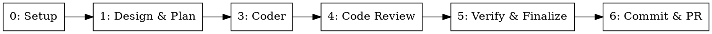

# Orchestrate: Multi-Agent Development Pipeline

Runs a full development pipeline in **7 stages** — 0, 1, then 3 through 7 (stage numbers are stable ids; 2 merged into 1). Stage 1 is the merged design-and-plan stage: the `planning` skill owns the question loop, the inline checkpoint, the library probe, and the plan gate. The Pipeline Stages table below is the authority on each stage's execution mode and output.

**Announce at start:** "Using the orchestrate skill to run the full development pipeline."

## Invariants

1. **Initialize before anything else.** Do NOT explore the codebase, read project files, or fetch URLs before the Initialization steps below. First actions: detect input, check for auto mode, gate on the plugin version, create the worktree, start the dashboard inside it.
2. **No pause after Stage 1.** One skill owns both approval gates — `planning` (Stage 1): its inline checkpoint and its plan gate on `plan.html`. Those are the only pauses, they belong to the skill, and both self-bypass in `--auto`. Once the plan is approved, run every remaining stage (3 → 4 → 5 → 6 → 7, ending in commit + PR + retro) back-to-back with NO stopping, pausing, questions, or interim summaries. The orchestrator adds no gate of its own.
3. **Halt only on a genuine BLOCK/FAIL.** The complete halt set is the `## Terminal BLOCK/FAIL conditions` table below — nothing outside it stops the pipeline. On halt, report which stage failed and why. Reaching Stage 6 (PR created) is the only successful terminal state; Stage 7 runs after it and cannot change the verdict.
4. **Every question uses `AskUserQuestion`** — never plain text. In `--auto` mode, skip all `AskUserQuestion` calls.
5. **Invoke the stage's resolved skill. Never hand-roll its output.** Every stage runs a skill — resolve *which* per `references/config.md`, then invoke it via the `Skill` tool. Do this even when you believe you already know what it would say: your recollection is not the contract, and a project may have swapped the skill out from under you. This binds main-conversation stages exactly as it binds sub-agents — writing `plan.html` or `plan.md` yourself instead of invoking the planning stage's skill is a pipeline violation, not a shortcut. **Before leaving a stage, confirm you invoked its skill.** If you didn't, the stage did not run.
6. **The skill owns the contract; the dispatch owns the variables.** When telling a sub-agent what to do, name the resolved skill and pass what only this run knows (paths, ids, ranges). Do NOT restate what the skill already says — a second copy is a second source of truth, and it will drift. If a sub-agent needs a rule that no skill states, add it to the skill rather than the prompt.

---

## Reference files

Every file below is one hop from here. Read the one whose condition you are in — do not work from memory of it.

| File | Read it when |
|------|--------------|
| `references/config.md` | anything to do with `orchestrate.config.json` — which skill or model a stage runs, the stage ids, the resolution order, and the gate contracts all live here. That one file also carries this project's commands and environments; read the config itself for those |
| `references/orchestrate.config.example.json` | you want a worked `orchestrate.config.json` to copy |
| `references/dag-commands.md` | running any dashboard command — the init block, stage transitions, `serve-start`, `finalize` |
| `references/dashboard-report-formats.md` | writing the markdown body of any `write-report` call |
| `references/stage-prompts.md` | dispatching a sub-agent (Stage 0 Baseline, Stage 3 Coder, Stage 5 Verify & Finalize) |
| `references/coder-contracts.md` | you need the coder stage's wire protocol — phase-file inputs, mandatory E2E, report artifacts |
| `references/consumer-repo-e2e.md` | a phase changes a published library whose end-to-end proof must run in a consumer repo |

---

## Initialization (do these first, in order, before anything else)

### Step 1: Detect the Input and Gate on the Plugin Version

One script does both. A stale harness runs stale contracts, so the gate runs **before the worktree exists** — a halt here leaves nothing to clean up. Pass the raw argument through, `--auto` and all:

```bash
bash "${CODEX_PLUGIN_ROOT:-${CLAUDE_PLUGIN_ROOT:-.}}/skills/orchestrate/scripts/init-gate.sh" "<raw argument>"
```

Outside a plugin runtime neither root is set — run the script by its path in the checkout instead. It resolves the version gate and the plugin manifest by walking up from its own location either way.

It prints exactly four lines. Act on them — do not re-derive them:

```
AUTO_MODE=true|false
INPUT_KIND=prompt|file|findings
INPUT_PATH=<absolute path, empty when INPUT_KIND=prompt>
VERSION_GATE=OK|UNKNOWN|STALE local=<x> remote=<y>
```

**Input.** The argument is either an **inline prompt** or a **path to a document describing the work** — a PRD, an issue export, a brief, or an existing design doc. (There is no `spec.md` stage in this pipeline; the requirement namespace belongs to the PRD and to `plan.md`.) The script has already stripped `--auto` and tested the remainder with `[ -f ]`:

- `INPUT_KIND=prompt` → the stripped argument is the inline task prompt. **Except:** when the
  **entire** argument matches the `tracker.resolve.pattern` in `orchestrate.config.json` (e.g.
  `/orchestrate REF-123`), this is **ticket mode**. Fetch it — `<TRACKER> get --ref '<arg>'` (read
  `<TRACKER>` as in the Tracker events section) — and halt if that exits non-zero or no `tracker`
  block exists: the user named a ticket, and inventing a task from a bare ref helps nobody. On
  success, `TASK_CONTEXT` = the ticket's title + body, its `url` is the run-started ticket URL,
  and store `TICKET_REF`; pass `--ref '<TICKET_REF>'` on every later `<TRACKER>` call so tracker
  writes never depend on the branch name.
- `INPUT_KIND=file` → read `INPUT_PATH` yourself; its contents are the task description.
- `INPUT_KIND=findings` → **tech-debt manifest mode.** `INPUT_PATH` is a `findings.json` from `tech-debt-finder` (detected by shape, not filename). Do NOT re-summarize it into prose. Read the manifest directly and follow `tech-debt-finder/references/auto-fix-handoff.md`: fix only `auto_fixable: true` findings, and before Stage 6 write `fix-manifest.json` giving every finding a terminal disposition (`fixed`/`issue`/`suppressed`/`dropped`, reason required for `dropped`). BLOCK the commit if any `auto_fixable` finding was dropped without a reason. Include the disposition table in the commit/PR body.

Store the resolved input as `TASK_CONTEXT` — passed to every stage.

**Version verdict.**

- `VERSION_GATE=OK` → continue.
- `VERSION_GATE=UNKNOWN` → log one warning line and continue; a version that could not be read is never grounds to block a ticket.
- `VERSION_GATE=STALE` → **stop before creating anything.** Report both versions and tell the user to update the harness plugin (`/plugin`), then reload the session or restart Claude and re-run the same orchestrate command. In `--auto` mode, log the same warning and continue — CI cannot reload a session. (The script exits non-zero only on `STALE`.)

When `AUTO_MODE=true`:
- Skip all `AskUserQuestion` calls — Claude decides autonomously, auto-approves designs and plans.
- Skip worktree creation — use current working directory (CI already checked out the branch).
- Skip all `dag-update` calls — no live dashboard.
- Skip PR creation in Stage 6 — only commit and push; caller handles PR.
- All artifacts still produced (design.md, plan.html, extracted plans) for auditability.

### Step 2: Create Worktree, then Bootstrap the DAG Dashboard

DAG commands, the init block, and the transition pattern all live in **`references/dag-commands.md`**. Resolve `DAG_SCRIPT` first:

The dashboard script path is: !`echo "${CODEX_PLUGIN_ROOT:-${CLAUDE_PLUGIN_ROOT}}/skills/orchestrate/dashboard/dag-update.mjs"`

**Create the worktree FIRST, then start the dashboard from inside it** — `init` writes `.harness/<SPEC_NAME>/` relative to cwd, so it must run with the worktree as cwd (else the dashboard and the phase artifacts split across two checkouts).

Every step here is seconds of work. The minutes-long baseline is dispatched by Stage 0 and joined
later, so nothing in initialization blocks on it.

(In `--auto` mode, skip this whole step — no worktree, no dashboard.)

1. Generate a spec name from the prompt: lowercase, spaces → hyphens, truncate to 30 chars — long enough to stay descriptive, short enough that the branch name and every `.harness/<SPEC_NAME>/…` path stay readable in `git branch` and on the dashboard. `"Add user auth system"` → `"add-user-auth-system"`. Then, **while cwd is still the launch directory** (before the worktree `cd`), capture the top-level session id so Stage 5 can publish artifacts against the real session: `SESSION_ID=$(basename "$(ls -t ~/.claude/projects/"$(pwd | sed 's#/#-#g')"/*.jsonl 2>/dev/null | head -1)" .jsonl 2>/dev/null)`. Store `SESSION_ID` (empty is fine — capture may be off; the verify skill then derives its own) and `LAUNCH_DIR=$(pwd)` beside it — Stage 7 needs the launch directory, because transcripts live under it and never under the worktree.
2. **Create the worktree.** Use the project's own worktree skill when it has one — check `CLAUDE.md` and the available skills for one that sets up a worktree — otherwise invoke `using-git-worktrees`. Either way, `cd` into it and store `WORKTREE_PATH`, `BRANCH_NAME`.
3. **From inside the worktree**, open `references/dag-commands.md` and run its init block verbatim — it creates every stage node, and a hand-built DAG will not match the transitions the rest of this file issues. Store the printed `HARNESS_DIR`.
4. Start the dashboard server: `Bash("export HARNESS_DIR='<HARNESS_DIR>' && node '<DAG_SCRIPT>' serve-start")`. It detaches, so this is a plain foreground call.
5. Record the existing worktree on the dashboard: `set-status setup running`, `write-report worktree` (path + branch), `set-status worktree done`.

---

## Pipeline Stages

| # | Stage | Execution | Output |
|---|-------|-----------|--------|
| 0 | Setup | **Main conversation** (`setup`) + background sub-agent (`baseline`) | Worktree path, spec artifact directory, and — once the join resolves — baseline metrics |
| 1 | Design & Plan | **Main conversation** | `design.md` (recorder; carries the dependency + fallback chain) · `plan.html` (review surface, gate) → extracted `plan.md` + `phases/phase-*.md` |
| 3 | Coder | Sub-agent (parallelizable) | Implementation + tests + `phase-<N>-e2e.json` (runner output) |
| 4 | Code Review | **Main conversation** | `.harness/<SPEC_NAME>/review/review.md` — per-axis findings + verdict, then fixes applied and recorded |
| 5 | Verify & Finalize | Sub-agent | Functional verification, quality gate PASS/BLOCKED, synced docs |
| 6 | Commit & PR | **Main conversation** | Commits + PR URL |
| 7 | Retro | Sub-agent | `.harness/<SPEC_NAME>/retro/report.md` — ranked harness defects this run exposed |

**Every stage runs a skill, and which one is never hardcoded here** — `references/config.md` owns the
stage → default-skill table, the resolution order, and each stage's gate contract. Resolve it
there, then invoke it (Invariant 5).

Stages 3, 5 and 7 are dispatched as sub-agents via `Agent`, as is Stage 0's `baseline` half. The rest run in the main conversation: Stage 0 sets the working directory, Stage 1 needs conversation context and explores the codebase interactively, Stage 4's skill dispatches its own reviewer personas, and Stage 6 commits.

**Every stage is mandatory except Stage 7**, which a project may switch off with `"retro": { "disabled": true }`. The planning skill scales itself — its step 0 collapses the question loop and checkpoint for work with nothing to decide, and its own gate may route atomic work to `implement`. The orchestrator never pre-empts either call.

---

## Execution Rules

**Waiting status:** a PreToolUse/PostToolUse hook sets the running node to `waiting` before any `AskUserQuestion` and back to `running` after — no manual dag-update needed.

**Sub-agent prompts:** every sub-agent prompt starts with `[PREAMBLE]` (worktree path + a pointer to `orchestrate.config.json` for commands and to `baseline.json` for the results a regression is measured against), then names the stage's resolved skill and passes this run's variables. **Before dispatching any sub-agent, read that stage's dispatch block in `references/stage-prompts.md` and build the prompt from it** — and per Invariant 6, do not add to it what a skill already says.

**DAG transitions:** `set-status running` before each stage, `done` after, `write-report` on completion. **Take every invocation verbatim from `references/dag-commands.md`** — read it before the first transition; a mistyped command silently writes nothing. Report bodies follow `references/dashboard-report-formats.md`.

**Notifications:** read the setting first. Run this from the worktree root:

```
node -e "const n=require('./orchestrate.config.json').notifier||{};console.log(JSON.stringify({enabled:n.enabled,provider:n.provider}))"
```

If `enabled` is not `true`, ignore the rest of this section. If it is `true`, run one command per
row of the table below. Read `<NOTIFY>` as
`node --experimental-strip-types <plugin-root>/skills/_shared/notify.ts`.

The first command prints a thread reference. Store it as `<THREAD>`, then add
`--title '<SPEC_NAME>' --thread '<THREAD>'` to every later command. Pass DAG node ids to `--stage`.
`references/config.md` owns the `notifier` config and its errors.

A person outside the team reads these messages. Write each `--body` in plain words. Say what
happened and what it means. Do not paste a verdict code, a raw metric, or a stage report.

`run-started`'s ticket URL comes from `TASK_CONTEXT`; drop the ` : <ticket URL>` suffix when the task
names no ticket.

| When | Command |
|------|---------|
| Stage 0 starts | `<NOTIFY> --event run-started --title '<SPEC_NAME>' --body '<one-line task> : <ticket URL>'` |
| you enter a stage | `<NOTIFY> --event stage-started --stage <id>` |
| you leave a stage | `<NOTIFY> --event stage-completed --stage <id> --body '<what the stage did, in plain words>' --artifact <that stage's artifact>` |
| before each `AskUserQuestion` or asking any question to the developer | `<NOTIFY> --event question-pending --stage <id> --body '<the question and its options>'` |
| you halt on a Terminal BLOCK/FAIL condition | `<NOTIFY> --event run-interrupted --stage <id> --body '<what failed, in plain words>'` |
| Stage 6 ends | `<NOTIFY> --event run-completed --body '<PR_URL>'` |

**Tracker events.** Read `<TRACKER>` as
`node --experimental-strip-types <plugin-root>/skills/_shared/tracker.ts`. These keep the run's
ticket current — each event runs whatever actions the project bound to it in `tracker.on`
(`references/config.md`). Every call is best-effort and exits 0: no `tracker` block, no bound
actions, or a tracker outage is one printed line, never a halt. In ticket mode append
`--ref '<TICKET_REF>'` to every call.

| When | Command |
|------|---------|
| Stage 0 ends | `<TRACKER> event run-started --var SPEC=<SPEC_NAME>` |
| Stage 6, right after the PR exists | `<TRACKER> event pr-created --var PR_URL=<PR_URL> --var SPEC=<SPEC_NAME>` |
| you halt on a Terminal BLOCK/FAIL condition | `<TRACKER> event run-interrupted --var SPEC=<SPEC_NAME>` |
| Stage 7 ends | `<TRACKER> event run-completed --var PR_URL=<PR_URL> --var SPEC=<SPEC_NAME>` |

**Documents a person reads** — `plan.html` copy, phase files, the README index, review reports. Every stage that writes one loads the `writing-style` skill first, and runs its ship-check before shipping. Sub-agents that write documents get the same instruction in their dispatch prompt. Agent-only files like `design.md` skip it.

### Pipeline Flow


```dot
digraph pipeline {
  rankdir=LR
  node [shape=box]
  stage_0 [label="0: Setup"]; stage_1 [label="1: Design & Plan"]
  stage_3 [label="3: Coder"]
  stage_4 [label="4: Code Review"]; stage_5 [label="5: Verify & Finalize"]
  stage_6 [label="6: Commit & PR"]
  stage_0 -> stage_1 -> stage_3
  stage_3 -> stage_4 -> stage_5 -> stage_6
}
```

### Parallel When Possible

Parallelism is **graph-driven**, not file-count-driven. Under vertical slicing (see the `planning` skill) each phase is an independent capability, so dispatch comes straight from the phase graph:

**Phase waves:** read the DOT phase graph from plan.md's `## Phases` section. Compute **ready nodes** = phases with no incomplete predecessors. Dispatch all ready phases in parallel (multiple `Agent` calls in one message). After each wave, recompute → dispatch the next wave.

**One phase = one coder dispatch** — the phase file is the unit: one TDD cycle, one commit. There is no step-level dispatch; a phase too large for one agent is a plan defect (re-slice), not a dispatch strategy.

---

## Sub-Agent Dispatch

### Stage 0: Setup (Main Conversation)

Worktree already created in Step 2 (`WORKTREE_PATH`, `BRANCH_NAME` stored; in `--auto` the caller's cwd is used). Then:

1. **Invoke `pipeline-setup` via `Skill` with its `setup` branch** — it owns the spec artifact directory (Invariant 5). **Pass it `WORKTREE_PATH`**: the worktree already exists from Step 2, and the skill adopts a caller-supplied path instead of creating a second one.
2. Store what it returns: `SPEC_NAME`, `SPEC_DIR` (`.harness/<SPEC_NAME>/`), `BASELINE_PATH`, and `MANIFEST_PATH`.
3. Create the directory `pipeline-setup` does not: `.harness/<SPEC_NAME>/verify-staging/`. The verification layout is functional-verify's — `verification/` flat with a single `screenshots/` under it, and `verify-staging/` as its **sibling**, not a child. The whole `.harness/` tree is gitignored.
4. **Load the config.** `orchestrate.config.json` lives at the repo root and is tracked, so it is in the worktree too. `Read` it and store it as `CONFIG`; resolve each stage's `skill`/`model` from `references/config.md`, which owns every rule about that file and none are restated here. A missing file is a halt, not a default — `pipeline-setup` reports it and names `setup-harness`.

   Resolve two more values here, once, and pass both in every dispatch that runs a command. No stage can infer either, and resolving them per stage is how the verify stage ends up on a different stack than the coder's e2e:
   - `PACKAGES` — the `packages` keys this run touches, from the task's repos or the worktree set.
   - `ENVIRONMENT` — the `environments` key this run drives, from the request, else `environments.default`.
5. `set-status setup done`, `set-status baseline running`, then **dispatch the `baseline` sub-agent** (block in `references/stage-prompts.md`) and go straight to Stage 1 without waiting for it.

**The join.** The baseline runs while the developer answers Stage 1's questions, so every stage that reads `baseline.json` joins it first — before the Stage 3 coder dispatch, before the Stage 5 dispatch, and before planning's `implement` route hands off. That route is the one path where Stage 1 does not take minutes, and the only one that starts editing source while the suite may still be running against the same tree.

Joining is two things, in order:

1. **Wait for the baseline sub-agent to report back** if it has not already. Never predict its result.
2. **Check the artifact, not the agent's word for it** — a returned agent may still have written nothing usable:

```
Bash("node -e \"const b=JSON.parse(require('fs').readFileSync('.harness/<SPEC_NAME>/baseline.json','utf8'));const pkgs='<PACKAGES>'.split(',').filter(Boolean);if(!b.timestamp||!pkgs.length||pkgs.some(p=>!b[p]||['type_check','lint','test','coverage'].some(k=>!(k in b[p]))))process.exit(1)\" || { echo 'BASELINE_UNUSABLE'; exit 1; }")
```

On the first successful join, `write-report baseline` and `set-status baseline done`.

### Stage 1: Design & Plan (Main Conversation)

1. `set-status planning running`.
2. Invoke `planning` via `Skill`. Pass `TASK_CONTEXT` (the prompt or document).
3. The skill owns the whole arc: understand → question loop → solution review → **inline checkpoint** (pause 1) → recorder writes `design.md` → phase design → **plan gate** on `.harness/<SPEC_NAME>/plan.html` (pause 2) → payload extraction. The orchestrator adds no `AskUserQuestion` of its own; the PreToolUse hook handles the `waiting` status. The skill's step 0 scales the flow itself — trivial work skips the checkpoint. Do not pre-empt that call.
4. After the skill returns, verify the outputs: `.harness/<SPEC_NAME>/plan.html` and extracted `plan.md` + `phases/phase-*.md`.
5. Add phase DAG nodes as children of `coder` (see `references/dag-commands.md`), `write-report planning`, `set-status planning done`.

**If planning routed to `implement` instead of writing a plan.** Its step-0 gate may hand genuinely atomic work straight to the `implement` skill, producing **no `plan.html` and no phase files**. That is a valid outcome, not a stage failure — and the orchestrator never pre-empts that gate by making the call itself. When it happens:

- Mark the `planning` node `done` and record the route in its report.
- **Skip Stages 3 and 4 entirely** — there is no phase graph to dispatch from and no slice to review at. Set both DAG nodes to `skipped`.
- Invoke `implement` via `Skill` with the recon findings planning handed back, then go to **Stage 5**. There are no phase files, so the route writes `phase-1-e2e.json` if it runs an e2e suite at all; where it does not, quality-gate's Check 9 is `NOT_APPLICABLE` and only the `proof-report.html` artifact contract is enforced.
- Stage 6 runs unchanged.

**Extract:** `PLAN_PATH`, `PHASE_DIR`, phase graph (DOT from plan.md), phase count — or the `implement` route.

### Stage 3: Coder

Dispatch from the phase graph (see "Parallel When Possible") using the Stage 3 block in `references/stage-prompts.md` — one agent per phase file.

**The coder agent invokes exactly one skill: `<SKILL:coder>`, defaulting to `implement`** — dispatch shape in `references/stage-prompts.md`. Handing it the phase file is what puts it in pipeline mode.

Coder writes one artifact per phase: `phase-<N>-e2e.json`, its e2e runner's own machine output, which quality-gate's Check 9 reads. Nothing in it is hand-authored. It is not an input to functional-verify — that skill derives its scenarios from the feature's docs, and treats anything the runner did not cover as unproven.

DAG: `set-status coder running` before dispatch; per phase `set-status <phase-node> running`/`done`; after all phases `set-status coder done`.

### Stage 4: Code Review

The semantic gate. `set-status code-review running`. Invoke `<SKILL:code-review>` **in this conversation** — it dispatches its own reviewer personas, so there is no sub-agent to dispatch and no model to retarget. After writing the report it applies the fixes and records them in it; Stage 5's quality gate runs after, so those edits are gated. Pass what only this run knows:

- Plan `--plan .harness/<SPEC_NAME>/plan.md`, scope `--commits <BASE_BRANCH>..HEAD`
- `--output .harness/<SPEC_NAME>/review/review.md`

`set-status code-review done`.

**Verdict parsing:** match `REQUEST CHANGES` first, then `APPROVE WITH SUGGESTIONS`, then `APPROVE`.

### Stage 5: Verify & Finalize

Single consolidated sub-agent: functional verification → quality gate → sync docs. `set-status verify-finalize running`. Dispatch the Stage 5 template from `references/stage-prompts.md`; model = verify-finalize model (`sonnet` default).

**After the sub-agent returns, enforce the artifact contract before trusting the verdict:**

```
Bash("
  test -f .harness/<SPEC_NAME>/verification/proof-report.html ||
  { echo 'MISSING_VERIFICATION_ARTIFACTS'; exit 1; }
")
```

If the file is missing → verification FAILED regardless of the returned verdict; stop the pipeline. A "PASSED" verdict without the artifact means the gate was skipped.

**The e2e evidence is quality-gate's job, not a second check here.** Its Check 9 reads every phase's runner report and blocks on a missing, failed, or unrun suite — it runs inside this stage, so re-checking the same files after the sub-agent returns proves nothing new.

**Verification itself is not gated.** functional-verify writes `proof-report.html` — an HTML workbench whose prose is written for a human, so there is no verdict here to grep for. A passing phase `.spec.ts` is NOT sufficient evidence a feature works: the verifier must have driven a real browser via the `agent-browser` CLI and filmed each scenario.

**Disposition every bug it reports before Stage 6 — the list is the checklist.** Enumerate the bugs from the returned report and give each exactly one of two dispositions:

- **fixed** — the fix is made in this run, and the Stage 5 report names the bug and the fix.
- **accepted** — deliberately not fixed, with the reason written into the Stage 5 report.

A bug carrying neither disposition halts the pipeline. "I judged it" is not a disposition; a bug nobody classified is unfinished work, not an accepted risk. A `FAILED` verdict halts regardless of how the individual bugs were dispositioned (Invariant 3).

`set-status verify-finalize done`.

### Stage 6: Commit & PR (Main Conversation)

`set-status commit-pr running`. Do these directly (no sub-agent):

1. **Generate `.harness/<SPEC_NAME>/README.md`** — the reviewer index: title + the final verification verdict stated inline; one-paragraph summary; TOC naming each artifact (`plan.html` first — the review surface — then `design.md`, `plan.md`, `phases/`); PR link placeholder. Reviewers read this index and its artifacts out-of-band (directly, or uploaded to the tracker), since nothing under `.harness/` reaches the PR.
2. Invoke `git-commit` via `Skill` for the feature changes. `.harness/` paths are gitignored and never staged — if `git status` shows them, fix `.gitignore` instead of committing.
3. `git push -u origin <BRANCH_NAME>`.
4. If PR desired (not `--no-pr`): `gh pr create --title '<spec title>' --body '<one-paragraph summary; note that design/plan/verification artifacts live in .harness/<SPEC_NAME>/ on the worktree>' --base main --head <BRANCH_NAME>`. Then fire the `pr-created` row of the Tracker events table.
5. Update `manifest.json` with `pr_number` + `completed_at`. Backfill the PR URL into README.md.
6. **Attach the spec directory to the ticket** — a zip of `.harness/<SPEC_NAME>/`, a **second**
   attachment beside functional-verify's `verification/` zip, not a replacement. Runs after step 5 so
   the bundle carries the README index and the PR link. Goes through the project's `tracker` block in
   `orchestrate.config.json` (provider credentials from the environment or `.env`); best-effort,
   prints one line and always exits 0.

   ```bash
   node --experimental-strip-types "${CODEX_PLUGIN_ROOT:-${CLAUDE_PLUGIN_ROOT}}/skills/orchestrate/scripts/upload-bundle.ts" '.harness/<SPEC_NAME>' 'harness-<SPEC_NAME>.zip'
   ```
7. `write-report commit-pr`, `set-status commit-pr done`.

**Extract:** commits, `PR_URL`.

---

### Stage 7: Retro

Resolve `CFG.retro`. When it carries `disabled: true`, `set-status retro skipped` and go straight
to the Summary. Otherwise `set-status retro running` and dispatch the Stage 7 template from
`references/stage-prompts.md`.

The retro audits the run that just finished: which defects a human had to catch, which the agents
burned time on, and which nothing caught at all. It reads the session transcripts, so it runs
**after** Stage 6 — the PR exists, and the transcript is complete through it.

**This stage cannot fail the run.** The PR is already open. On any error, `set-status retro failed`,
print one line naming what went wrong, and continue to the Summary with the retro row marked
`not produced`. Nothing here belongs in the Terminal BLOCK/FAIL table.

`write-report retro`, `set-status retro done`.

**Extract:** issue count, MISSED count, report path.

---

## Terminal BLOCK/FAIL conditions

This table is Invariant 3's halt set — the whole of it. Stop the pipeline and report which stage failed and why on any of:

| Condition | Detail |
|-----------|--------|
| Sub-agent error | Any sub-agent fails or returns an error |
| Functional verification FAILED | Feature doesn't work as specified — report which scenarios failed |
| Missing verification artifacts | `proof-report.html` absent → `MISSING_VERIFICATION_ARTIFACTS` |
| Config missing | `orchestrate.config.json` is absent from the repo root — report it and name `setup-harness`, which writes it. Never fall back to discovering commands |
| Package not in config | a `PACKAGES` entry `CONFIG.packages` does not carry — halt and name `setup-harness`, which adds it. Every stage after this one would otherwise guess its commands |
| Config stale | A command the config names does not resolve (exit 127, missing script, binary not installed) — report the command, the package it came from, and that the config needs updating |
| Baseline unavailable | `BASELINE_UNUSABLE` — `baseline.json` is missing, unparseable, or carries no metrics, so no later stage can tell a regression from a suite that was already red |
| Quality gate BLOCKED | Report what failed |
| Quality gate STAGNATION | Do NOT retry — report the stagnated check, repeated error signature, need for manual intervention |
| Library-probe BLOCKED | No viable alternative; or `BLOCKED:repeated-lib-failure` after 2 loopbacks |
| Review hard-standards failure | `REQUEST CHANGES` **and** `review.md` has a hard violation (a breach of a documented standard, cited to its source file + rule) → stop; report the cited rule + `file:line` |

`REQUEST CHANGES` with only judgement-call defects (no cited standard) → **log a warning but proceed** to Stage 5; verification and gate catch the rest. On any halt, the worktree is preserved for manual intervention — present what was accomplished and suggest next steps.

---

## Summary

Present ONLY after Stage 6 completes, or after a genuine BLOCK/FAIL halt — never between stages.

```markdown
## Pipeline Complete

**Task:** <TASK_CONTEXT summary>
**Worktree:** <WORKTREE_PATH> (branch: <BRANCH_NAME>)

| Stage | Result |
|-------|--------|
| 0. Setup | Worktree at <path>, baseline captured |
| 1. Design & Plan | Design: .harness/<SPEC_NAME>/design.md · Plan: .harness/<SPEC_NAME>/plan.html |
| 2. Plan | <phase_count> phases |
| 3. Coder | <files> files, <tests> tests |
| 4. Review | <verdict> (<findings> findings) |
| 5. Verify & Finalize | Verify: <PASSED/FAILED>, Gate: <PASS/BLOCKED>, docs: <N> updated |
| 6. PR | <PR_URL> |
| 7. Retro | <N> issues (<M> MISSED) → .harness/<SPEC_NAME>/retro/report.md |

**Issues:** <any retries, failures, stagnation, or "None">
```

Finalize: `Bash("export HARNESS_DIR='<HARNESS_DIR>' && node '<DAG_SCRIPT>' finalize done")`
