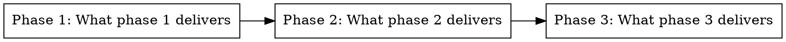
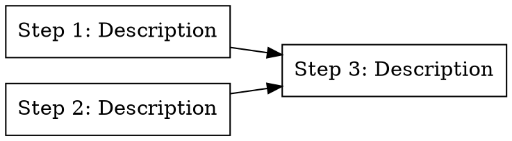

# Implementation Planning

Produces actionable implementation plans as a folder of documents — one overview and
one file per phase. Each phase is a logical feature or capability. The folder structure
lets you work on early phases while refining later ones in parallel sessions.

**Announce at start:** "Using the planning skill to create an implementation plan."

**Plan output:**
```
docs/plans/<feature-name>/
├── plan.md          # Overview — what each phase achieves
├── phase-1.md       # First logical feature
├── phase-2.md       # Second logical feature
└── ...
```

**For small, obvious changes** (single file, clear fix): skip planning, go straight to TDD.

---

## The Planning Process

### Step 1: Understand the Input

The input is either a **design document**, a **spec**, or a **feature description**.

- Read it thoroughly — requirements, chosen approach, decisions, edge cases
- Note open questions or assumptions that affect implementation

**Goal:** What are we building, what are the acceptance criteria, what's already decided?

### Step 2: Explore the Codebase

Build understanding of existing code before planning changes. Use `Agent` sub-agents (subagent_type=Explore) in parallel to investigate multiple areas simultaneously. Also use `Glob`, `Grep`, and `Read` directly for targeted lookups.

**What to explore:**

1. **Files that will be touched/extended** — find them, read them, understand their structure
2. **Data flow** — trace how data moves through the parts of the codebase this feature touches
3. **Existing patterns** — utilities, base classes, conventions that the implementation should follow
4. **Potential conflicts** — modules that share state, coupling risks, migration concerns
5. **Test infrastructure** — how similar features are tested, what fixtures and helpers exist
6. **E2E test infrastructure** — what e2e frameworks exist, what tests already cover, how backing services are started, what the dev server command is
6. **Dependencies** — what depends on what, what can run in parallel
7. **Library docs** — for external libraries the feature touches, use context7 or web search to check current API signatures and usage patterns

**Depth scaling** (match effort to change size):
- **Minor changes:** Quick scan of 2-3 files, skip parallel agents
- **Medium changes:** Thorough scan, use 2-3 parallel explore agents
- **Major changes:** Deep exploration with 4+ parallel agents covering different areas

Record findings — they go into plan.md's Codebase Context section.

### Step 3: Interactive Q&A

From the codebase exploration, identify implementation questions and resolve them with the user before designing phases. This ensures the planner starts with zero ambiguity.

**Question categories:**

**A. Implementation Approach**
- "The spec says X, but the codebase does Y — should we follow the existing pattern or change it?"
- "There are two ways to extend this — via Z or via W. Which do you prefer?"

**B. Integration Points**
- "This touches module M which also affects feature F — is that intentional?"
- "Should this reuse the existing utility at `path/to/util` or create a new one?"

**C. Edge Cases & Error Handling**
- "The spec doesn't cover what happens when X fails — should we retry, fail silently, or propagate?"

**D. Scope Boundaries**
- "Implementing REQ-003 would require changing the shared Z interface — is that in scope?"

**E. Technical Decisions**
- "What's the preferred approach for state management here — option A or option B?"
- "Should tests use real DB or mocks for this feature?"

**Rules:**
- **Always use the `AskUserQuestion` tool** to ask questions — never embed questions in plain text output
- Ask questions **one at a time** (or small batches of 2-3 closely related ones)
- Use **multiple-choice** when possible to reduce cognitive load
- After each answer, check if it raises follow-up questions
- If the user says "you decide" or "your call," make the decision, state it clearly, and record the rationale
- If the codebase exploration reveals no questions (rare — typically only for trivial changes), skip this step

**Hard gate:** All questions must be resolved before proceeding to phase design.

### Step 5: Design the Phases

Each phase is a **logical feature or capability** — a coherent piece of functionality
that makes sense on its own. A phase typically follows one TDD cycle (RED-GREEN-REFACTOR)
resulting in one commit. Occasionally a complex phase may need multiple TDD cycles, each
with its own commit — but this should be rare. If a phase needs many cycles, it's
probably two features and should be split.

**Phase design:**
- Delivers a recognizable capability: "user registration," "rate limiting," "report generation"
- Has clear done criteria
- Leaves codebase in a working state with all tests passing
- Express dependencies as a DOT digraph in plan.md — nodes with no edges between them are independent

**Step design (optional):**
- Only add steps when a phase has genuinely independent work that benefits from parallelism
- Each step must leave the codebase in a compilable/testable state
- Steps should be coarse enough to be worth parallelizing — not single-function granularity
- If all work in a phase is sequential, skip the Steps section

### Step 6: Write the Plan Documents

Create the folder and write all documents. Use the `AskUserQuestion` tool to present
the plan summary and ask for approval — never embed approval questions in plain text output.

---

## plan.md Format

The overview is concise — what each phase delivers and how they relate. No
implementation details. See `references/plan-template.md` for annotated example.

```markdown
# Plan: [Feature Name]

> **Source:** [Design doc link or "Feature request"]
> **Created:** YYYY-MM-DD
> **Status:** planning | in-progress | complete

## Goal

[One sentence: what this plan delivers when complete]

## Acceptance Criteria

- [ ] Criterion 1
- [ ] Criterion 2

## Codebase Context

### Existing Patterns to Follow
- **[Pattern]**: `path/to/example.py` — [brief description]

### Test Infrastructure
- Test runner, fixtures, factories, run command

## Phase Graph



Nodes with no incoming edges are ready to dispatch. Nodes with no edges between them are independent and can run in parallel.
```

---

## phase-N.md Format

Each phase file describes what to build, which files to touch, and includes code
for anything non-obvious. The `tdd` skill handles the RED-GREEN-REFACTOR mechanics
during execution.

```markdown
# Phase N: [What This Phase Delivers]

> **Status:** pending | in-progress | complete

## Step Graph (optional — only when phase has independent work)



### Step 1: [Description]
- Files: `path/to/file.ext`
- Tests: [Key behaviors to test]
- Done: [Completion criteria]

### Step 2: [Description]
- Files: `path/to/file.ext`
- Tests: [Key behaviors to test]
- Done: [Completion criteria]

## Overview

[What capability exists after this phase that didn't before. Short paragraph.]

## Implementation

**Files:**
- Create: `exact/path/to/file.py`
- Modify: `exact/path/to/existing.py` — [what changes]
- Test: `tests/exact/path/to/test_file.py`

**Pattern to follow:** `path/to/similar_feature.py`

**What to test:**
- [Key behavior 1 the test should assert]
- [Key behavior 2]
- [Edge case worth calling out]

**Traces to:** REQ-001, EDGE-003 (from spec)

**What to build:**
[Describe the implementation. Reference the pattern file for straightforward parts.
Include code for complex/non-obvious parts — algorithms, tricky integrations,
business rules that could easily be gotten wrong.]

**Commit:** `feat(scope): description`

## Done When

- [ ] Tests pass for [key behaviors]
- [ ] Existing tests still pass
- [ ] [Any phase-specific verification]

## E2E Verification (when applicable)

Include when the phase delivers user-visible behavior or modifies a flow crossing service boundaries.

- **Infrastructure needed:** [backing services required]
- **E2E tests to run:** [specific test commands or patterns]
- **Browser verification:** [pages to visit, behaviors to confirm]

Omit for phases that are purely internal (libraries, utilities, refactors with no user-facing change).
```

### When to include code in a phase

Include code when the logic is non-obvious, the algorithm matters, the business rule
is complex, or the pattern diverges from codebase conventions. Skip code when a
reference to "follow the pattern in `path/to/example.py`" is sufficient — the TDD
cycle will produce the right code naturally.

---

## @fix Tags

Annotate phase files with `@fix` tags to mark what needs changing. The agent reads
the tags, applies changes, and removes them.

**Format:** `<!-- @fix: description of what needs to change -->`

Place directly above the content that needs updating.

**Examples:**
```markdown
<!-- @fix: use argon2 instead of bcrypt — it's already a project dependency -->
Hash the password with bcrypt before storing.

<!-- @fix: this phase is too large — split webhook delivery into its own phase -->
## Overview
This phase implements notifications: email, SMS, and webhook delivery.
```

When processing: collect all `@fix` tags, summarize changes to user, apply them,
remove tags. If fixes change phase structure, update plan.md too.

---

## Integration with Other Skills

**From brainstorm:** Read the design doc/spec, focus on codebase exploration,
interactive Q&A, and phase design.

**To execution:** After plan approval, work through phases in dependency order.
Load each phase-N.md, use the `tdd` skill for RED-GREEN-REFACTOR, commit after
each cycle. Update phase status as they complete. User can say "implement through
phase 3" to set a stopping point.

**Parallel sessions:** Session A implements phases 1-2 while Session B refines
phase-3.md and phase-4.md with `@fix` tags or direct edits.

**Tasks:** Create one task per phase with dependency relationships matching plan.md.
Update status as phases complete.
