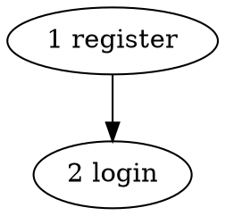

# plan.md and phases/phase-N.md — Section Contract

Paths: `.harness/<name>/plan.md` · `.harness/<name>/phases/phase-N.md`. Examples use a
neutral domain (user auth) unrelated to the feature being planned; the plan's own artifacts
use the target feature's real vocabulary.

**File references, everywhere in both documents:** `src/services/user.ts:34 — createUser,
the insert path`. The path leads so click-detection resolves it; the clause names what's
there so the reader doesn't open the file to find out. Repo-relative always.

## plan.md — sections

| Section | Holds |
|---|---|
| `## Goal` | one sentence |
| `## Requirements` | the `R#`/`NF#`/`EC#` list planning established from the PRD, in the EARS shapes given in `SKILL.md`. Cites the PRD story id each was drawn from. |
| `## Global Constraints` | project-wide requirements binding **every** slice — version floors, naming rules, platform limits — exact values verbatim. Slices are dispatched in isolation; anything project-wide is invisible unless broadcast here. |
| `## Codebase Context` | patterns to follow · reuse verdicts · verified preconditions · the create/modify file table |
| `## Tech Debt` | the disposition table: file · issue (severity/category) · disposition · reason |
| `## Structure Outline` | the C-header view — see below |
| `## Test Matrix` | one row per requirement: Requirement · Level · Where it's proven · Slice |
| `## System Verification` | cross-slice E2E flows written out in full, each owned by the slice completing its journey (that phase file notes it in one line) · the full-suite run after all slices land |
| `## Deferred` | follow-up work deliberately not in this plan (including every "fix after" debt disposition) |

No `## Acceptance Criteria` (the requirements — the design's or `## Requirements` — carry
them), no status fields (progress derives from git and the DAG), no Unit/API scenarios
(those live in phase files).

## The Structure Outline

Types, then signatures, then phases — one section read as a unit: what do I build, in what
order, and what works after each step.

```markdown
## Structure Outline

**New types**

    type Session = { token: string, expiresAt: Date }

**Signatures**

    register(email, password) → User | DuplicateError
    issueToken(user)          → Session
    POST /register → 201 | 409 | 422

**Phases**

  1 · register — an account can be created and read back with no password exposed
      builds: register(), POST /register, users table
  2 · login — a registered account obtains a session that expires
      builds: issueToken(), POST /login
      needs: register() from 1


```

- The signatures block is the **source of truth** for every new or changed signature and
  type, whole-feature, decided before any slice is written — the cross-slice naming
  collision (slice 2 invents `getUser`, slice 4 invents `fetchUserByEmail`) is uncatchable
  from inside any single slice. Contracts only: no bodies, no per-slice detail.
- A phase line is `N · tag — <demonstrable capability>` plus `builds:` and (when it consumes
  an earlier slice) `needs:`. The title *is* the anti-horizontal test: a title that names
  only a layer names no capability.
- The DOT digraph closes the section — orchestrate computes dispatch waves from it; `needs:`
  carries the same order for the reader.

## phase-N.md — header plus five sections

Header: `# Phase N (<tag>): <the capability title from the outline>` + a `Depends on:` line.

| Section | Answers only | Must not contain |
|---|---|---|
| `## Goal` | why this slice exists, what it unlocks | file lists, steps |
| `## Interfaces` | what this slice consumes from earlier slices and produces for later ones — **names from the outline's signatures, never re-typed** | rationale, steps |
| `## Implementation` | how, as ordered steps | scenario prose, done-criteria |
| `## Test Scenarios` | the behavior that proves it — `### Unit` / `### API` / `### E2E`, only the subsections this slice has | implementation detail, cross-slice flows |
| `## Commit` | the message | — |

Omit `## Interfaces` for a slice with no seam (typically slice 1). No Done-When section —
the scenarios are the definition of done. Content restating another section is cut.

## Implementation steps — the shape

Each step opens with a bold action title naming its file(s), then:

**Changing existing code — quote, then describe.** Quote the minimum region that orients (the
signature and the lines the change lands in, not the whole function), then state the change
in prose. The quote is context; the prose is the instruction; the file stays the source of
truth.

```markdown
1. **Modify `src/services/user.ts:31 — createUser, the insert path`** — reject duplicates

   Today:
   ```ts
   async function createUser(email: string, pw: string): Promise<User> {
     const hash = await bcrypt.hash(pw, 12)
     return db.users.insert({ email, hash })
   }
   ```
   Add a `findByEmail` lookup before hashing; when it returns a row, throw
   `DuplicateError(email)` instead of inserting. The happy path is unchanged.
```

**Creating a new file — Contract + Logic, no quote.**

- **Contract** — the signature or data shape it introduces, one line, named in the outline.
- **Logic** — the ordered operations *including the branch and error path*: normalize →
  look up → reject duplicate → hash → persist → return without the secret field.
- **Integrates** *(optional)* — the existing function it calls or convention it follows.

A pure wiring step (register a route, add an export) stays a one-liner. A test-file step
states what it sets up, what it asserts, and what that proves.

## Test Scenarios in the phase file

Steps/Expected shape, ids, and trace tags per `scenarios.md` — the format lives there, once.
A vertical slice almost always owns a `### E2E`: its point is a runnable end-to-end
capability, and a slice with none is a signal it was cut horizontally.
