# Plan Template Reference

Annotated examples for the plan folder structure.

---

## plan.md Example

```markdown
# Plan: User Authentication System

> **Source:** `.harness/features/<SPEC_NAME>/design.md`
> **Created:** 2026-02-24
> **Status:** in-progress

## Goal

Add JWT-based authentication with login, registration, and token refresh.

## Acceptance Criteria

- [ ] Users can register with email and password
- [ ] Users can log in and receive a JWT token
- [ ] Protected endpoints reject unauthenticated requests
- [ ] Tokens expire and can be refreshed

## Codebase Context

### Existing Patterns to Follow

- **API endpoints**: `src/routes/health.py` — request validation, service call, response
- **Data models**: `src/models/session.py` — Pydantic BaseModel with validators
- **Service layer**: `src/services/usage_service.py` — business logic with injected deps

### Test Infrastructure

- Test runner: `pytest` with `pytest-asyncio`
- Fixtures: `tests/conftest.py` — `test_client`, `mock_config`
- Run: `uv run pytest tests/ -v`

<!-- plan.md carries NO Unit/API scenarios — those live in the phase files. It DOES carry the
     whole-feature E2E flows, in the System E2E Tests section below. See test-scenarios.md. -->

## Phase Graph

```dot
digraph phases {
  rankdir=LR
  node [shape=box]

  // Vertical slices — each a thin capability through every layer it needs (model + endpoint +
  // response), independently demoable. Phase 1 is the walking skeleton: the thinnest path that
  // touches storage, an endpoint, and a response once.
  phase_1 [label="Phase 1 (register): a user can create an account (walking skeleton)"]
  phase_2 [label="Phase 2 (login): a registered user logs in and gets a token"]
  phase_3 [label="Phase 3 (protected): a token holder reaches a protected page; others are refused"]
  phase_4 [label="Phase 4 (refresh): an expired token is refreshed without re-login"]

  phase_1 -> phase_2
  phase_2 -> phase_3
  phase_3 -> phase_4
}
```



Nodes with no incoming edges are ready to dispatch. Each slice cuts through every layer its
capability needs (the user model/storage rides inside the register slice that first needs it — no
separate "build all the models" phase), so each is demoable on its own. Nodes with no edges between
them are independent and can run in parallel.

## System E2E Tests

<!-- CROSS-SLICE flow scenarios only: journeys that combine two independently-built capabilities, so
     no single phase can run them end to end (owned by no one phase). Under vertical slicing this is
     the EXCEPTION — most E2E flows are phase-level and live in their phase's ### E2E (a slice owns
     every layer its capability touches, so its flow runs on its own code). See test-scenarios.md
     "the placement rule". Full Steps + Expected, one per cross-slice journey. Environment/harness
     setup (backing services, dev-server/build command, browser driver) is NOT here — it lives in
     the project's CLAUDE.md. -->

Scenario S20 (flow): A user registers, then logs in, then reaches a protected page
  Steps:
    1. From the running app, register a new account with a valid email and strong password
    2. Log in with those credentials
    3. Navigate to a protected page
  Expected:
    - registration succeeds and no password is shown anywhere
    - login with the just-registered credentials returns a working session
    - the protected page loads while authenticated and is refused when logged out
  (traces to REQ-001, REQ-002, REQ-003)

<!-- This flow is cross-slice: it chains the register slice, the login slice, and the protected slice,
     so no one phase can run it. The register slice's OWN flow (register → the account exists and can
     be fetched, no password leaked) is phase-level and lives in phase-1's ### E2E, not here. -->

## Notes

- The user model/storage is not its own phase — it rides inside Phase 1 (register), the first slice
  that needs it (walking skeleton).
- JWT secret should come from environment config, not hardcoded
```

---

## phase-N.md Example

```markdown
# Phase 1 (register): A user can create an account  (walking skeleton)

> **Status:** pending
> **Depends on:** —

## Overview

The walking skeleton: the thinnest end-to-end slice that lets a real person create an account —
touching storage, an endpoint, and a response once. It carries the user model/storage inside it (no
separate "build the model" phase), establishing the plumbing every later auth slice (login, refresh,
protected routes) builds on. On its own it is demoable: POST /register and the account exists.

## Implementation

<!-- Ordered, action-centric steps naming the files each touches, with the approach/content — not
     a bare list and not one paragraph. This slice spans layers (model → service → route), so its
     steps name files across them. Test steps state setup, assertions, and what they prove. -->

1. **Add the user model and storage** — create `src/models/user.py`: a Pydantic `User` with
   `EmailStr` and a hashed-password field (never plaintext), following the validator shape in
   `src/models/session.py`; and its storage accessor. This is the shared foundation, carried inside
   the first slice that needs it rather than a phase of its own.
2. **Add the registration service** — create `src/services/auth_service.py`: expose
   `register(email, password)` that normalizes the email, rejects a duplicate (looks up the existing
   account first), hashes the password with bcrypt (never stores plaintext), persists the user, and
   returns the user without the password field. Follows the injected-deps shape in
   `src/services/usage_service.py`.
3. **Expose the endpoint** — create `src/routes/registration.py`: a `POST /register` route with a
   Pydantic request model (`EmailStr` + password-strength validator); on valid input call
   `auth_service.register` and return 201 with the password-free user; map duplicate → 409, weak
   password → 422 naming the unmet rule. Mirrors `src/routes/health.py`.
4. **Wire the route** — modify `src/routes/__init__.py`: register the new route on the app router.
5. **Cover it** — create `tests/test_registration.py`: with no account for the test email, assert
   (a) a valid POST returns 201 and the body has no `password` field; (b) `password:"abc"` returns
   422 naming the unmet rule; (c) a second POST with an existing email returns 409 and no second
   account is created; (d) a hashed password verifies true for the right password, false for a
   wrong one, and the stored value is not the plaintext; plus the end-to-end flow in `### E2E` below
   (register → fetch the account back). Proves registration works, rejects bad input at the
   boundary, and never leaks or stores plaintext. Uses the `test_client` fixture in
   `tests/conftest.py`.

**Pattern to follow:** `src/routes/health.py` (route structure), `src/services/usage_service.py`
(service layer), `src/models/session.py` (model validators).

Password hashing is the one non-obvious bit — salt rounds and the verify function matter:

```python
import bcrypt

def hash_password(plain: str) -> str:
    return bcrypt.hashpw(plain.encode(), bcrypt.gensalt(rounds=12)).decode()

def verify_password(plain: str, hashed: str) -> bool:
    return bcrypt.checkpw(plain.encode(), hashed.encode())
```

## Test Scenarios

`### Unit` / `### API`, plus the `### E2E` this slice runs on its own code. Because this is a
vertical slice — register end to end — it owns a phase-level flow (register → the account exists and
comes back on a fetch, no password leaked). Only a flow that *chains another slice* (register → then
log in → then a protected page) is cross-slice and lives in plan.md's System E2E Tests, not here.

```markdown
### Unit

Scenario S1: Passwords are stored hashed, never in plaintext
  Steps:
    1. Hash a known password, then verify it against the stored value
  Expected:
    - the stored value is not the plaintext
    - verify() returns true for the right password and false for a wrong one
  (traces to REQ-001)

### API

Scenario S2: A new user registers successfully
  Steps:
    1. With no account for alice@example.com, POST a valid email and strong password to /register
  Expected:
    - the response is 201
    - the returned user has no password field
  (traces to REQ-001)

Scenario S3: Weak passwords are rejected with a reason
  Steps:
    1. POST a registration with password "abc" to /register
  Expected:
    - the response is 422
    - it names the unmet rule (length/upper/lower/digit)
  (traces to REQ-001)

Scenario S4: Duplicate email is rejected
  Steps:
    1. With an account already existing for alice@example.com, POST a second registration with the same email
  Expected:
    - the response is 409
    - no second account is created
  (traces to EDGE-002)

Scenario S5 (regression): Public endpoints stay open
  Steps:
    1. Call the health endpoint without credentials
  Expected:
    - it still returns 200 (unchanged from before this change)
  (traces to NF-004)

### E2E

Scenario S6 (flow): A user registers and the account exists end to end
  Steps:
    1. From the running app, POST /register with a valid email and strong password
    2. Fetch the just-created account back through the normal read path
  Expected:
    - registration returns 201 with no password field
    - the fetched account exists with the registered email and no plaintext password anywhere
  (traces to REQ-001)
```

S6 is **phase-level**: every step — register, then read the account back — runs on this slice's own
code (model + service + route), so it lives here, not in plan.md. The cross-slice flow that continues
"…then log in and reach a protected page" (S20) needs the login and protected slices too, so it lives
in plan.md's System E2E Tests.

## Commit

`feat(auth): add registration endpoint with validation`
```

Use the conventional prefix that matches the phase's work: `feat:` for new behavior, `fix:` for a
bug fix, `test:` for a confirm-and-guard / regression-only phase that adds coverage with no
production change, `refactor:` for internal restructuring.

---

## @fix Tag Examples

```markdown
<!-- @fix: use argon2 instead of bcrypt — already a project dependency -->
Password hashing — include because salt rounds matter:

<!-- @fix: split webhook delivery into its own phase — this is too large -->
## Overview
This phase implements notifications: email, SMS, and webhook delivery.
```
